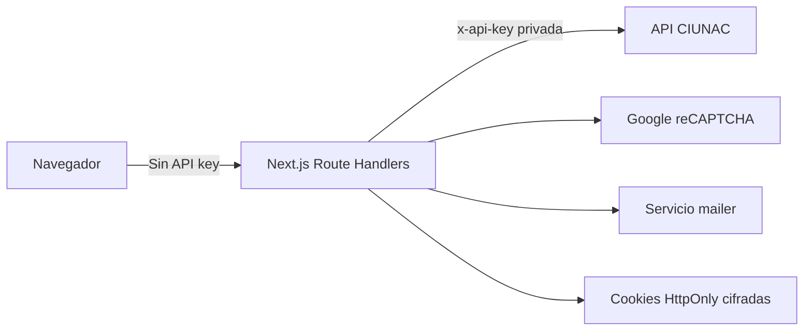

# ADR-007 BFF Seguro Para API, OTP y CAPTCHA

## Estado
Aceptado e implementado en Fase 1C.

## Contexto
El navegador consumia la API CIUNAC con `NEXT_PUBLIC_API_KEY`, generaba el OTP con `Math.random`, lo guardaba en `sessionStorage` y validaba CAPTCHA solo por presencia. Esto permitia extraer la API key del bundle y manipular las verificaciones desde el cliente.

## Decision
Usar Route Handlers de Next.js como Backend for Frontend (BFF). El codigo sigue dentro del repositorio frontend, pero se ejecuta exclusivamente en Node.js.

La API key, el secreto CAPTCHA y el secreto de sesion se leen solo desde variables privadas. El proxy generico usa una allowlist de rutas y metodos, y excluye `mailer`.

El OTP tiene seis digitos criptograficos, expira en cinco minutos, permite cinco intentos, exige 60 segundos entre reenvios y limita cinco envios cada 15 minutos. El desafio se cifra con AES-GCM y el codigo se compara mediante HMAC y `timingSafeEqual`.

## Cookies Firmadas Sin Persistencia
La Fase 1C almacena desafio, intentos y rate limit en una cookie cifrada `HttpOnly`, `SameSite=Strict`. Esta alternativa evita infraestructura adicional y protege el flujo normal del navegador.

Limitacion aceptada: un atacante que conserve deliberadamente una version anterior valida de la cookie puede intentar reproducir ese estado. El uso unico es estricto para el estado actual del navegador, pero no frente a replay de una cookie antigua. La solucion definitiva requiere estado server-side compartido, por ejemplo Redis o persistencia backend.

## Consecuencias
- Ninguna API key privada se envia al navegador.
- OTP, CAPTCHA y correo se procesan en servidor.
- Las paginas de proceso requieren una sesion verificada.
- Las consultas crean una sesion breve ligada al documento y tipo consultado.
- Las respuestas externas y logs se normalizan sin payloads ni datos personales.
- Un despliegue horizontal futuro debera adoptar persistencia compartida para eliminar la limitacion de replay.

## Alternativas
- Mantener OTP en `sessionStorage`: descartado por ser controlable desde cliente.
- Server Actions: descartadas para este limite HTTP porque Route Handlers expresan mejor contratos, metodos y pruebas de integracion.
- Redis desde esta fase: diferido para mantener el cambio acotado y porque la limitacion fue aceptada explicitamente.
