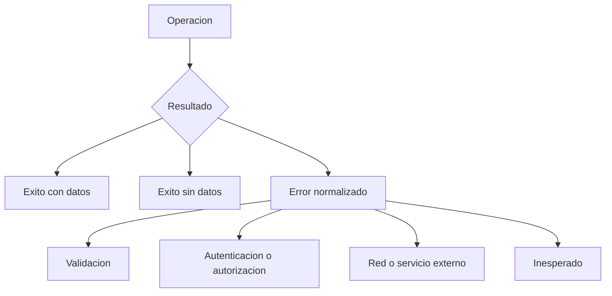

# ADR-008 Resultados Explicitos de Operacion

## Estado

Aceptado e implementado en Fase 1D.

## Contexto

Los servicios compartian respuestas ambiguas: `null`, arreglos vacios y errores capturados podian representar indistintamente ausencia real, error externo o exito sin cuerpo. En los registros, la persistencia ocurria antes del correo, pero un fallo de notificacion se presentaba como fallo total y habilitaba el reenvio completo del formulario.

## Decision

Adoptar resultados discriminados para lecturas y resultados de registro que distingan una operacion completa de una persistencia con notificacion pendiente.

Las respuestas criticas se validan en el limite de infraestructura con Zod. Un cuerpo vacio solo es valido para comandos cuyo contrato no necesita respuesta. Las creaciones deben devolver un identificador valido antes de notificar o continuar.

Cuando el correo falla despues del guardado, el caso de uso devuelve `saved_notification_failed`, conserva el ID persistido y permite reintentar solo la notificacion. Las paginas finales requieren un comprobante cifrado emitido por el Route Handler despues de que `mailer` acepte la solicitud HTTP.

## Consecuencias

- La UI diferencia carga, datos, vacio, error y exito parcial.
- Ninguna escritura indeterminada se reintenta automaticamente.
- El correo puede reintentarse sin duplicar la solicitud ni sus adjuntos.
- Los errores externos se normalizan y no exponen respuestas internas.
- Los casos de uso y mappers pueden probar cada resultado sin depender de componentes React.

## Limitaciones

El comprobante demuestra aceptacion HTTP de `mailer`, no entrega SMTP. Tampoco ofrece idempotencia entre reintentos; esa garantia requiere soporte del backend mediante una clave idempotente u outbox.

## Alternativas

- Mantener `null` y excepciones como contrato implicito: descartado porque no distingue ausencia de fallo.
- Compensar eliminando la solicitud si falla el correo: descartado porque el correo no forma parte de una transaccion atomica con CIUNAC.
- Repetir automaticamente todo el flujo: descartado por riesgo de solicitudes y cobros duplicados.
