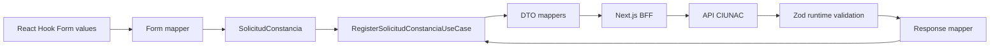

# ADR-009 Flujo Tipado de Solicitud de Constancia

## Estado

Aceptado e implementado en Fase 2A.

## Contexto

El slice de constancias usaba `Partial<SolicitudConstanciaDraft>` como estado principal. El mismo objeto representaba formulario incompleto, modelo de negocio y datos de integracion. `updateDraft(Partial<...>)` permitia combinaciones invalidas, mientras `toCompleteDraft` reconstruia el modelo mediante comprobaciones y un cast.

Las respuestas de estudiante, solicitud y cargo tambien atravesaban interfaces genericas con propiedades opcionales. Una respuesta vacia, incompleta o con forma inesperada podia alcanzar la UI antes de ser rechazada.

## Decision

Separar los modelos de presentacion, dominio e integracion dentro de `solicitud-constancia`:

El dominio completo contiene `email`, `basicData` y `payment`. Los datos basicos discriminan alumno UNAC y no UNAC. El pago discrimina monto cero sin voucher y monto positivo con voucher completo.

Zustand conserva un workflow discriminado con estados `initial`, `editing`, `submitting`, `success`, `saved_notification_failed` y `error`. Las mutaciones genericas se sustituyen por commands que expresan transiciones de negocio. Completar nuevamente los datos basicos invalida el pago anterior.

Los adaptadores reciben respuestas `unknown`, las validan con Zod y solo entonces cumplen sus puertos tipados. Crear estudiante o solicitud debe devolver un ID valido. El cargo usa un modelo completo y distingue `loading`, `data`, `empty` y `error`.

El Route Handler valida vouchers por ausencia, tamano, extension, MIME y firma binaria. Esta validacion se limita a `upload/vouchers`; no cambia las reglas de DNI ni becas.

## Consecuencias

- El caso de uso no depende de interfaces genericas de certificados o solicitudes.
- El store no puede actualizar campos arbitrarios ni usar `Partial` como modelo principal.
- Las respuestas incompletas se detienen en infraestructura antes de correo, navegacion o PDF.
- Un cargo inexistente se diferencia de una indisponibilidad tecnica.
- PDF, PNG y JPEG falsificados por MIME son rechazados antes de llegar al proveedor externo.
- Se agregan mappers y schemas explicitos, aumentando archivos pero reduciendo ambiguedad entre capas.

## Dependencias Compartidas

Se mantienen como contratos estables `FinData`, `finInfoSchema`, catalogos, cliente HTTP, errores normalizados y el endpoint `upload/vouchers`. No se crea un segundo componente ni schema de pago.

## Limitaciones

- La API externa sigue siendo la autoridad final sobre permisos, persistencia y propiedad de la URL del voucher.
- La firma binaria confirma el formato declarado, no que el contenido visual sea un comprobante valido.
- Certificados, ubicacion, beca y alumno nuevo mantienen sus modelos actuales y quedan fuera de Fase 2A.

## Alternativas

- Mantener un borrador `Partial`: descartado porque traslada validaciones y casts a cada consumidor.
- Copiar todo el modulo de certificados: descartado por duplicar reglas inestables y mantener el acoplamiento.
- Migrar todos los features a la vez: descartado para conservar una refactorizacion incremental y verificable.
