# ADR-010 Contexto Tipado Para Consultas

## Estado

Aceptado e implementado en Fase 2B.

## Contexto

Las consultas por documento reutilizaban `ISolicitudRes`, una interfaz generica con
propiedades opcionales, y convertian respuestas externas mediante casts. La pagina
de resultados mezclaba acceso HTTP, filtrado por tipo, interpretacion de estados,
carga de textos y renderizado. Una respuesta incompleta podia llegar a la vista y
las solicitudes de ubicacion aparecian en la consulta de certificados.

El formulario de consulta tambien estaba alojado dentro de
`consulta-solicitud`, aunque era consumido por solicitud y ubicacion.

## Decision

Crear `modules/consultas` como contexto comun para el comportamiento estable de
consulta por documento:

- formulario de busqueda y contrato de comprobacion;
- modelo `ConsultedRequest` completo;
- DTOs y schemas Zod en el limite externo;
- mappers DTO a dominio;
- caso de uso para consultar, filtrar y cargar textos auxiliares;
- repository server-only para comunicarse con CIUNAC.

`consulta-solicitud` conserva exclusivamente su presentacion de resultados,
generacion de cargo y documentos digitales.

```mermaid
flowchart LR
    Form["Formulario de consulta"] --> Security["POST /api/security/consulta"]
    Security --> Session["Sesion de consulta"]
    Session --> Page["Server Component"]
    Page --> UseCase["GetConsultationRequestsUseCase"]
    UseCase --> Repository["Repository server-only"]
    Repository --> BFF["Next.js BFF"]
    BFF --> API["API CIUNAC"]
    API --> Schema["Validacion Zod"]
    Schema --> Mapper["Mapper DTO a dominio"]
    Mapper --> View["Resultados tipados"]
```

La pagina de resultados permanece como Server Component. No se agrega Zustand:
los resultados son datos de solo lectura obtenidos en servidor y los estados
efimeros de PDF o aceptacion pertenecen a cada componente cliente.

Los documentos digitales usan contratos explicitos para certificado y constancia.
Se distingue `loading`, `empty`, `data` y `error`; una respuesta mal formada no se
interpreta como ausencia.

## Consecuencias

- La consulta general deja de depender de `ISolicitudRes`.
- Las respuestas externas se validan antes de llegar a presentacion.
- Certificados/constancias y examenes se filtran por una regla de dominio unica.
- El fallo de textos auxiliares no oculta solicitudes validas.
- Las rutas vacias, los errores tecnicos y los documentos inexistentes se muestran
  como estados diferentes.
- El formulario compartido queda ubicado en el contexto que realmente lo posee.
- Se eliminan fachadas y componentes sin uso vinculados a documentos digitales.

## Limites

- `consulta-certificado/[id]` fue migrado posteriormente en Fase 2C mediante ADR-011.
- El detalle de ubicacion y su join fueron migrados posteriormente en Fase 2D mediante ADR-012.
- El BFF generico autentica la sesion, pero todavia no demuestra que el documento
  digital solicitado pertenece al documento de identidad consultado. Debe crearse
  un endpoint especializado que valide propiedad antes de exponer o aceptar el
  documento.
- La clasificacion de tipos se basa en IDs y nombres observados del contrato actual;
  cambios del catalogo externo requieren actualizar las reglas y sus pruebas.

## Alternativas

- Mantener el formulario dentro de `consulta-solicitud`: descartado porque ubicacion
  ya lo consume y el contrato es transversal.
- Crear un store global para resultados: descartado porque duplicaria estado del
  servidor y agregaria invalidacion innecesaria.
- Migrar simultaneamente certificado y ubicacion: descartado para conservar el
  alcance incremental y verificable de Fase 2B.
