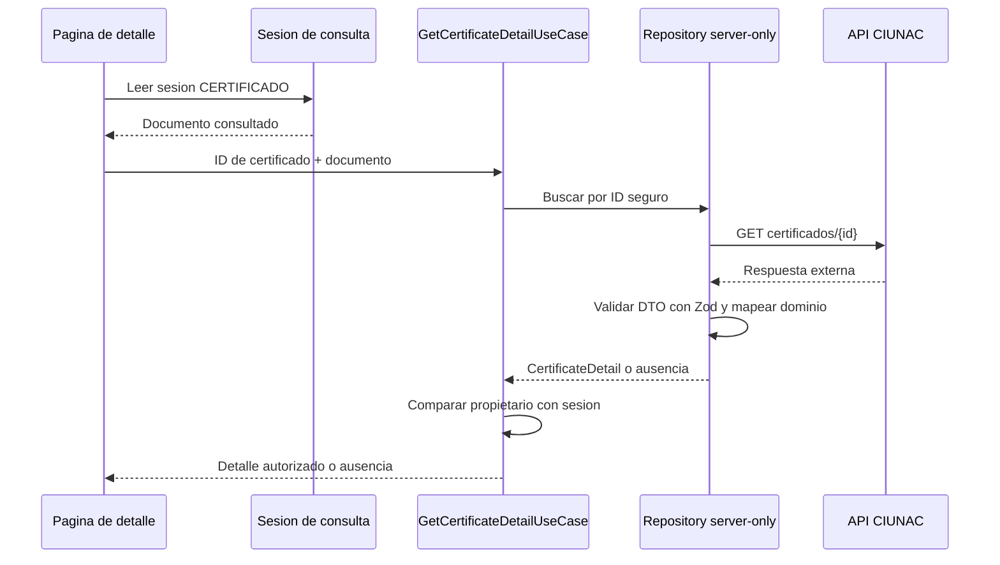

# ADR-011 Detalle de Certificado Tipado y Asociado a la Consulta

## Estado

Aceptado e implementado en Fase 2C.

## Contexto

`consulta-certificado/[id]` concentraba acceso HTTP, cast a una interfaz compartida,
orden de notas, derivacion de etiquetas, formato de fechas y renderizado. El schema
externo solo comprobaba `notas`, por lo que un objeto sin estudiante, registro,
fechas u horas podia llegar a la vista.

La ruta exigia una sesion de consulta, pero no comprobaba que el certificado
recuperado perteneciera al documento usado para crear esa sesion.

## Decision

Crear un slice interno para el detalle de certificado:

```text
modules/consulta-certificado/
  domain/
  application/
  infrastructure/
  presentation/
```



El identificador solo permite letras, numeros, guion y guion bajo, con longitud
maxima de 80 caracteres. El repositorio traduce `404` o un `2xx` sin cuerpo a
ausencia. Una estructura incompleta, fecha invalida o nota mal formada produce un
error externo y activa `error.tsx`.

El caso de uso compara `certificate.documentNumber` con el documento normalizado de
la sesion. Una diferencia se trata como no encontrado para no revelar existencia.
Las notas se ordenan de forma estable por el numero final del ciclo.

## Consecuencias

- La pagina queda limitada a sesion, parametros, caso de uso y render.
- Desaparecen el cast y la interfaz `ICertificado` compartida.
- Campos principales y fechas se validan antes de presentacion.
- Lista de notas vacia es un estado funcional, no un error.
- `loading.tsx`, `error.tsx` y `not-found.tsx` cubren los estados de ruta.
- El detalle ya no permite consultar un certificado de otro documento usando un ID
  conocido dentro de una sesion valida.
- Los textos con codificacion danada quedan corregidos en la nueva vista.

## Limites

- La sesion se crea mediante la consulta por documento; no se cambia el flujo de
  acceso QR en esta fase.
- La aceptacion y descarga del documento digital siguen perteneciendo a
  `consulta-solicitud` y conservan la deuda registrada en ADR-010.
- El detalle de examen de ubicacion queda fuera hasta Fase 2D.

## Alternativas

- Ampliar `ISolicitudRes` o `ICertificado`: descartado porque mantendria modelos
  ambiguos entre solicitudes, documentos digitales y detalle publico.
- Validar solo las notas: descartado porque permite falsos estados de exito con
  metadatos incompletos.
- Devolver `403` ante propietario distinto: descartado para no confirmar que el ID
  del certificado existe.
