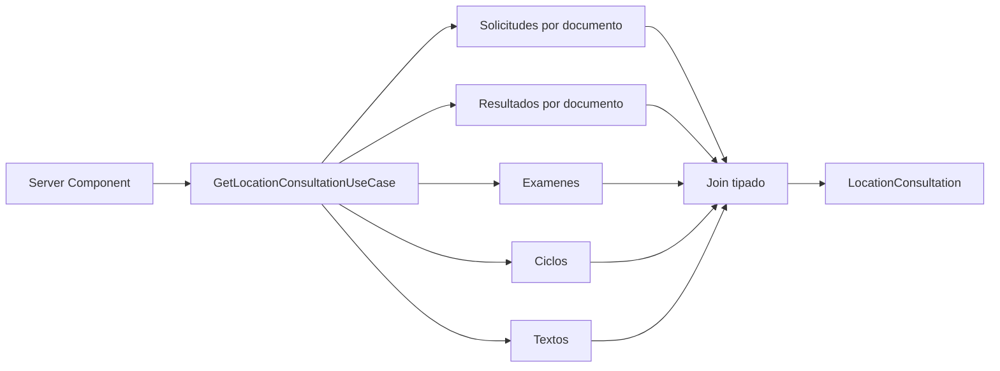

# ADR-012 Join Server-Side Para Consulta de Ubicacion

## Estado

Aceptado e implementado en Fase 2D.

## Contexto

`consulta-ubicacion/[dni]` cargaba la solicitud en un Server Component, pero delegaba
notas, examenes y ciclos a un componente cliente. Tres lecturas adicionales se
ejecutaban desde `useEffect` y el join se repetia con `find()` durante cada render.
Las fronteras usaban interfaces opcionales, schemas genericos y casts.

El detalle podia omitir relaciones de examen o ciclo sin distinguir entre un
resultado parcial y un error. El PDF consultaba `textos` nuevamente desde el
navegador y podia generarse sin el nombre institucional del año.

## Decision

Crear un caso de uso server-side que consulta en paralelo solicitudes, resultados,
examenes, ciclos y textos, valida cada respuesta y realiza el join en application y
domain.

Reglas del join:

- solo participan solicitudes clasificadas como examen de ubicacion;
- la solicitud debe pertenecer al documento de la sesion;
- un resultado debe referenciar una solicitud permitida;
- si el resultado incluye estudiante, su documento tambien debe coincidir;
- si omite estudiante, se completa desde la solicitud autorizada;
- examen o ciclo ausente produce `dataQuality: partial`, no ausencia de nota;
- resultados completos se ordenan por fecha descendente;
- la solicitud mas reciente se usa para descargar el cargo cuando no hay notas.

La constancia PDF solo se habilita cuando el resultado esta terminado, el join tiene
fecha y ciclo, y `TEXTO_NOMBREAN` esta disponible. Los textos son auxiliares: su
fallo no oculta la nota.

## Consecuencias

- La pagina deja de realizar joins o casts.
- Se eliminan tres consultas cliente, estados duplicados y renders asociados.
- Las respuestas externas se validan con schemas especificos antes del mapper.
- Vacio, error tecnico y resultado parcial tienen representaciones diferentes.
- La generacion PDF recibe un modelo completo y muestra loading/error local.
- Se corrigen textos visibles con codificacion dañada.
- No se incorpora Zustand para datos de solo lectura server-side.

## Limites

- El cargo mostrado cuando no hay notas conserva el componente legacy de
  `solicitud-ubicacion`; tiparlo pertenece a una fase posterior del flujo de registro.
- La validacion del formato del PDF no demuestra autenticidad academica; la API sigue
  siendo la autoridad de los resultados.
- El acceso depende de una sesion de consulta `EXAMEN` vigente.

## Alternativas

- Mantener el join en React: descartado por duplicar estado remoto y consultas.
- Rechazar toda nota con relaciones ausentes: descartado porque ocultaria un resultado
  valido; se representa explicitamente como parcial y se bloquea solo la constancia.
- Crear un store global: descartado porque los datos son de solo lectura y pertenecen
  a una unica ruta server-rendered.
