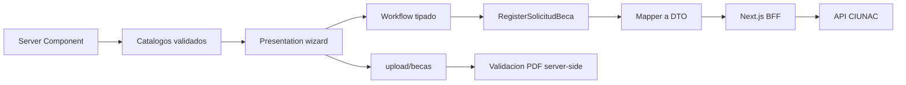

# ADR-013 Workflow Tipado y Documentos Seguros Para Becas

- Estado: Aceptado.
- Fecha: 2026-08-05.

## Contexto

`solicitud-beca` utilizaba un modelo que mezclaba formulario, estado, respuesta y
payload externo. El store se basaba en `Partial` y setters `unknown`; los cinco PDF
se validaban solo por MIME declarado en el navegador y los catalogos se cargaban
mediante efectos cliente sin un estado de error completo.

## Decision

- Adoptar `SolicitudBeca`, `ScholarshipBasicData` y `ScholarshipDocuments` como dominio.
- Separar FormModel, dominio, command, request DTO y response DTO.
- Sustituir el store parcial por un workflow discriminado con commands tipados.
- Obtener facultades y escuelas en el Server Component, en paralelo y con Zod.
- Mantener el contrato externo y el campo historico `contancia_tercio` solo en el DTO.
- Mantener `/upload/becas`, aceptando exclusivamente PDF de hasta 8 MiB.
- Verificar extension y MIME en cliente, y firma `%PDF-` en el Route Handler.
- Tratar el fallo de correo posterior al guardado como exito parcial reintentable.

## Consecuencias

- La UI ya no puede construir solicitudes incompletas mediante setters genericos.
- Un cambio de numero de documento invalida los adjuntos previamente nombrados.
- Respuestas sin ID no se consideran exitosas y no disparan correo.
- El resumen de beca deja de depender del modulo de consultas.
- La propiedad definitiva de las URLs cargadas sigue requiriendo validacion del backend externo.
