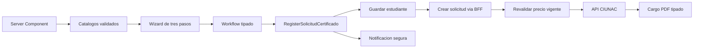

# ADR-014 Workflow Tipado y Precio Verificado Para Certificados

- Estado: Aceptado.
- Fecha: 2026-08-05.

## Contexto

`solicitud-certificado` compartia un store `Partial<Isolicitud>` con ubicacion,
aceptaba setters `unknown` y mezclaba formulario, dominio y DTO externo. Los
parametros de URL `trabajador` y `antiguo` podian alterar decisiones de
presentacion; en particular, `trabajador` habilitaba descuentos sin una validacion
confiable del backend. Las respuestas de estudiante, solicitud y cargo se consumian
mediante propiedades opcionales y casts.

## Decision

- Adoptar un dominio `SolicitudCertificado` para tipos `1` a `4` y niveles `1` a `3`.
- Separar FormModel, command, dominio, request DTO, response DTO y cargo.
- Sustituir el store compartido por un workflow discriminado y commands tipados.
- Cargar catalogos de solo lectura en el Server Component y validarlos con Zod.
- Mantener unicamente el precio normal publicado por `tipossolicitud`.
- Revalidar el monto en el BFF inmediatamente antes de reenviar `POST solicitudes`.
- Responder `409 PRICE_CHANGED` cuando el monto no coincide y no ejecutar la escritura.
- Eliminar `trabajador` y `antiguo` del contrato de navegacion de certificados.
- Derivar `digital` exclusivamente de los tipos `2` y `4`.
- Mantener `FinData`, la politica comun de voucher, OTP, CAPTCHA y sesion verificada.
- Tratar el fallo de correo posterior al guardado como exito parcial reintentable.
- Generar el cargo A4 solo con un modelo completo y textos institucionales requeridos.

## Consecuencias

- La UI no puede construir combinaciones parciales mediante setters genericos.
- Cambiar documento o tipo invalida el pago y voucher capturados.
- Una respuesta sin identificador detiene correo y navegacion.
- Los descuentos de trabajador quedan deshabilitados hasta disponer de un contrato
  backend que pruebe la condicion y autorice el precio.
- Ubicacion conserva temporalmente el store y el paso documental legacy; no queda
  acoplada al nuevo workflow de certificados.
- La validacion BFF evita manipulacion desde el navegador, pero el backend externo
  sigue siendo responsable ultimo de aplicar sus reglas comerciales.

