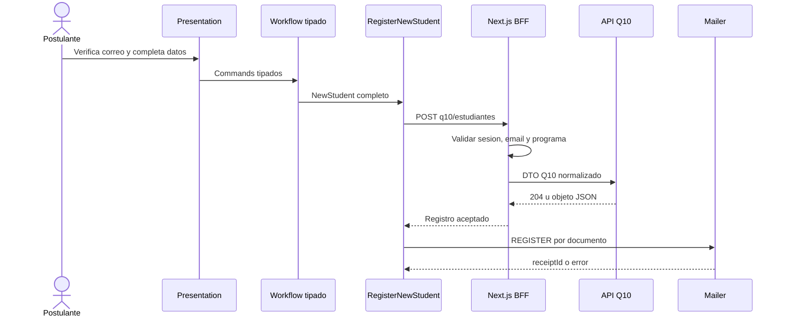

# ADR-015 Workflow Tipado y Validacion Server-Side Para Alumno Nuevo

- Estado: Aceptado.
- Fecha: 2026-08-05.

## Contexto

`solicitud-nuevo` conservaba el DTO de Q10 como estado Zustand, permitia setters
`unknown` y validaba superficialmente catalogos y respuestas externas. El correo
del request podia diferir del email verificado por OTP, y la pagina final afirmaba
un registro exitoso aun sin comprobante de notificacion.

## Decision

- Adoptar `NewStudent` como dominio independiente del formulario y Q10.
- Separar FormModel, command, dominio, DTO externo y respuesta de comando.
- Sustituir el store generico por un workflow discriminado con commands tipados.
- Consultar y validar programas Q10 exclusivamente en servidor.
- Revalidar el programa seleccionado inmediatamente antes del registro.
- Usar como email autoritativo la sesion OTP con proposito `NUEVO`.
- Aceptar como confirmacion Q10 un `204` o un objeto JSON; rechazar otros cuerpos.
- Bloquear reenvios cuando el resultado de escritura sea indeterminado.
- Tratar el fallo posterior de correo como exito parcial y reintentar solo `REGISTER`.
- Mantener el filtro actual de programas como compatibilidad, pendiente de validacion funcional.

## Consecuencias

- La UI ya no conoce los nombres de campos Q10.
- Un catalogo vacio es un estado funcional; uno mal formado activa `error.tsx`.
- Una respuesta de red ambigua no se reintenta automaticamente por riesgo de duplicidad.
- El comprobante final confirma aceptacion HTTP del correo, no entrega SMTP.
- La consulta sigue limitada a 30 programas y conserva exclusiones por nombre sin una regla administrativa confirmada.
