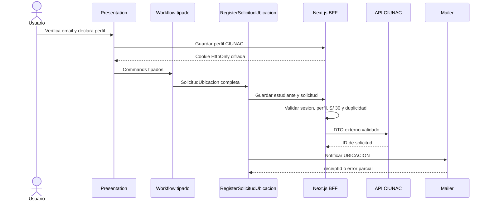

# ADR-016 Workflow Tipado y Validacion Server-Side Para Solicitud de Ubicacion

- Estado: Aceptado.
- Fecha: 2026-08-10.

## Contexto

`solicitud-ubicacion` compartia `Partial<Isolicitud>`, setters `unknown`, servicios
genericos y modelos opcionales con certificados. La condicion CIUNAC viajaba en un
query string manipulable, el precio E2E estaba desactualizado y las respuestas y
archivos externos no se validaban de forma especifica antes de continuar.

## Decision

- Adoptar `SolicitudUbicacion` como dominio independiente del formulario y DTO.
- Sustituir el store global por un workflow discriminado y commands tipados.
- Mantener `FinData` y `finInfoSchema` como politica comun de pago.
- Fijar el tipo de solicitud en `7` y la tarifa oficial en S/ 30.00.
- Exigir que el tarifario externo y el monto enviado coincidan con S/ 30.00.
- Asociar el perfil CIUNAC a la sesion OTP `UBICACION` mediante cookie cifrada
  `HttpOnly`, en lugar de confiar en query strings.
- Revalidar perfil, precio y duplicidad en el BFF antes de crear la solicitud.
- Validar en servidor extension, MIME, tamano y firma binaria del documento de
  identidad, voucher y certificado academico.
- Tratar el fallo posterior de correo como exito parcial y reintentar solo la
  notificacion.
- Mantener el cargo en A4, pero generarlo solo desde un modelo completo validado.

## Consecuencias

- Ubicacion deja de depender del store, interfaces y servicios legacy compartidos
  con certificados.
- El usuario no puede activar el perfil CIUNAC ni alterar el precio mediante URL o
  payload sin que el BFF lo detecte.
- Un tarifario distinto de S/ 30 se trata como inconsistencia de configuracion y
  bloquea el registro.
- La declaracion de alumno CIUNAC sigue siendo autorreportada; no prueba matricula.
- La cookie protege el flujo normal, pero una autoridad definitiva sobre la
  condicion CIUNAC requiere validacion del backend institucional.
- El comprobante de correo confirma aceptacion HTTP, no entrega SMTP.

## Evolucion

ADR-023 conserva estas reglas y agrega APIs publicas, composition roots y limites
ESLint. Las factories de application y los imports directos a infrastructure fueron
retirados sin cambiar los contratos funcionales aqui definidos.
