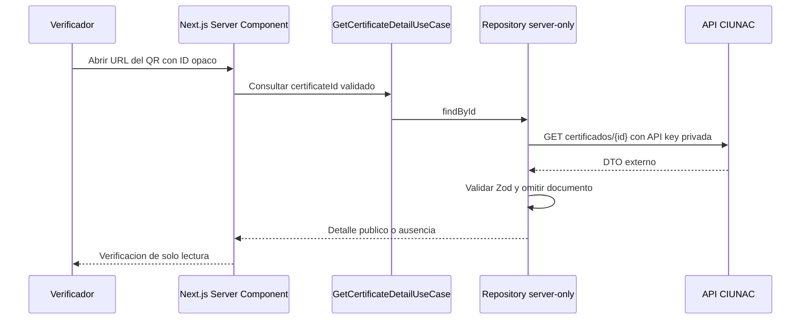

# ADR-017 Acceso Publico al Certificado Mediante QR

## Estado

Aceptado e implementado el 2026-08-10. Reemplaza la autorizacion por sesion y
documento definida en ADR-011, sin reemplazar su arquitectura modular ni sus
contratos tipados.

## Contexto

El QR impreso en un certificado contiene una URL
`/consulta-certificado/{certificateId}`. La fase de seguridad hizo depender esta
ruta de una sesion creada por `consulta-solicitud`, por lo que un tercero que
escaneaba un QR valido era redirigido antes de consultar el certificado.

Los certificados historicos tambien pueden devolver `numeroDocumento: null` y
`aceptado: null`. Ninguno de estos valores debe impedir la verificacion publica:
el documento no se presenta y una aceptacion nula representa entrega pendiente.

## Decision

- El identificador opaco del QR funciona como localizador publico de solo lectura.
- La ruta no exige sesion, CAPTCHA ni documento del usuario.
- El ID se limita a letras, numeros, guion y guion bajo, hasta 80 caracteres.
- La API key y la llamada `GET certificados/{id}` permanecen exclusivamente en
  servidor mediante `ciunacRequest`, con `no-store` y timeout.
- El BFF generico no se convierte en publico; el navegador no llama al proveedor.
- `numeroDocumento` se ignora en el contrato publico y no se mapea al dominio ni
  a presentacion.
- `aceptado: null` o ausente se normaliza como estado pendiente.
- La ruta publica se marca `noindex, nofollow`.

## Consecuencias

- Un QR valido funciona sin pasar por `consulta-solicitud`.
- El nombre, notas y metadatos visibles se consideran informacion publica de
  verificacion del certificado.
- No se habilitan descarga, aceptacion ni mutaciones desde esta ruta.
- Un ID invalido, `404` o respuesta vacia muestra `not-found`; una respuesta mal
  formada conserva el error reintentable.
- La ruta raiz explica que la consulta se inicia escaneando el QR.
