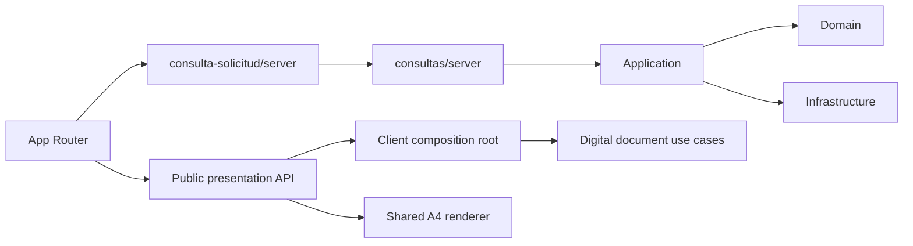

# ADR-018 Limites Modulares Para Consulta de Solicitudes

## Estado

Aceptado e implementado.

## Contexto

`consulta-solicitud` ya utilizaba modelos tipados, pero la ruta App Router componia
el caso de uso mediante imports profundos. La presentacion de documentos digitales
consumia directamente un repository y el cargo de constancias reutilizaba el
dominio y el PDF interno de `solicitud-certificado`.

Los cargos de certificado, constancia y ubicacion repetian exactamente el formato
A4, encabezado institucional y estilos. Sus titulos, textos y reglas posteriores
al pago continuan siendo decisiones propias de cada flujo.

## Decision

- Exponer `modules/consultas` mediante `@/modules/consultas` y
  `@/modules/consultas/server`.
- Exponer `consulta-solicitud` mediante `@/modules/consulta-solicitud` y
  `@/modules/consulta-solicitud/server`.
- Organizar documentos digitales en `domain`, `application`, `infrastructure` y
  `presentation`.
- Usar `client.tsx` como composition root cliente, sin convertirlo en una quinta
  capa de negocio.
- Inferir los DTOs desde sus schemas Zod.
- Centralizar exclusivamente el formato visual de los cargos en
  `AdministrativeCargoPdf`.
- Mantener titulo, introduccion, campos y textos finales en cada feature.
- Aplicar restricciones ESLint solo al feature estabilizado.

## Consecuencias

- Las rutas no conocen factories, repositories ni componentes internos.
- Presentacion no importa infraestructura ni modelos de dominio directamente.
- Certificados, constancias y consulta de solicitudes no se importan entre si.
- Un cambio de formato institucional de los cargos se realiza en un unico lugar.
- Las variantes conservan control sobre sus textos y reglas funcionales.
- La pagina de resultados continua obteniendo sus datos como Server Component.

## Limites

- El BFF generico todavia no demuestra que el documento digital solicitado
  pertenece al documento consultado antes de devolver su URL.
- `consulta-ubicacion` ya consume exclusivamente las APIs publicas de consultas,
  segun ADR-019. Seguridad conserva sus adaptadores propios fuera de este alcance.
- No se modifican contratos HTTP ni reglas de aceptacion de documentos.

## Alternativas

- Copiar un PDF dentro de `consulta-solicitud`: descartado por duplicar el formato.
- Importar las APIs de certificado y constancia: descartado porque conservaria el
  acoplamiento entre features.
- Mover reglas de certificados y constancias a `shared`: descartado porque shared
  solo debe contener el renderer visual estable.
