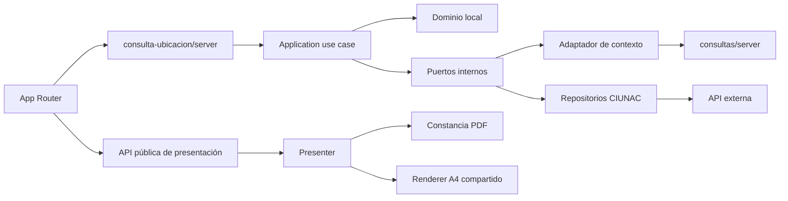

# ADR-019 Límites Modulares Para Consulta de Ubicación

## Estado

Aceptado e implementado.

## Contexto

`consulta-ubicacion` ya ejecutaba el join de solicitudes, notas, exámenes y ciclos
en servidor, pero su dominio y aplicación importaban contratos internos de
`modules/consultas`. La vista importaba el cargo interno de
`solicitud-ubicacion`, que volvía a consultar `solicitudes/{id}` aunque la
solicitud activa ya estaba disponible.

Los DTOs de ubicación duplicaban los tipos definidos por Zod y las rutas App
Router componían factories y componentes mediante imports profundos.

## Decisión

- Exponer presentación desde `@/modules/consulta-ubicacion`.
- Exponer composición server-only desde `@/modules/consulta-ubicacion/server`.
- Mantener modelos locales de solicitud, textos, notas, exámenes, ciclos y cargo.
- Consumir el contexto común solo mediante `@/modules/consultas/server`, dentro
  del adaptador de infraestructura.
- Inferir DTOs externos desde los schemas Zod.
- Construir el cargo con la solicitud activa ya consultada.
- Mantener el formato específico de la constancia en presentation.
- Reutilizar únicamente el renderer visual A4 `AdministrativeCargoPdf`.
- Aplicar restricciones ESLint por capa solo al feature estabilizado.

## Consecuencias

- Dominio y aplicación no dependen de otros features.
- La infraestructura traduce el resultado público de consultas al dominio local.
- Presentación no importa dominio, infraestructura ni módulos de registro.
- El estado sin notas conserva la descarga del cargo sin ejecutar
  `GET solicitudes/{id}`.
- La tarifa mostrada en el cargo proviene de la solicitud activa y la cobertura
  automatizada usa el precio oficial de S/ 30.00.
- Las rutas solo conocen las entradas públicas `index.ts` y `server.ts`.

## Límites

- La sesión de consulta `EXAMEN` continúa siendo responsabilidad de seguridad.
- La fuente Roboto remota del PDF permanece como deuda técnica.
- La veracidad académica de notas y constancias continúa siendo responsabilidad
  del backend externo.

## Alternativas

- Reutilizar el cargo interno de `solicitud-ubicacion`: descartado por acoplar
  features y repetir una consulta ya resuelta.
- Copiar el formato A4 completo: descartado porque el renderer visual ya tiene un
  contrato compartido estable.
- Mover reglas de ubicación a `shared`: descartado porque no son transversales.
