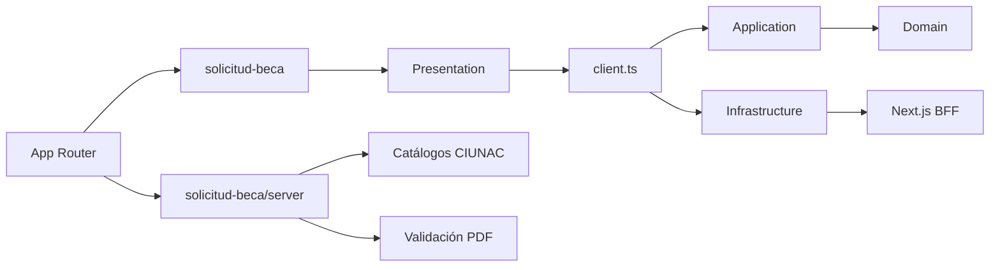

# ADR-020 Límites Modulares Para Solicitud de Beca

## Estado

Aceptado e implementado.

## Contexto

`solicitud-beca` ya disponía de dominio, workflow tipado, gateways y validación
runtime, pero mantenía límites incompletos: una factory dentro de application
instanciaba infraestructura, los schemas estaban fuera de las cuatro capas y las
rutas App Router y el BFF consumían archivos internos.

La política PDF de dominio dependía del tipo browser `File` y devolvía mensajes de
presentación. Los DTOs de respuestas y catálogos duplicaban los tipos inferibles
desde sus schemas Zod.

## Decisión

- Exponer presentación desde `@/modules/solicitud-beca`.
- Exponer catálogos y validación de uploads desde
  `@/modules/solicitud-beca/server`.
- Componer gateways y caso de uso en `@/modules/solicitud-beca/client`.
- Mantener los schemas React Hook Form dentro de presentation y la validación del
  command dentro de application.
- Conservar manualmente solo `ScholarshipRequestDto`, porque representa el contrato
  enviado al backend, incluido `contancia_tercio`.
- Inferir DTOs de respuesta y catálogos desde Zod.
- Representar la política PDF con metadatos neutrales y códigos de violación; la
  presentación y la infraestructura traducen esos códigos en sus respectivas
  fronteras.
- Aplicar reglas ESLint exclusivamente al feature estabilizado.

## Consecuencias

- Application deja de importar infraestructura.
- Las rutas y el Route Handler dejan de usar imports profundos.
- Dominio no conoce React, Next.js, HTTP, `File` ni mensajes de interfaz.
- Presentación no consume infraestructura ni otros features.
- Becas permanece independiente de certificados y constancias.
- OTP, CAPTCHA, sesión, finalización y notificación continúan como capacidades
  compartidas estables.

## Límites

- El backend externo debe validar la propiedad de las URLs cargadas.
- La aceptación HTTP del correo no garantiza entrega SMTP.
- La infraestructura compartida de uploads continúa en el Route Handler genérico;
  el feature solo expone su política específica mediante `server.ts`.

## Alternativas

- Mover documentos de beca a `shared`: descartado porque sus cinco documentos y
  reglas no son transversales.
- Mantener la factory en application: descartado porque invierte la dirección de
  dependencias.
- Duplicar OTP o finalización dentro del feature: descartado porque sus contratos
  compartidos ya están estabilizados.
