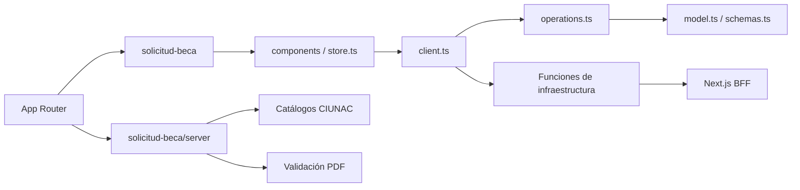

# ADR-020 Límites Modulares Para Solicitud de Beca

## Estado

Aceptado, implementado y simplificado el 2026-09-01.

Revision del paso 5: 2026-09-23. Se conserva la simplificacion funcional previa y
se ordenan los archivos sin imponer una jerarquia por capa.

## Contexto

`solicitud-beca` ya disponía de dominio, workflow tipado, gateways y validación
runtime, pero mantenía límites incompletos: una factory dentro de application
instanciaba infraestructura, los schemas estaban fuera de las cuatro capas y las
rutas App Router y el BFF consumían archivos internos.

La política PDF de dominio dependía del tipo browser `File` y devolvía mensajes de
presentación. Los DTOs de respuestas y catálogos duplicaban los tipos inferibles
desde sus schemas Zod.

## Decisión

- Exponer presentación desde `@/modules/solicitud-beca`.
- Exponer catálogos y validación de uploads desde
  `@/modules/solicitud-beca/server`.
- Componer funciones de aplicacion e infraestructura en
  `@/modules/solicitud-beca/client`.
- Mantener los schemas React Hook Form en `components/` y la validacion de la
  solicitud completa en `schemas.ts`, junto con `model.ts`, `operations.ts` y
  `store.ts` en la raiz del feature.
- Definir `ScholarshipRequestDto` desde el schema Zod que representa el contrato
  enviado al backend, incluido `contancia_tercio`.
- Inferir DTOs de respuesta y catálogos desde Zod.
- Representar la política PDF con metadatos neutrales y códigos de violación; la
  presentación y la infraestructura traducen esos códigos en sus respectivas
  fronteras.
- Mantener las reglas ESLint consolidadas del paso 2; reconocen responsabilidades
  tanto en carpetas por capa como en esta estructura pragmatica.
- Evitar commands, ports y clases gateway de un solo metodo cuando una funcion con
  dependencias inyectables conserva la misma separacion y capacidad de prueba.
- Revalidar en el BFF la relacion facultad-escuela y sustituir nombres y periodo
  por valores autoritativos antes de persistir.

```mermaid
flowchart LR
    Route["App Router"] --> Public["solicitud-beca"]
    Route --> Server["solicitud-beca/server"]
    Public --> UI["components / store.ts"]
    UI --> Client["client.ts"]
    Client --> UseCase["operations.ts"]
    UseCase --> Domain["model.ts / schemas.ts"]
    Client --> Adapters["Funciones de infraestructura"]
    Server --> Catalogs["Catálogos CIUNAC"]
    Server --> Upload["Validación PDF"]
    Adapters --> BFF["Next.js BFF"]
```

## Consecuencias

- Application deja de importar infraestructura.
- Las rutas y el Route Handler dejan de usar imports profundos.
- Dominio no conoce React, Next.js, HTTP, `File` ni mensajes de interfaz.
- Presentación no consume infraestructura ni otros features.
- Becas permanece independiente de certificados y constancias.
- OTP, CAPTCHA, sesión, finalización y notificación continúan como capacidades
  compartidas estables.
- La solicitud se valida una vez en aplicacion y otra en el BFF, que es la frontera
  no confiable. Los formularios conservan sus schemas especificos de presentacion.
- Los errores normalizados mantienen codigo, status, correlation ID y capacidad de
  reintento al atravesar el adaptador de becas.
- El reintento publico llama directamente al adaptador de correo: se retira la
  funcion interior que solo delegaba. No se agrega otro registro ni otra carga.
- El adaptador deja de reconstruir `AppError`: conserva tambien `details`, causa
  y un `retryable: false` explicito, antes sobrescrito para ciertos errores.
- Se mantienen 24 archivos porque mapper, politica PDF pura, validador binario,
  catalogo y validacion academica tienen responsabilidades reales. No se fuerza
  una reduccion artificial de archivos ni se mezclan contratos con componentes.

## Límites

- El backend externo debe validar la propiedad de las URLs cargadas.
- La revalidacion autoritativa agrega lecturas de facultades y escuelas al registrar;
  si esos catalogos no estan disponibles, la escritura se bloquea con `503`.
- La aceptación HTTP del correo no garantiza entrega SMTP.
- La infraestructura compartida de uploads continúa en el Route Handler genérico;
  el feature solo expone su política específica mediante `server.ts`.

## Alternativas

- Mover documentos de beca a `shared`: descartado porque sus cinco documentos y
  reglas no son transversales.
- Mantener la factory en application: descartado porque invierte la dirección de
  dependencias.
- Duplicar OTP o finalización dentro del feature: descartado porque sus contratos
  compartidos ya están estabilizados.
