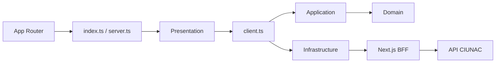

# ADR-021 Limites Modulares Para Solicitud de Certificados

- Estado: Aceptado.
- Fecha: 2026-08-13.

## Contexto

El feature ya contaba con dominio, workflow tipado y validacion runtime, pero sus
limites no estaban estabilizados. App Router importaba repositories y componentes
internos, presentacion ejecutaba infraestructura directamente y una factory dentro
de application componia gateways concretos. Los DTOs de respuesta duplicaban los
schemas Zod y existian dos adaptadores para la integracion de estudiantes.

## Decision

- Exponer presentacion mediante `@/modules/solicitud-certificado`.
- Exponer catalogos y validacion BFF mediante
  `@/modules/solicitud-certificado/server`.
- Usar `@/modules/solicitud-certificado/client` como composition root del navegador.
- Mantener en application los puertos y casos de uso de registro, busqueda de
  estudiante y consulta de cargo.
- Consolidar guardar, actualizar y buscar estudiante en un solo gateway.
- Conservar request DTOs explicitos e inferir respuestas externas desde Zod.
- Mantener `FinData`, voucher, OTP, CAPTCHA, comprobante de correo y renderer A4
  como capacidades shared estables.
- Aplicar restricciones ESLint exclusivamente al feature estabilizado.

## Consecuencias

- Rutas y BFF dejan de conocer componentes, schemas, repositories y gateways.
- Presentacion no ejecuta infraestructura directamente.
- Application ya no compone implementaciones externas.
- Certificados y constancias permanecen independientes; solo comparten contratos
  transversales estables.
- El precio sigue siendo autorizado en el BFF y el backend externo conserva sus
  contratos y responsabilidad final sobre las escrituras.
