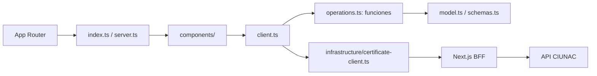

# ADR-021 Limites Modulares Para Solicitud de Certificados

- Estado: Aceptado.
- Fecha: 2026-08-13.
- Revision pragmatica: 2026-09-22 (paso 3).

## Contexto

El feature ya contaba con dominio, workflow tipado y validacion runtime, pero sus
limites no estaban estabilizados. App Router importaba repositories y componentes
internos, presentacion ejecutaba infraestructura directamente y una factory dentro
de application componia gateways concretos. Los DTOs de respuesta duplicaban los
schemas Zod y existian dos adaptadores para la integracion de estudiantes.

## Decision

- Exponer presentacion mediante `@/modules/solicitud-certificado`.
- Exponer catalogos y validacion BFF mediante
  `@/modules/solicitud-certificado/server`.
- Usar `@/modules/solicitud-certificado/client` como composition root del navegador.
- Expresar registro, busqueda y cargo como funciones en `operations.ts`, con
  dependencias inyectadas, sin clases o archivos de ports de un solo metodo.
- Consolidar las cinco operaciones HTTP en `infrastructure/certificate-client.ts`.
- Inferir el DTO de solicitud y respuestas desde Zod. El DTO de estudiante queda
  junto al mapper que lo construye, sin duplicar el contrato BFF compartido.
- Mantener `FinData`, voucher, OTP, CAPTCHA, comprobante de correo y renderer A4
  como capacidades shared estables.
- Usar la regla ESLint unificada de dependencias; `model.ts` y `schemas.ts` siguen
  libres de React, stores y transporte.

La revision conserva las APIs publicas y las cuatro responsabilidades, no la
obligacion de representarlas con carpetas anidadas. Se mantienen Zustand, mappers,
validacion de precio server-side y PDF diferido porque tienen responsabilidades
reales. El resumen construye un borrador tipado con guardas de presencia; la
validacion completa ocurre al registrar y, de forma independiente, en el BFF.

```mermaid
flowchart LR
    Route["App Router"] --> Public["index.ts / server.ts"]
    Public --> UI["components/"]
    UI --> Client["client.ts"]
    Client --> UseCases["operations.ts: funciones"]
    UseCases --> Domain["model.ts / schemas.ts"]
    Client --> Gateways["infrastructure/certificate-client.ts"]
    Gateways --> BFF["Next.js BFF"]
    BFF --> API["API CIUNAC"]
```

## Consecuencias

- Rutas y BFF dejan de conocer componentes, schemas, repositories y gateways.
- Presentacion no ejecuta infraestructura directamente.
- Application ya no compone implementaciones externas.
- Certificados y constancias permanecen independientes; solo comparten contratos
  transversales estables.
- El precio sigue siendo autorizado en el BFF y el backend externo conserva sus
  contratos y responsabilidad final sobre las escrituras.
- El feature pasa de 31 a 22 archivos y de siete clases a ninguna. Los reintentos
  de correo conservan el ID y no vuelven a guardar estudiante, voucher o solicitud.
- Se preservan categoria, status, correlationId y retryable del error de correo,
  en lugar de convertirlo siempre en EXTERNAL_SERVICE.
