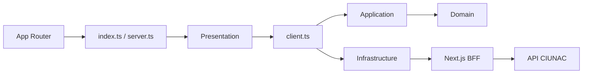

# ADR-022 Limites Modulares de Solicitud de Constancias

## Estado

Aceptado e implementado.

## Contexto

`solicitud-constancia` ya tenia dominio y workflow propios, pero sus componentes
consultaban repositories y stores globales directamente. App Router importaba
dominio, schemas de infraestructura y componentes internos. La composicion del
caso de uso estaba ubicada dentro de infraestructura y los DTOs de respuesta
duplicaban las estructuras validadas con Zod.

Aunque no existian imports hacia `solicitud-certificado`, la falta de una API
publica permitia que ese acoplamiento reapareciera. El BFF tampoco revalidaba el
precio vigente de los tipos `5` y `6` antes de persistir.

## Decision

Mantener el feature independiente y aplicar cuatro capas con tres entradas
publicas:

- `@/modules/solicitud-constancia`: proceso y componentes de finalizacion.
- `@/modules/solicitud-constancia/client`: composicion browser-side de casos de uso.
- `@/modules/solicitud-constancia/server`: catalogos y validacion de precio server-only.

Los catalogos de tipos `5` y `6`, idiomas, facultades, escuelas y textos se cargan
en Server Components, se validan como `unknown` y se mapean a
`ConstanciaCatalogs`. Presentation ya no consume stores globales de catalogos.

Los contratos de escritura permanecen como DTOs explicitos. Las respuestas de
estudiante, solicitud, catalogos y cargo se infieren desde sus schemas Zod. Los
casos de uso de lectura validan documento e identificador antes de llamar sus
puertos.

El BFF consulta el tarifario vigente y compara el precio en centimos antes de
reenviar solicitudes de tipos `5` y `6`. Un monto distinto devuelve
`409 PRICE_CHANGED` y no alcanza la API externa.

## Dependencias Compartidas

Se mantienen `FinData`, `finInfoSchema`, upload de voucher, OTP/CAPTCHA, sesion,
comprobante de correo, errores normalizados y `AdministrativeCargoPdf`. Ninguno
contiene reglas exclusivas de constancias o certificados.

## Consecuencias

- Presentation deja de depender de infrastructure.
- App Router y el BFF consumen unicamente APIs publicas.
- Constancias y certificados continuan sin imports mutuos.
- Un catalogo vacio, mal formado o inconsistente detiene el flujo antes de la UI.
- El pago se conserva al editar datos que no cambian documento ni tipo.
- La validacion server-side agrega una consulta al tarifario antes de persistir.

## Alternativas

- Reutilizar internals de certificados: descartado por acoplamiento entre features.
- Mantener catalogos en stores globales: descartado por estado difuso y errores
  indistinguibles de listas vacias.
- Crear una abstraccion generica de solicitudes: descartado porque los contratos de
  registro todavia difieren y no estan estabilizados.
