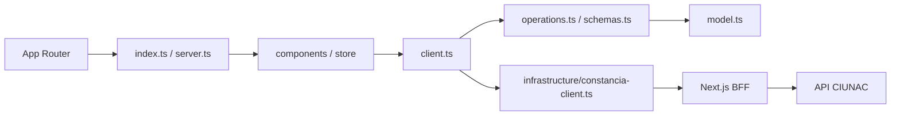

# ADR-022 Limites Modulares de Solicitud de Constancias

## Estado

Aceptado e implementado. Revisado el 2026-09-23 durante el paso 4 pragmatico.

## Contexto

`solicitud-constancia` ya tenia dominio y workflow propios, pero sus componentes
consultaban repositories y stores globales directamente. App Router importaba
dominio, schemas de infraestructura y componentes internos. La composicion del
caso de uso estaba ubicada dentro de infraestructura y los DTOs de respuesta
duplicaban las estructuras validadas con Zod.

Aunque no existian imports hacia `solicitud-certificado`, la falta de una API
publica permitia que ese acoplamiento reapareciera. El BFF tampoco revalidaba el
precio vigente de los tipos `5` y `6` antes de persistir.

## Decision

Mantener el feature independiente y cuatro responsabilidades, sin imponer
carpetas, clases o ports por cada operacion. Se conservan tres entradas publicas:

- `@/modules/solicitud-constancia`: proceso y componentes de finalizacion.
- `@/modules/solicitud-constancia/client`: composicion browser-side de operaciones.
- `@/modules/solicitud-constancia/server`: catalogos y validacion de precio server-only.

```mermaid
flowchart LR
    Route["App Router"] --> Public["index.ts / server.ts"]
    Public --> Presentation["components / store"]
    Presentation --> Client["client.ts"]
    Client --> Application["operations.ts / schemas.ts"]
    Application --> Domain["model.ts"]
    Client --> Infrastructure["infrastructure/constancia-client.ts"]
    Infrastructure --> BFF["Next.js BFF"]
    BFF --> API["API CIUNAC"]
```

Los catalogos de tipos `5` y `6`, idiomas, facultades, escuelas y textos se cargan
en Server Components, se validan como `unknown` y se mapean a
`ConstanciaCatalogs`. Presentation ya no consume stores globales de catalogos.

El DTO de solicitud se infiere de `constanciaRequestDtoSchema`; el contrato de
estudiante permanece local a su mapper. Respuestas y catalogos se infieren desde
Zod. `operations.ts` contiene registro y lecturas como funciones con dependencias
inyectables. `infrastructure/constancia-client.ts` agrupa las cinco operaciones
HTTP; catalogos, precio, schemas externos y mappers conservan archivos propios.

`model.ts`, `schemas.ts` y `store.ts` quedan en la raiz; `components/` agrupa UI,
schema de formulario, hook y mapper de presentacion. Se eliminan siete clases,
el command envoltorio y los ports triviales: 31 archivos pasan a 22. No se crea
una abstraccion compartida de registro con certificados.

La confirmacion construye el borrador completo mediante guardas de presencia,
sin parse completo por render ni casts. La validacion completa continua al
registrar y de forma independiente en el BFF. El store conserva sus transiciones.

El fallo de correo conserva la referencia persistida y la categoria, status,
correlationId y retryable del error original. El reintento publico solo notifica.

El BFF consulta el tarifario vigente y compara el precio en centimos antes de
reenviar solicitudes de tipos `5` y `6`. Un monto distinto devuelve
`409 PRICE_CHANGED` y no alcanza la API externa.

## Dependencias Compartidas

Se mantienen `FinData`, `finInfoSchema`, upload de voucher, OTP/CAPTCHA, sesion,
comprobante de correo, errores normalizados y `AdministrativeCargoPdf`. Ninguno
contiene reglas exclusivas de constancias o certificados.

## Consecuencias

- Presentation deja de depender de infrastructure.
- App Router y el BFF consumen unicamente APIs publicas.
- Constancias y certificados continuan sin imports mutuos.
- Un catalogo vacio, mal formado o inconsistente detiene el flujo antes de la UI.
- El pago se conserva al editar datos que no cambian documento ni tipo.
- La validacion server-side agrega una consulta al tarifario antes de persistir.

## Alternativas

- Reutilizar internals de certificados: descartado por acoplamiento entre features.
- Mantener catalogos en stores globales: descartado por estado difuso y errores
  indistinguibles de listas vacias.
- Crear una abstraccion generica de solicitudes: descartado porque los contratos de
  registro todavia difieren y no estan estabilizados.
- Conservar una clase por integracion: descartado en el paso 4 porque delegaban
  en una sola operacion sin aportar comportamiento. Las funciones mantienen la
  frontera HTTP, validacion runtime y facilidad de pruebas.
