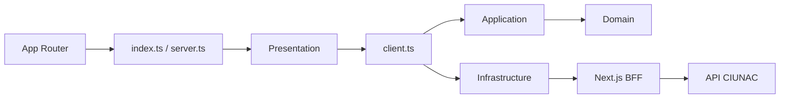

# ADR-023 Limites Modulares de Solicitud de Ubicacion

## Estado

Aceptado e implementado.

## Contexto

`solicitud-ubicacion` ya tenia dominio y workflow tipados, pero application
importaba DTOs de infraestructura y componia gateways mediante factories. Varios
componentes consumian repositories directamente, mientras App Router, el BFF y el
Route Handler del perfil importaban archivos internos del feature.

Las politicas de archivos dependian del tipo navegador `File` y devolvian mensajes
de interfaz. El certificado academico tambien se validaba indirectamente como un
documento de beca porque ambos conservan el endpoint historico `upload/becas`.

## Decision

Mantener ubicacion como feature independiente con cuatro capas y tres entradas:

- `@/modules/solicitud-ubicacion`: componentes publicos de presentacion.
- `@/modules/solicitud-ubicacion/client`: composition root de casos de uso cliente.
- `@/modules/solicitud-ubicacion/server`: catalogos, perfil y validaciones server-only.

Los puertos usan modelos internos y no DTOs externos. Alta, actualizacion y
consulta de estudiante comparten un gateway; el cargo dispone de puerto y caso de
uso propios. Los DTOs de escritura permanecen explicitos y las respuestas se
infieren desde Zod.

Las politicas de DNI y certificado academico reciben metadatos puros y devuelven
codigos de violacion. Presentacion los traduce a mensajes y el servidor a errores
seguros. El BFF selecciona el validador academico de ubicacion cuando la sesion OTP
es `UBICACION`, aunque el endpoint externo siga llamandose `upload/becas`.

## Consecuencias

- Application deja de depender de infrastructure.
- Presentation deja de consumir gateways o repositories.
- App Router y Route Handlers consumen solo APIs publicas.
- Seguridad compartida deja de importar schemas internos de ubicacion.
- Certificados, constancias y ubicacion permanecen sin imports mutuos.
- Pago, voucher, OTP/CAPTCHA y renderer A4 siguen siendo capacidades compartidas.
- El nombre historico `upload/becas` permanece como deuda del contrato backend.

## Alternativas

- Crear una solicitud generica compartida: descartado porque los dominios y DTOs
  todavia tienen reglas diferentes.
- Compartir internals con certificados o constancias: descartado por acoplamiento.
- Mantener factories en application: descartado por invertir la direccion de
  dependencias.
