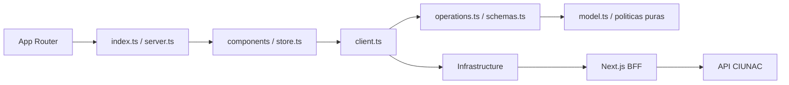

# ADR-023 Limites Modulares de Solicitud de Ubicacion

## Estado

Aceptado e implementado.

Revision pragmatica del paso 5: 2026-09-24.

## Contexto

`solicitud-ubicacion` ya tenia dominio y workflow tipados, pero application
importaba DTOs de infraestructura y componia gateways mediante factories. Varios
componentes consumian repositories directamente, mientras App Router, el BFF y el
Route Handler del perfil importaban archivos internos del feature.

Las politicas de archivos dependian del tipo navegador `File` y devolvian mensajes
de interfaz. El certificado academico tambien se validaba indirectamente como un
documento de beca porque ambos conservan el endpoint historico `upload/becas`.

## Decision

Mantener ubicacion como feature independiente con cuatro responsabilidades y tres
entradas, sin exigir una carpeta por capa:

- `@/modules/solicitud-ubicacion`: componentes publicos de presentacion.
- `@/modules/solicitud-ubicacion/client`: composition root de casos de uso cliente.
- `@/modules/solicitud-ubicacion/server`: catalogos, perfil y validaciones server-only.

```mermaid
flowchart LR
    Route["App Router"] --> Public["index.ts / server.ts"]
    Public --> Presentation["components / store.ts"]
    Presentation --> Client["client.ts"]
    Client --> Application["operations.ts / schemas.ts"]
    Application --> Domain["model.ts / politicas puras"]
    Client --> Infrastructure["Infrastructure"]
    Infrastructure --> BFF["Next.js BFF"]
    BFF --> API["API CIUNAC"]
```

La simplificacion funcional de 2026-09-08 ya reunia las operaciones en funciones.
El paso 5 las conserva en `operations.ts`, sin reescribirlas. Registro recibe solo
las funciones de guardar estudiante, crear solicitud y enviar notificacion; las
lecturas reciben su funcion de acceso. No hay clases, command envoltorio ni archivos
de ports para contratos de una sola implementacion.

`infrastructure/location-client.ts` concentra el transporte del feature. Los
DTOs de escritura y respuesta se infieren desde Zod; los mappers conservan los
nombres externos. `client.ts` sigue componiendo dependencias sin exponerlas a UI.
Las cookies, catalogos y validadores binarios permanecen server-only y separados.

Modelo, validacion y Zustand quedan visibles en `model.ts`, `schemas.ts` y
`store.ts`. Componentes, hook, formularios, mapper y mensajes de archivos quedan
en `components/`. Las politicas tecnicas puras permanecen en `domain/`; la
validacion binaria vive en `infrastructure/server/`. Se conservan 31 archivos y
cero clases: no se fusionan responsabilidades solo para disminuir el conteo.

La duplicidad utiliza una regla pura comun en cliente y servidor, sin eliminar
ninguna comprobacion. Formulario, aplicacion y BFF validan fronteras distintas;
la pantalla de confirmacion solo construye el borrador completo y deja de ejecutar
el schema completo en cada render. El workflow Zustand se conserva porque los
pasos se desmontan y el fallo parcial de correo debe retener la solicitud guardada.

DNI exige ocho digitos; CE/pasaporte nueve caracteres alfanumericos. El BFF tambien
exige nivel basico para no CIUNAC. Al cambiar tipo o numero se invalidan identidad,
pago y certificado asociados; al cambiar tipo se limpia el numero para reiniciar
la mascara. Las busquedas obsoletas se descartan y el avance concurrente se bloquea.

Las politicas de DNI y certificado academico reciben metadatos puros y devuelven
codigos de violacion. Presentacion los traduce a mensajes y el servidor a errores
seguros. El BFF selecciona el validador academico de ubicacion cuando la sesion OTP
es `UBICACION`, aunque el endpoint externo siga llamandose `upload/becas`.

## Consecuencias

- Application deja de depender de infrastructure.
- Presentation deja de consumir gateways o repositories.
- App Router y Route Handlers consumen solo APIs publicas.
- Seguridad compartida deja de importar schemas internos de ubicacion.
- Certificados, constancias y ubicacion permanecen sin imports mutuos.
- Pago, voucher, OTP/CAPTCHA y renderer A4 siguen siendo capacidades compartidas.
- El nombre historico `upload/becas` permanece como deuda del contrato backend.
- La entrada carga tarifa, textos y cronogramas (tres GET); idiomas se carga solo
  en el proceso. Ese ajuste de App Router es anterior al paso 5; este traslado
  no modifica rutas, BFF, shared ni otros features.
- Errores de correo conservan su categoria y metadata; los del perfil se normalizan
  por status sin convertir indisponibilidad del servidor en error de formulario.
- El cargo conserva A4 y carga diferida de React PDF. No se agrega cache global.
- La propiedad definitiva de URLs cargadas sigue requiriendo soporte backend.

## Alternativas

- Crear una solicitud generica compartida: descartado porque los dominios y DTOs
  todavia tienen reglas diferentes.
- Compartir internals con certificados o constancias: descartado por acoplamiento.
- Mantener factories en application: descartado por invertir la direccion de
  dependencias.
- Conservar una clase y puerto por cada operacion: reemplazado por funciones
  inyectables; las cuatro responsabilidades no requieren cuatro jerarquias.
