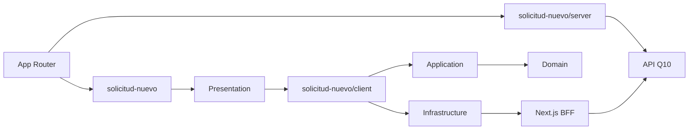

# ADR-024 Limites Modulares y APIs Publicas Para Alumno Nuevo

- Estado: Aceptado.
- Fecha: 2026-08-17.

## Contexto

`solicitud-nuevo` ya contaba con dominio, caso de uso, infraestructura Q10 y un
workflow tipado, pero la composicion de gateways vivia dentro de `application`.
App Router, el BFF y el modulo de seguridad importaban archivos internos del
feature. Los schemas de formulario y command compartian un directorio superior y
los DTOs de respuesta duplicaban los tipos validados por Zod.

## Decision

- Exponer presentacion desde `@/modules/solicitud-nuevo`.
- Componer gateways y caso de uso desde `@/modules/solicitud-nuevo/client`.
- Exponer catalogos y validacion BFF desde `@/modules/solicitud-nuevo/server`.
- Mantener `application` independiente de implementaciones de infraestructura.
- Ubicar la validacion del command en `application/validation` y el FormModel en
  `presentation/schemas`.
- Conservar un DTO explicito solo para el request Q10 e inferir respuestas desde
  schemas Zod.
- Reutilizar el schema OTP compartido sin generalizar la pantalla con Stepper.
- Aplicar restricciones ESLint inicialmente solo a este feature.

## Consecuencias

- Las rutas y el BFF dejan de conocer la estructura interna del feature.
- El modulo compartido de seguridad deja de depender de infraestructura de alumno
  nuevo.
- OTP, CAPTCHA y finalizacion permanecen como capacidades transversales.
- El filtro de programas Q10 y el contrato HTTP no cambian.
- La idempotencia del alta Q10 y el teardown de Playwright en Windows permanecen
  como deuda tecnica independiente.
