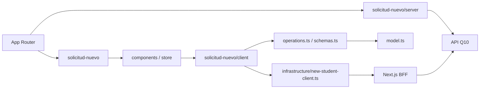

# ADR-024 Limites Modulares y APIs Publicas Para Alumno Nuevo

- Estado: Aceptado.
- Fecha: 2026-08-17.
- Revision pragmatica implementada: 2026-09-23, cierre del paso 4.

## Contexto

`solicitud-nuevo` ya contaba con dominio, caso de uso, infraestructura Q10 y un
workflow tipado, pero la composicion de gateways vivia dentro de `application`.
App Router, el BFF y el modulo de seguridad importaban archivos internos del
feature. Los schemas de formulario y command compartian un directorio superior y
los DTOs de respuesta duplicaban los tipos validados por Zod.

## Decision

- Exponer presentacion desde `@/modules/solicitud-nuevo`.
- Componer operaciones e integracion desde `@/modules/solicitud-nuevo/client`.
- Exponer catalogos y validacion BFF desde `@/modules/solicitud-nuevo/server`.
- Mantener `operations.ts` independiente de infraestructura, con funciones y
  dependencias inyectables en lugar de command envoltorio, ports y clase.
- Agrupar modelo, validacion del registro y workflow en `model.ts`, `schemas.ts`
  y `store.ts`. `components/` contiene UI, hook, formulario y mapper de presentacion.
- Inferir tambien `Q10StudentRequestDto` de su schema externo, sin cambiar campos
  ni validaciones. Mantener mapper Q10, schemas, catalogo y validacion server-side
  separados porque tienen responsabilidades distintas.
- Consolidar Q10 y correo en `infrastructure/new-student-client.ts`, conservando
  la respuesta vacia de comandos exitosos y rechazando JSON no objeto o mal formado.
- Reutilizar el schema OTP compartido sin generalizar la pantalla con Stepper.
- Conservar las restricciones ESLint consolidadas en el paso 2, compatibles con
  capas y con los archivos pragmaticos; no se relajan al mover archivos.

```mermaid
flowchart LR
    Route["App Router"] --> Public["solicitud-nuevo"]
    Route --> Server["solicitud-nuevo/server"]
    Public --> UI["components / store"]
    UI --> Client["solicitud-nuevo/client"]
    Client --> UseCase["operations.ts / schemas.ts"]
    UseCase --> Domain["model.ts"]
    Client --> Gateway["infrastructure/new-student-client.ts"]
    Server --> Q10["API Q10"]
    Gateway --> BFF["Next.js BFF"]
    BFF --> Q10
```

## Consecuencias

- El modulo pasa de 25 a 21 archivos y de tres clases delegadoras a cero.
- La confirmacion construye el alumno completo con guardas de presencia, sin
  parse durante cada render; se conserva la validacion al registrar y en el BFF.
- `registerNewStudent({ student })` y `retryNewStudentNotification(documentNumber)`
  conservan sus firmas y resultados. La referencia sigue siendo el documento,
  no un ID que Q10 no garantiza devolver.
- Correo fallido conserva codigo, status, correlationId y retryable; solo se
  reintenta notificacion, nunca se repite automaticamente una escritura Q10.
- El workflow y el bloqueo por escritura indeterminada permanecen intactos.
- Las rutas y el BFF dejan de conocer la estructura interna del feature.
- El modulo compartido de seguridad deja de depender de infraestructura de alumno
  nuevo.
- OTP, CAPTCHA y finalizacion permanecen como capacidades transversales.
- El filtro de programas Q10 y el contrato HTTP no cambian.
- La idempotencia del alta Q10 y el teardown de Playwright en Windows permanecen
  como deuda tecnica independiente.
