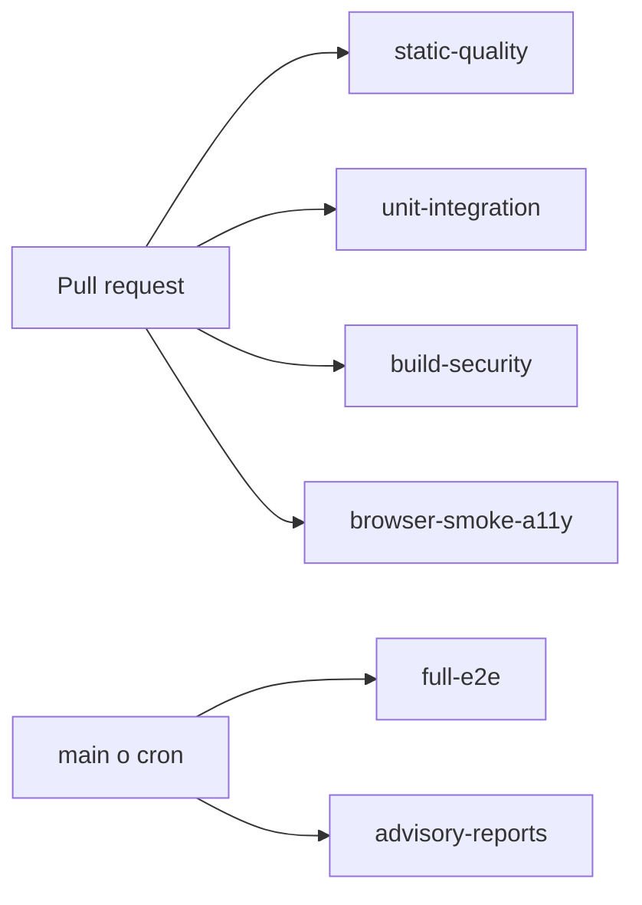

# ADR-025 Gates Automaticos de Calidad

- Estado: Aceptado e implementado.
- Fecha: 2026-08-17.

## Contexto

El repositorio tenia pruebas y verificaciones locales, pero no workflows de CI.
La ejecucion dependia de disciplina manual y no existian gates uniformes para
instalacion reproducible, calidad estatica, seguridad del bundle, accesibilidad o
auditoria de dependencias.

La auditoria inicial registra cuatro advisories altos de produccion. Corregirlos
requiere actualizar Next.js y queda fuera de esta decision para evitar mezclar
gobierno tecnico con una migracion de framework.

## Decision

- Usar GitHub Actions con Node.js `24.11.1` y `npm ci`.
- Bloquear PRs con `static-quality`, `unit-integration`, `build-security` y
  `browser-smoke-a11y`.
- Ejecutar la regresion Playwright completa despues de integrar a `main`, bajo
  demanda y de lunes a viernes a las `08:00 UTC`.
- Mantener baselines temporales, versionadas y con vencimiento para auditoria npm
  y accesibilidad. Una vulnerabilidad alta nueva, una critica o una excepcion
  vencida bloquea el gate.
- Usar Knip como gate de archivos, dependencias y referencias no declaradas. Los
  exports y tipos sin uso se publican como informe no bloqueante.
- Usar variables sinteticas en CI; no copiar credenciales reales a workflows.
- Retener reportes Playwright, axe, auditoria y Knip durante 14 dias.

## Consecuencias

- Los cuatro gates deben configurarse manualmente como checks requeridos en la
  proteccion de `main`.
- La actualizacion de seguridad de Next.js debe completarse antes del
  `2026-09-17`; el baseline no es una aceptacion permanente del riesgo.
- Axe detecta una parte de WCAG A/AA, pero no reemplaza pruebas con teclado,
  lector de pantalla ni revision humana.
- El teardown local de Playwright en Windows no condiciona CI, que ejecuta Ubuntu.
- El build conserva por ahora su dependencia de red para Google Fonts.
