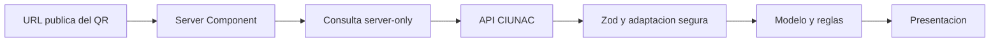

# ADR-027 Consulta Publica de Certificado Simplificada

## Estado

Aceptado e implementado el 2026-08-24. Reemplaza la estructura interna de cuatro
capas de `consulta-certificado` documentada en ADR-011, pero conserva su dominio
tipado y complementa las medidas de acceso publico de ADR-017.

## Contexto

La consulta publica realiza una unica operacion de lectura por el identificador
opaco incluido en el QR. La implementacion tenia caso de uso de clase, puerto,
repository de clase, singleton, schema, mapper y presenter, aunque solo existe un
proveedor y no hay decisiones de negocio entre varias implementaciones.

Estas abstracciones aumentaban los saltos de navegacion sin mejorar la seguridad.
Sin embargo, no era correcto regresar el acceso HTTP a la pagina ni eliminar la
validacion runtime y la minimizacion de datos.

## Decision

Usar un slice vertical con tres responsabilidades explicitas:

- `domain`: modelo publico y orden estable de notas;
- `infrastructure`: contrato Zod y adaptacion de la respuesta externa;
- `presentation`: formato visible y renderizado;
- `server.ts`: frontera server-only que valida el ID, consulta CIUNAC, traduce
  ausencia y aplica la regla de ordenamiento.

No se crea una capa `application` porque la consulta no contiene una orquestacion
o politica que justifique un caso de uso y un puerto propios. Si aparecen otro
proveedor, autorizacion compleja o varias operaciones coordinadas, esta decision
debera revisarse.

El contrato externo:

- valida solamente los campos utilizados por la verificacion publica;
- elimina campos desconocidos en lugar de propagarlos;
- nunca incorpora el numero de documento al modelo;
- comprueba que `_id` coincida con el identificador solicitado;
- normaliza entrega pendiente y fechas antes de presentacion.

Se conservan `server-only`, API key privada, `no-store`, timeout, ID con lista
blanca, estados de ruta, `noindex, nofollow` y mensajes publicos genericos.

## Consecuencias

- Se eliminan caso de uso, puerto, repository de clase, singleton y mapper
  separado.
- La API publica sigue limitada a `index.ts` y `server.ts`.
- El dominio permanece independiente de React, Next.js, HTTP y Zod.
- Una respuesta valida perteneciente a otro ID se trata como fallo del proveedor.
- El idioma visible usa el campo explicito `idioma`, no una inferencia del nombre
  del primer ciclo.

## Riesgos Pendientes

- Debe confirmarse con backend que los IDs del QR tienen entropia suficiente y no
  son enumerables.
- El rate limiting debe implementarse en backend, gateway o plataforma con un
  almacen compartido; una memoria local de una instancia serverless no es valida.
- El propietario funcional debe ratificar que nombre y notas forman parte de la
  informacion publica minima de verificacion.
- No se incorpora CAPTCHA, OTP ni sesion porque impedirian la verificacion publica
  prevista por el QR.
