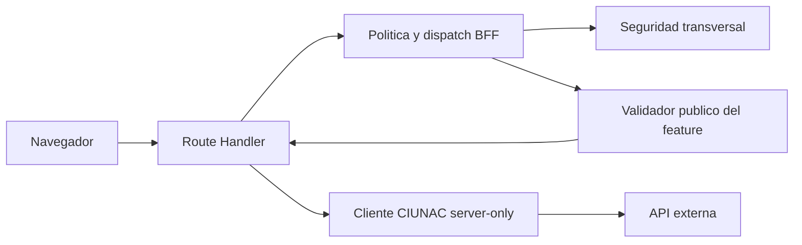

# ADR-030: Limites Pragmaticos del Modulo de Seguridad

- Estado: Aceptado
- Fecha: 2026-09-01
- Alcance: `modules/security` y Route Handlers BFF

## Contexto

`modules/security` protegia correctamente API keys, OTP, CAPTCHA y cookies, pero
tambien contenia la politica de rutas CIUNAC y schemas de certificado, constancia
y beca. El Route Handler dinamico mezclaba autorizacion, uploads, dispatch por
feature, validacion, forwarding y normalizacion. Varios payloads se parseaban dos
veces y el cliente de seguridad importaba un schema interno de consultas.

Eliminar cifrado, CAPTCHA o controles OTP habria reducido lineas a costa de la
seguridad. Crear cuatro capas dentro de seguridad tambien habria aumentado la
ceremonia sin aportar una frontera funcional nueva.

## Decision

- Mantener en `modules/security` solo capacidades transversales: OTP, CAPTCHA,
  cifrado AES-GCM, sesiones, entorno privado, cliente CIUNAC, origen, errores y
  contratos propios de los endpoints de seguridad.
- Ubicar `proxy-policy.ts` y `proxy-validation.ts` junto a
  `app/api/ciunac/[...path]`, porque describen la superficie HTTP del BFF y no el
  dominio de autenticacion.
- Hacer que cada feature valide su DTO de negocio mediante su API publica
  `server.ts` y devuelva el valor ya parseado. El BFF no repite ese parseo.
- Conservar en el BFF solamente los contratos verdaderamente transversales de
  transporte: estudiante compartido, aceptacion digital, tipo de cargo y upload.
- Centralizar correlation ID y normalizacion de errores mediante
  `handleSecurityRoute`.
- Centralizar lectura, escritura, expiracion y limpieza de cookies cifradas con
  definiciones internas, preservando todos los exports publicos existentes.
- Validar localmente en `security-client.ts` la respuesta minima
  `{ ok: true, found: boolean }`, sin importar infraestructura de otro feature.

## Consecuencias

- Las URLs, status HTTP, cuerpos, cookies y secuencias externas permanecen
  compatibles.
- El adaptador dinamico queda enfocado en composicion y no contiene reglas de
  archivos, precios, perfiles o DTOs de features.
- `modules/security/server/schemas.ts` solo declara OTP, consulta y notificacion.
- Certificados, constancias, becas, ubicacion y alumno nuevo conservan autoridad
  sobre sus contratos sin imports profundos desde el BFF.
- La politica del proxy no se reutiliza como una abstraccion general; pertenece a
  esa ruta concreta.

## Riesgos Pendientes

- El estado OTP en cookie no evita replay deliberado de una cookie valida antigua;
  la solucion requiere Redis o persistencia backend.
- La sesion de consulta todavia no demuestra por DNI la propiedad de cada
  documento digital.
- La API externa sigue siendo responsable definitivo de autorizar recursos y de
  validar la propiedad de URLs cargadas.

## Verificacion

- Caracterizacion de status, cuerpos, cookies y llamadas a proveedor.
- Unitarias de OTP y politica metodo/ruta/proposito.
- Integracion de Route Handlers, cookies, BFF y flujos de feature.
- Smoke de certificado, constancia, beca, ubicacion y alumno nuevo.
- Comprobacion de ausencia de secretos en el bundle cliente.
