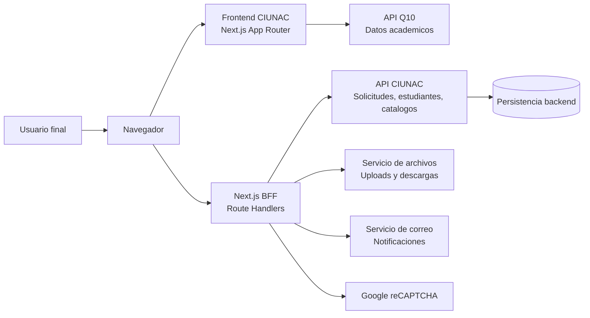
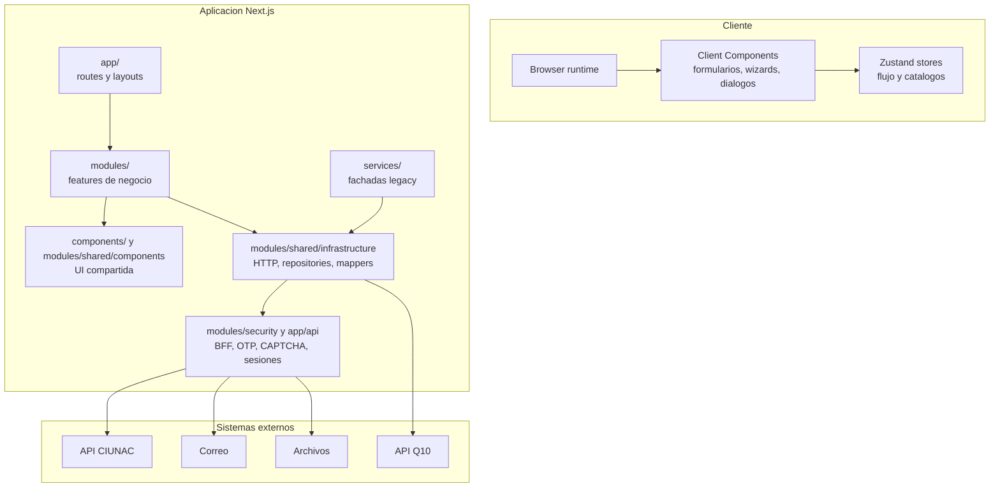
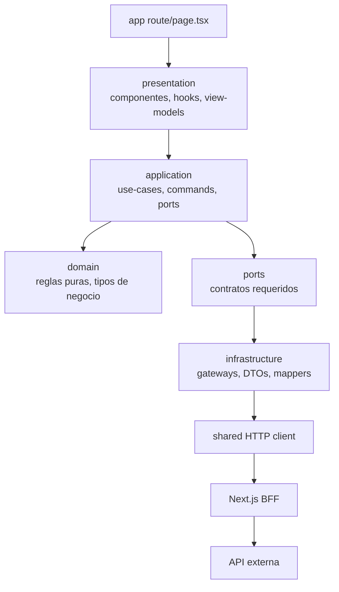
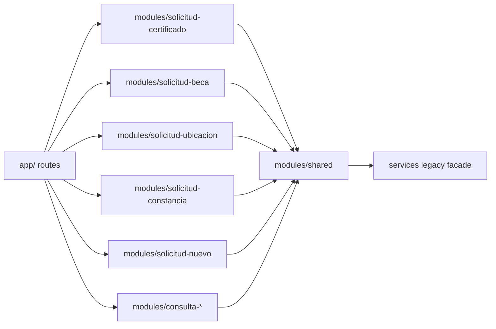
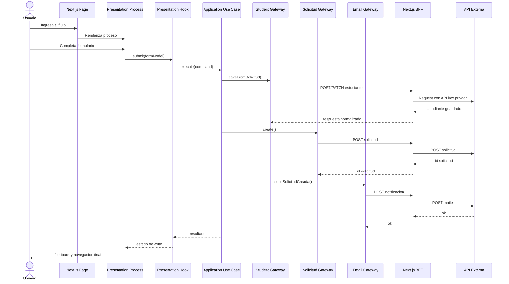
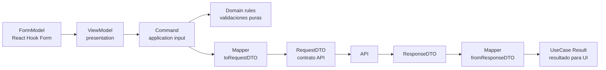
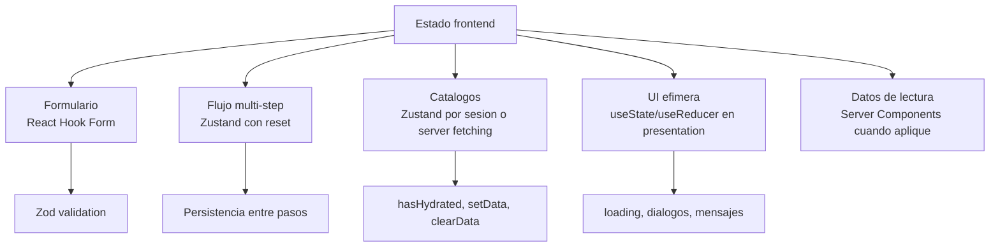
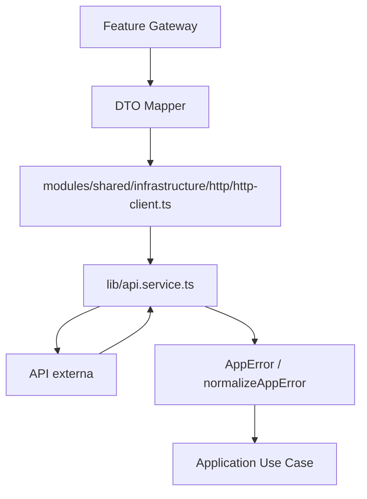
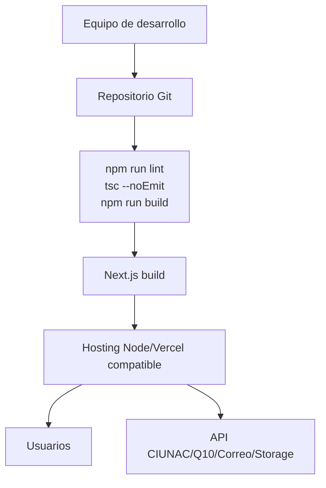
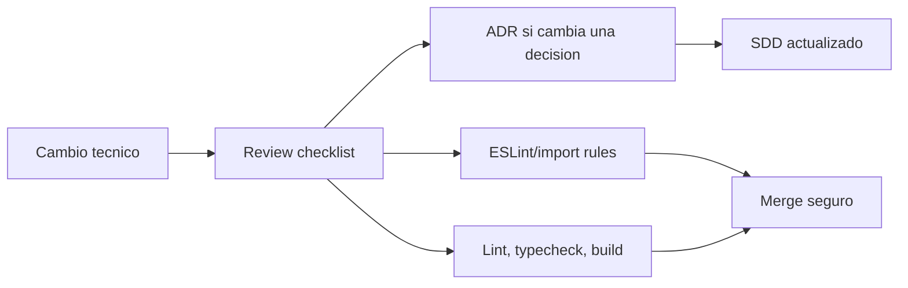

# Arquitectura Completa del Frontend CIUNAC

## 1. Proposito
Este documento describe la arquitectura completa del frontend CIUNAC despues de la refactorizacion incremental realizada por fases. Su objetivo es servir como mapa tecnico para mantenimiento, onboarding, evolucion de features y revisiones arquitectonicas.

La arquitectura actual se define como una aplicacion Next.js App Router con arquitectura modular por feature. Cada flujo critico debe separar UI, orquestacion de caso de uso, reglas de dominio e integraciones externas.

## 2. Resumen ejecutivo
- El sistema es un frontend administrativo y academico para registrar y consultar solicitudes CIUNAC.
- La aplicacion consume APIs externas para persistencia, catalogos, envio de correos, archivos y validaciones.
- La UI se implementa con Next.js, React, Tailwind CSS y shadcn/ui.
- Los formularios usan React Hook Form y Zod.
- Zustand se reserva para estado efimero entre pasos y catalogos de sesion.
- Los nuevos flujos deben seguir capas internas por feature: `presentation`, `application`, `domain`, `infrastructure`.
- `services/` queda como fachada legacy; la nueva integracion debe vivir en `modules/**/infrastructure`.
- Las credenciales, OTP, CAPTCHA y correo se resuelven en Route Handlers server-side.

## 3. Vista de contexto
El frontend no contiene la base de datos ni la logica transaccional principal. Actua como capa de experiencia, validacion de entrada, orquestacion frontend y adaptacion a contratos HTTP.



## 4. Vista de contenedores
La aplicacion se ejecuta como frontend Next.js. El navegador aloja la interaccion cliente; Next.js resuelve rutas, layouts, renderizado y empaquetado. Las integraciones se abstraen a traves de gateways y un cliente HTTP compartido.



## 5. Vista logica por capas
La regla central es mantener alta cohesion y bajo acoplamiento. La UI no debe conocer detalles HTTP; la aplicacion no debe depender de React o Next.js; el dominio debe permanecer puro; la infraestructura adapta contratos externos.



### Responsabilidades
- `app/`: rutas, layouts y composicion inicial de paginas.
- `presentation/`: render, eventos de UI, estado visual, navegacion y adaptacion a view models.
- `application/`: casos de uso, comandos, puertos y orquestacion del flujo.
- `domain/`: reglas puras de negocio frontend y tipos sin dependencias de framework.
- `infrastructure/`: gateways concretos, DTOs, mappers y adaptadores a API.
- `modules/shared/`: piezas transversales ya estabilizadas.
- `services/`: fachadas legacy para compatibilidad durante la migracion.

## 6. Vista de desarrollo
La estructura recomendada por feature es:

```text
modules/
  <feature>/
    presentation/
      components/
      hooks/
      view-models/
    application/
      commands/
      factories/
      ports/
      use-cases/
    domain/
      rules/
      types/
    infrastructure/
      api/
      dto/
      mappers/
```

Estado actual de los modulos principales:

| Modulo | Estado arquitectonico | Observacion |
| --- | --- | --- |
| `solicitud-certificado` | Refactorizado por capas | Flujo piloto y referencia principal. |
| `solicitud-beca` | Refactorizado por capas | Replica del patron con caso de uso y gateways. |
| `solicitud-ubicacion` | Refactorizado por capas | Incluye validacion de duplicidad y reglas de precio. |
| `solicitud-constancia` | Refactorizado por capas | Slice independiente con pago transversal compartido y cargo PDF propio. |
| `solicitud-nuevo` | Parcial | Mantiene componentes y store; candidato siguiente para migracion completa. |
| `consulta-*` | Parcial / legacy controlado | Mantiene componentes de consulta y algunos servicios adaptados. |
| `modules/shared` | Consolidado inicial | Errores, HTTP, repositories, mappers y componentes compartidos. |



## 7. Vista de flujo principal
Los flujos de solicitud siguen un patron vertical: el usuario completa pasos, la UI construye un comando, el caso de uso orquesta integraciones y presentation decide feedback y navegacion.



## 8. Vista de datos y contratos
El proyecto debe evitar modelos ambiguos. Cada frontera tiene su propio shape.



Reglas de datos:
- `FormModel` pertenece a formularios y schemas Zod.
- `Command` pertenece al caso de uso y expresa intencion de negocio.
- `RequestDTO` y `ResponseDTO` pertenecen a `infrastructure`.
- Los mappers son la unica zona donde se traduce entre modelos.
- La UI no debe construir payloads HTTP.

## 9. Vista de estado frontend
La politica de estado reduce complejidad accidental. No todo debe ir a Zustand.



Reglas vigentes:
- React Hook Form maneja estado de formulario.
- Zustand maneja datos entre pasos o catalogos por sesion.
- Cada store de flujo debe exponer `reset`.
- Al entrar a un proceso multi-step se reinicia el store del flujo.
- Catalogos de solo lectura son candidatos a Server Components si no requieren interaccion cliente temprana.

## 10. Vista de integracion HTTP
La infraestructura compartida centraliza acceso a API, errores, uploads y respuestas seguras.



Componentes clave:
- `HttpClient`: wrapper comun para `get`, `post`, `patch`, `postSafe` y `upload`.
- `AppError`: contrato comun para errores `VALIDATION`, `INTEGRATION`, `NETWORK` y `UNEXPECTED`.
- Repositories compartidos: recursos, correo y storage.
- Gateways por feature: implementan puertos de application y adaptan la API externa.

## 11. Vista de despliegue
La aplicacion puede desplegarse como Next.js app. El backend y servicios externos se consideran dependencias remotas.



Consideraciones:
- Mantener runtime Node.js por defecto salvo necesidad clara de Edge.
- Evitar caches en memoria si el despliegue escala horizontalmente.
- Preferir variables de entorno para endpoints y credenciales.
- Usar `next/image` y `next/font` en nuevas mejoras de performance visual.

## 12. Gobierno arquitectonico
La arquitectura se sostiene con documentacion, ADRs, reglas de lint y checklist de revision.



Documentos relacionados:
- `docs/architecture/sdd.md`
- `docs/architecture/overview.md`
- `docs/architecture/conventions.md`
- `docs/architecture/architecture-rules.md`
- `docs/architecture/refactoring-roadmap.md`
- `docs/architecture/testing-strategy.md`
- `docs/architecture/review-checklist.md`
- `docs/architecture/adr/`

## 13. Reglas de dependencia
Reglas automatizadas actuales:
- `domain` y `application` no pueden importar React.
- `domain` y `application` no pueden importar Next.js.
- `domain` y `application` no pueden importar componentes UI.
- `domain` y `application` no pueden importar stores.
- `hooks/useStore` queda retirado.

Reglas manuales:
- `presentation` no llama `fetch`, `apiFetch` ni `apiUpload`.
- `presentation` no construye DTOs de API.
- `application` orquesta usando puertos.
- `infrastructure` implementa puertos y traduce DTOs.
- `shared` solo recibe logica transversal real y estable.

## 14. Patron para agregar un nuevo flujo
Para crear o migrar un flujo nuevo:

1. Crear la ruta en `app/` como pagina delgada.
2. Crear `modules/<feature>/presentation/components/<feature>-process.tsx`.
3. Crear hooks de presentation para submit, loading, errores y navegacion.
4. Crear command del caso de uso.
5. Crear puertos de application.
6. Crear use case con orquestacion de negocio.
7. Crear reglas puras en domain si existen decisiones de negocio.
8. Crear gateways en infrastructure.
9. Crear DTOs y mappers.
10. Agregar o actualizar pruebas planificadas.
11. Validar con lint, typecheck y build.
12. Actualizar SDD o ADR si se introduce una decision nueva.

## 15. Riesgos actuales
| Riesgo | Impacto | Mitigacion |
| --- | --- | --- |
| `solicitud-nuevo` aun no sigue el patron completo | Inconsistencia entre flujos | Migrarlo como siguiente slice vertical. |
| `services/` sigue existiendo | Puede crecer deuda legacy | Mantenerlo como fachada y no agregar nueva logica ahi. |
| Falta framework de pruebas | Refactors con menor red de seguridad | Incorporar Vitest y pruebas de mappers/use cases. |
| Catalogos aun pueden cargarse en cliente por costumbre | Hidratacion y duplicidad de fetches | Revisar cada catalogo y mover a server cuando aplique. |
| Mappers compartidos pueden crecer demasiado | Acoplamiento indirecto | Separar por dominio si aparece divergencia real. |

## 16. Roadmap recomendado
Prioridad inmediata:
- Migrar `solicitud-nuevo` a capas internas.
- Agregar Vitest para reglas, mappers y casos de uso.
- Evaluar catalogos candidatos a Server Components.
- Extraer dialogos compartidos solo cuando el contrato este estabilizado.

Prioridad media:
- Endurecer reglas de imports entre capas con una herramienta especializada si el equipo lo acepta.
- Separar generacion de PDF por feature.
- Reducir gradualmente `services/` a compatibilidad legacy minima.

Prioridad posterior:
- Evaluar Server Actions solo si reducen complejidad real.
- Introducir monitoreo frontend si hay errores recurrentes de integracion.
- Documentar contratos API reales con ejemplos de request/response.

## 17. Definicion de exito
La arquitectura se considera sostenible cuando:
- todos los flujos principales tienen casos de uso testeables;
- los componentes `register` o process no contienen orquestacion HTTP;
- los DTOs no se mezclan con modelos de formulario;
- los stores tienen alcance claro y reset explicito;
- cada decision estructural nueva queda en ADR;
- lint, typecheck y build pasan antes de merge.
