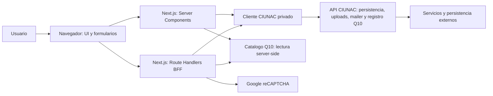
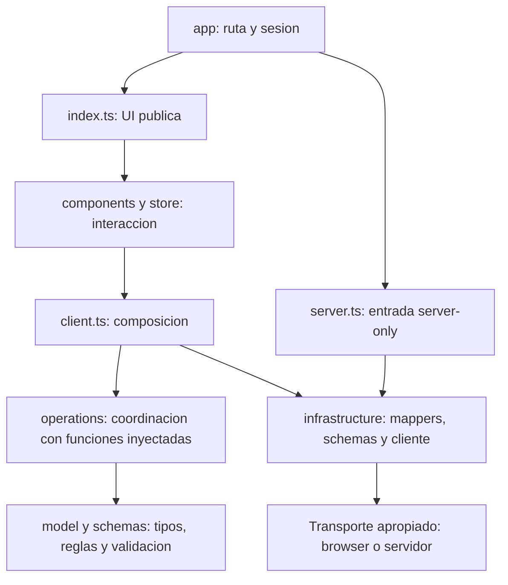

# Mapa de Arquitectura del Frontend CIUNAC

Actualizado al 2026-09-28. Este mapa explica lo implementado; el
[SDD](sdd.md) es la descripcion de diseno y
[ADR-031](adr/031-pragmatic-feature-architecture.md) registra la decision general.
No se exige repetir cuatro directorios por feature.

## Contexto y fronteras

```mermaid
flowchart LR
    User["Usuario"] --> Browser["Navegador: UI y formularios"]
    Browser --> Pages["Next.js: Server Components"]
    Browser --> BFF["Next.js: Route Handlers BFF"]
    Pages --> CI["Cliente CIUNAC privado"]
    BFF --> CI
    CI --> API["API CIUNAC: persistencia, uploads, mailer y registro Q10"]
    Pages --> Q10["Catalogo Q10: lectura server-side"]
    BFF --> Q10
    BFF --> Captcha["Google reCAPTCHA"]
    API --> Backend["Servicios y persistencia externos"]
```

La API key no viaja al navegador. Programas Q10 se leen directamente desde
servidor; el registro usa la ruta CIUNAC q10/estudiantes. Los internos del backend
no estan en este repositorio. Las lecturas CIUNAC/Q10 usan no-store; no se ha
implementado la matriz propuesta de cache de catalogos.

## Responsabilidades y archivos

```mermaid
flowchart TD
    Route["app: ruta y sesion"] --> Public["index.ts: UI publica"]
    Route --> Server["server.ts: entrada server-only"]
    Public --> UI["components y store: interaccion"]
    UI --> Client["client.ts: composicion"]
    Client --> Ops["operations: coordinacion con funciones inyectadas"]
    Ops --> Model["model y schemas: tipos, reglas y validacion"]
    Client --> Infra["infrastructure: mappers, schemas y cliente"]
    Server --> Infra
    Infra --> HTTP["Transporte apropiado: browser o servidor"]
```

El diagrama representa composicion y dependencias, no una cadena obligatoria de
imports. Operations no importa infraestructura: recibe funciones tipadas.
Consulta de certificado resuelve una lectura en server.ts sin crear operaciones
vacias. Las rutas consumen solo index/server; shared/security no importan features.

| Feature | Responsabilidad propia que permanece |
| --- | --- |
| solicitud-certificado | Tipos 1-4, precio vigente, estudiante y cargo |
| solicitud-constancia | Tipos 5-6, registro y cargo independientes de certificados |
| solicitud-beca | Cinco PDF, relacion facultad/escuela y DTO contancia_tercio |
| solicitud-ubicacion | Tipo 7, S/ 30, perfil CIUNAC, duplicidad y documentos |
| solicitud-nuevo | Programas Q10, registro sin ID garantizado y escritura indeterminada |
| consultas | Contexto comun y formulario por documento |
| consulta-solicitud | Certificados/constancias digitales, aceptacion y cargo |
| consulta-ubicacion | Join de notas, examenes y ciclos; cargo sin segunda lectura |
| consulta-certificado | Verificacion publica QR, sin sesion ni numero de documento |

## Persistencia y correo

Ejemplo de certificado; becas y Q10 conservan sus secuencias propias.

```mermaid
sequenceDiagram
    actor User as Usuario
    participant UI as Wizard
    participant Op as Operacion
    participant BFF as BFF
    participant API as CIUNAC
    User->>UI: Confirmar datos
    UI->>Op: Registrar modelo validado
    Op->>BFF: Guardar estudiante
    BFF->>API: Validar sesion y reenviar
    API-->>Op: ID de estudiante via BFF
    Op->>BFF: Crear solicitud
    BFF->>API: Validar contrato y precio; reenviar
    API-->>Op: ID de solicitud via BFF
    Op->>BFF: Notificar referencia guardada
    BFF->>API: mailer
    alt Correo aceptado por HTTP
        BFF-->>Op: Comprobante de notificacion
        Op-->>UI: completed
    else Correo fallido
        Op-->>UI: saved_notification_failed con ID
        User->>UI: Reintentar correo
        UI->>BFF: Solo notificacion, sin repetir persistencia
    end
```

Un error anterior al ID detiene las operaciones posteriores. Un guardado ambiguo
no se reintenta automaticamente. Aceptacion HTTP no garantiza entrega SMTP.

## Capacidades comunes y estado

- Archivo: metadata y firma en shared; politicas de formatos/limites en sus owners.
- Pago: FinData y conversiones comunes; precio y perfil no pertenecen a shared.
- PDF: renderer A4 comun, wrappers y textos propios. Se importa al descargar.
- HTTP browser: browser-http.ts; lib/api.service.ts agrega semantica CIUNAC.
  ciunacRequest permanece privado, separado, con API key y no-store.
- Correo: mailApiRepository convierte aceptacion segura a un comprobante.
- Upload: storage.service.ts construye multipart, nombre y valida respuesta.
  Se conserva porque tiene consumidores y comportamiento, no es un delegado vacio.
- React Hook Form edita; cinco stores Zustand conservan workflows; componentes
  conservan UI efimera. No hay stores globales de catalogos.
- Server Components reciben datos privados sin cache global y pasan catalogos
  resueltos por props. No se paralelizan escrituras dependientes.

## Gobierno y limites

[Convenciones](conventions.md), [reglas efectivas](architecture-rules.md) y
[checklist](review-checklist.md) guian cambios. Vitest cubre reglas/contratos;
Playwright cubre flujos y axe. GitHub Actions declara cuatro gates; activar branch
protection sigue siendo una tarea de administracion, no verificada localmente.

El cierre no significa ausencia de deuda. Auditoria bloqueada, replay de cookies
sin persistencia, propiedad backend de documentos, idempotencia de correo/Q10,
fuentes remotas y teardown Windows siguen en el [SDD](sdd.md#11-riesgos-y-mitigaciones).
Las cifras y ejecuciones estan en la [linea base](../quality/baseline.md).
