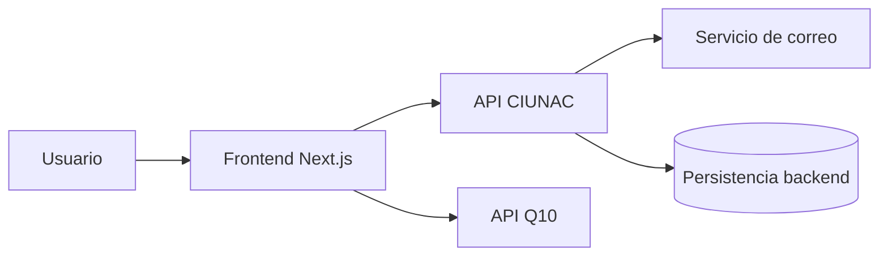
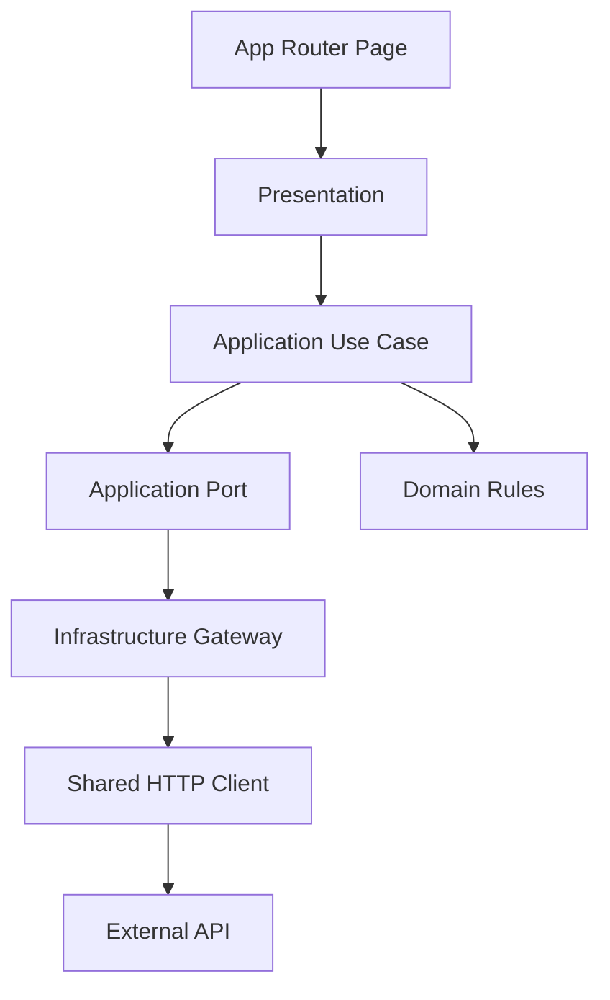
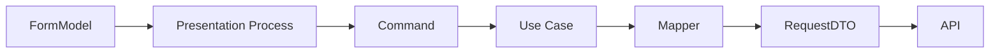
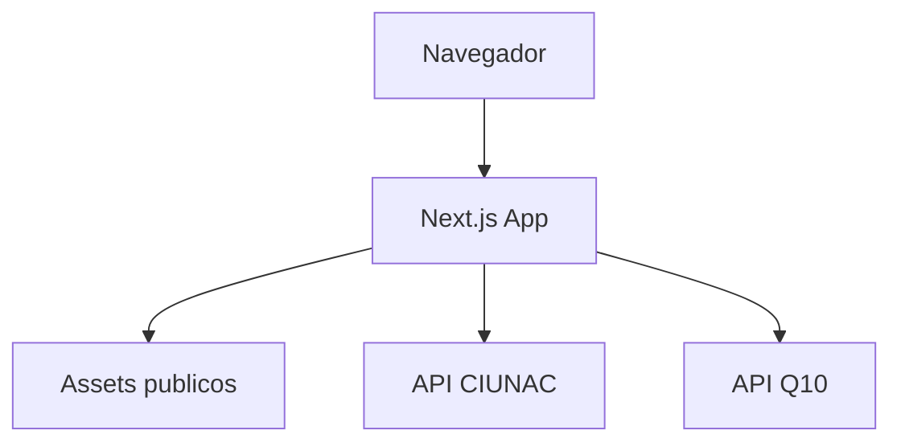

# Software Design Description (SDD) v1

## 1. Contexto del sistema
El frontend CIUNAC gestiona procesos academicos y administrativos para postulantes y estudiantes. La aplicacion guia al usuario por formularios multi-step, consulta catalogos, registra solicitudes, envia notificaciones y genera comprobantes consumiendo APIs externas.



## 2. Alcance
Este SDD describe la arquitectura del frontend Next.js. El backend, la base de datos y servicios externos se tratan como sistemas integrados mediante contratos HTTP.

Quedan dentro del alcance:
- flujos de solicitud de certificados;
- solicitud de beca;
- examen de ubicacion;
- alumno nuevo;
- consulta y descarga de cargos o constancias;
- estrategia de estado, integracion HTTP y reglas de modulo.

## 3. Arquitectura actual consolidada
- Next.js App Router.
- Componentes cliente con formularios multi-step.
- `shadcn/ui`, React Hook Form y Zod para UI y validacion.
- Zustand para estado efimero de flujo y cache de catalogos por sesion.
- Infraestructura compartida para HTTP, errores, repositories y mappers.
- Features principales organizadas por capas internas.

## 4. Arquitectura objetivo
Cada feature principal sigue una arquitectura modular con capas internas:

```text
modules/<feature>/
  presentation/
  application/
  domain/
  infrastructure/
```



## 5. Vista logica
### Presentation
- Paginas, componentes de proceso, hooks de submit, loading, dialogos y navegacion.
- Puede usar casos de uso y reglas de dominio.
- No debe construir payloads HTTP ni hablar con `fetch`.

### Application
- Casos de uso y puertos.
- Orquesta pasos como guardar estudiante, registrar solicitud, enviar correo o validar duplicidad.
- No debe depender de React, Next.js, stores ni componentes UI.

### Domain
- Reglas puras y tipos del negocio frontend.
- No conoce transporte, framework, stores ni infraestructura.

### Infrastructure
- Gateways, repositories, DTOs, mappers y clientes de API.
- Implementa puertos definidos por application.

### Shared
- Infraestructura transversal, errores, hooks de catalogos, componentes compartidos y tipos comunes.
- Solo recibe piezas que ya tienen uso transversal real.

## 6. Vista de desarrollo
Patron ya aplicado en:
- `modules/solicitud-certificado`
- `modules/solicitud-beca`
- `modules/solicitud-ubicacion`

Infraestructura compartida:
- `modules/shared/application/errors/app-error.ts`
- `modules/shared/infrastructure/http/http-client.ts`
- `modules/shared/infrastructure/api/*`
- `modules/shared/infrastructure/mappers/*`
- `hooks/useCatalogStore.ts`
- `hooks/useCachedFetch.ts`

Estado compartido y de flujo:
- `stores/types.stores.ts`: catalogos por sesion.
- `stores/solicitud.store.ts`: certificados y ubicacion.
- `modules/solicitud-beca/stores/solicitud-beca.store.ts`: beca.
- `modules/solicitud-nuevo/stores/student.store.ts`: alumno nuevo.

## 7. Vista de datos
Se distinguen estos modelos:
- `FormModel`: datos capturados por React Hook Form.
- `Command`: entrada del caso de uso.
- `DomainModel`: conceptos de negocio frontend.
- `RequestDTO`: contrato enviado a API.
- `ResponseDTO`: contrato recibido desde API.
- `ViewModel`: shape listo para render o flujo de UI.



## 8. Vista de estado
- React Hook Form: estado local de formulario.
- Zustand de flujo: datos que sobreviven entre pasos del wizard.
- Zustand de catalogos: cache por sesion con hidratacion explicita.
- Hooks de presentation: loading, submit, mensajes y dialogos.
- Server Components: candidatos preferentes para datos de solo lectura cuando el flujo lo permita.

## 9. Vista de despliegue
La aplicacion compila como frontend Next.js. Las rutas se generan como contenido estatico o dinamico segun App Router.



## 10. Decisiones arquitectonicas
Las decisiones quedan registradas como ADRs en `docs/architecture/adr/`.

ADRs vigentes:
- ADR-001 Mantener Next.js App Router.
- ADR-002 Refactorizar incrementalmente por feature.
- ADR-003 Adoptar capas internas por feature.
- ADR-004 Centralizar HTTP, errores y mappers.
- ADR-005 Definir politica de estado frontend.

## 11. Riesgos y mitigaciones
- Riesgo: extraer demasiada logica a `shared`.
  Mitigacion: exigir uso transversal real y contrato estable.
- Riesgo: que application vuelva a depender de UI.
  Mitigacion: reglas ESLint iniciales y checklist de revision.
- Riesgo: que Zustand se convierta en cache global difusa.
  Mitigacion: separar catalogos, flujo y estado visual.
- Riesgo: servicios legacy sigan creciendo.
  Mitigacion: mantenerlos como fachada y mover nueva integracion a infrastructure.

## 12. Criterios de calidad
- `npm run lint` sin errores.
- `npx tsc --noEmit` sin errores.
- `npm run build` exitoso.
- Nuevos flujos con casos de uso testeables.
- Nuevas reglas de negocio puras en `domain`.
- Componentes `register` sin orquestacion de API directa.
