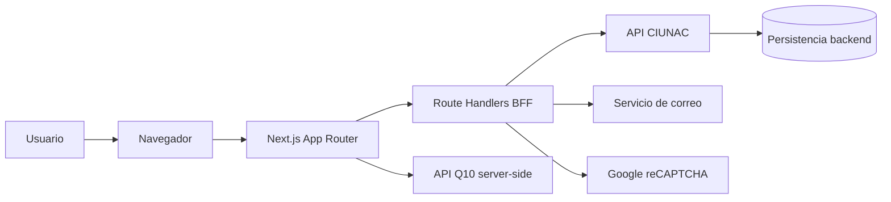
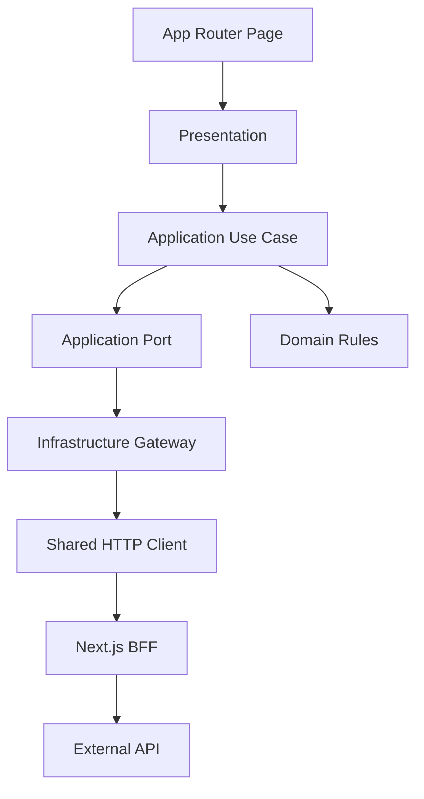
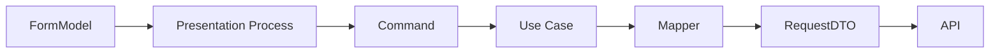
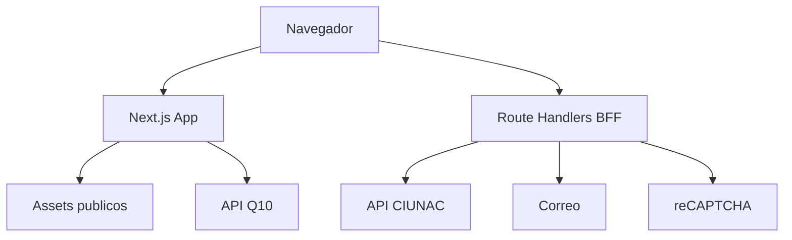

# Software Design Description (SDD) v1

## 1. Contexto del sistema
El frontend CIUNAC gestiona procesos academicos y administrativos para postulantes y estudiantes. La aplicacion guia al usuario por formularios multi-step, consulta catalogos, registra solicitudes, envia notificaciones y genera comprobantes consumiendo APIs externas.



## 2. Alcance
Este SDD describe la arquitectura del frontend Next.js. El backend, la base de datos y servicios externos se tratan como sistemas integrados mediante contratos HTTP.

La vista completa de arquitectura, con diagramas de contexto, contenedores, capas, datos, estado, integracion y despliegue, se mantiene en `docs/architecture/complete-architecture.md`.

Quedan dentro del alcance:
- flujos de solicitud de certificados;
- solicitud de constancias;
- solicitud de beca;
- examen de ubicacion;
- alumno nuevo;
- consulta y descarga de cargos o constancias;
- estrategia de estado, integracion HTTP y reglas de modulo.

## 3. Arquitectura actual consolidada
- Next.js App Router.
- Componentes cliente con formularios multi-step.
- `shadcn/ui`, React Hook Form y Zod para UI y validacion.
- Zustand para estado efimero de flujo y cache de catalogos por sesion.
- Infraestructura compartida para HTTP, errores, repositories y mappers.
- BFF con Route Handlers para credenciales, OTP, CAPTCHA y operaciones protegidas.
- Features principales organizadas por capas internas.

## 4. Arquitectura objetivo
Cada feature principal sigue una arquitectura modular con capas internas:

```text
modules/<feature>/
  presentation/
  application/
  domain/
  infrastructure/
```



## 5. Vista logica
### Presentation
- Paginas, componentes de proceso, hooks de submit, loading, dialogos y navegacion.
- Puede usar casos de uso y reglas de dominio.
- No debe construir payloads HTTP ni hablar con `fetch`.

### Application
- Casos de uso y puertos.
- Orquesta pasos como guardar estudiante, registrar solicitud, enviar correo o validar duplicidad.
- No debe depender de React, Next.js, stores ni componentes UI.

### Domain
- Reglas puras y tipos del negocio frontend.
- No conoce transporte, framework, stores ni infraestructura.

### Infrastructure
- Gateways, repositories, DTOs, mappers y clientes de API.
- Implementa puertos definidos por application.

### Shared
- Infraestructura transversal, errores, hooks de catalogos, componentes compartidos y tipos comunes.
- Solo recibe piezas que ya tienen uso transversal real.

## 6. Vista de desarrollo
Patron ya aplicado en:
- `modules/solicitud-certificado`
- `modules/solicitud-beca`
- `modules/solicitud-ubicacion`
- `modules/solicitud-constancia`
- `modules/consultas`
- `modules/consulta-solicitud`
- `modules/consulta-certificado`
- `modules/consulta-ubicacion`

API publica de `consulta-certificado`:
- `@/modules/consulta-certificado`: contrato de presentacion.
- `@/modules/consulta-certificado/server`: caso de consulta compuesto y marcado
  `server-only`.
- Las rutas y otros features no consumen `domain`, `application`, `infrastructure`
  o `presentation` mediante imports profundos.
- `/consulta-certificado/{id}` es una verificacion publica de solo lectura iniciada
  por el QR. No depende de la sesion de `consulta-solicitud`.
- El navegador nunca recibe la API key ni accede directamente al proveedor; la
  consulta y la validacion Zod se ejecutan en el Server Component.

API publica de consultas de solicitudes:
- `@/modules/consultas`: formulario y contratos transversales browser-safe.
- `@/modules/consultas/server`: consulta tipada compuesta en servidor.
- `@/modules/consulta-solicitud`: resultados de certificados y constancias.
- `@/modules/consulta-solicitud/server`: entrada server-only que fija el contexto
  funcional de certificados y constancias.
- `client.tsx` conecta los casos de uso de documentos digitales con su gateway sin
  permitir imports de infraestructura desde presentation.

Formato compartido de cargos:
- `modules/shared/components/administrative-cargo-pdf.tsx` contiene A4, encabezado
  institucional y estilos comunes.
- Certificado, constancia, ubicacion y consulta mantienen sus propios adaptadores,
  titulos, textos y reglas funcionales.

API publica de consulta de ubicacion:
- `@/modules/consulta-ubicacion`: vista y contrato de presentacion.
- `@/modules/consulta-ubicacion/server`: composicion server-only del join.
- Su infraestructura adapta `@/modules/consultas/server` a modelos locales; dominio,
  aplicacion y presentacion no importan otros features.
- El cargo se deriva de la solicitud activa y no realiza una segunda consulta por ID.

API publica de solicitud de beca:
- `@/modules/solicitud-beca`: formulario de verificacion y wizard.
- `@/modules/solicitud-beca/client`: composicion de registro y reintento de correo.
- `@/modules/solicitud-beca/server`: catalogos academicos y validacion binaria PDF.
- Las rutas y el BFF no importan application, infrastructure o presentation de
  forma profunda.

API publica de solicitud de constancias:
- `@/modules/solicitud-constancia`: wizard y componentes de finalizacion.
- `@/modules/solicitud-constancia/client`: composicion de registro, estudiante,
  correo y cargo.
- `@/modules/solicitud-constancia/server`: catalogos y validacion server-side del
  precio para tipos `5` y `6`.
- App Router y el BFF no importan internals; los catalogos se validan en servidor y
  presentation no consume repositories ni stores globales de catalogos.

API publica de solicitud de ubicacion:
- `@/modules/solicitud-ubicacion`: cronograma, wizard y finalizacion.
- `@/modules/solicitud-ubicacion/client`: composicion de perfil, duplicidad,
  estudiante, registro, correo y cargo.
- `@/modules/solicitud-ubicacion/server`: catalogos, cookie de perfil y validacion
  server-side de payloads y archivos.
- El BFF selecciona el validador PDF academico mediante la sesion `UBICACION` y no
  reutiliza reglas internas de becas.

API publica de solicitud de alumno nuevo:
- `@/modules/solicitud-nuevo`: wizard de tres pasos.
- `@/modules/solicitud-nuevo/client`: composicion de registro Q10 y reintento de
  notificacion.
- `@/modules/solicitud-nuevo/server`: catalogo de programas, schema externo y
  validacion server-side de sesion, email y programa.
- App Router, el BFF y seguridad no importan internals del feature; los DTOs de
  respuesta se infieren desde la validacion Zod.

Infraestructura compartida:
- `modules/shared/application/errors/app-error.ts`
- `modules/shared/infrastructure/http/http-client.ts`
- `modules/shared/infrastructure/api/*`
- `modules/shared/infrastructure/mappers/*`
- `hooks/useCatalogStore.ts`
- `hooks/useCachedFetch.ts`
- `modules/security/server/*`
- `modules/security/client/security-client.ts`
- `app/api/security/*`
- `app/api/ciunac/[...path]/route.ts`

Estado compartido y de flujo:
- `stores/types.stores.ts`: catalogos por sesion.
- `modules/solicitud-certificado/presentation/solicitud-certificado.store.ts`: workflow tipado de certificados.
- `modules/solicitud-constancia/presentation/solicitud-constancia.store.ts`: borrador exclusivo de constancias.
- `modules/solicitud-beca/presentation/solicitud-beca.store.ts`: workflow tipado de beca.
- `modules/solicitud-nuevo/presentation/new-student.store.ts`: workflow tipado de alumno nuevo.
- `modules/solicitud-ubicacion/presentation/solicitud-ubicacion.store.ts`: workflow tipado de ubicacion.

## 7. Vista de datos
Se distinguen estos modelos:
- `FormModel`: datos capturados por React Hook Form.
- `Command`: entrada del caso de uso.
- `DomainModel`: conceptos de negocio frontend.
- `RequestDTO`: contrato enviado a API.
- `ResponseDTO`: contrato recibido desde API.
- `ViewModel`: shape listo para render o flujo de UI.



## 8. Vista de estado
- React Hook Form: estado local de formulario.
- Zustand de flujo: datos que sobreviven entre pasos del wizard.
- Zustand de catalogos: cache por sesion con hidratacion explicita.
- Hooks de presentation: loading, submit, mensajes y dialogos.
- Server Components: candidatos preferentes para datos de solo lectura cuando el flujo lo permita.

## 9. Vista de despliegue
La aplicacion compila como frontend Next.js. Las rutas se generan como contenido estatico o dinamico segun App Router.



## 10. Decisiones arquitectonicas
Las decisiones quedan registradas como ADRs en `docs/architecture/adr/`.

ADRs vigentes:
- ADR-001 Mantener Next.js App Router.
- ADR-002 Refactorizar incrementalmente por feature.
- ADR-003 Adoptar capas internas por feature.
- ADR-004 Centralizar HTTP, errores y mappers.
- ADR-005 Definir politica de estado frontend.
- ADR-006 Separar el flujo de constancias.
- ADR-007 Introducir BFF seguro, OTP y CAPTCHA server-side.
- ADR-008 Usar resultados explicitos para operaciones externas.
- ADR-009 Adoptar dominio, workflow y fronteras runtime tipadas para constancias.
- ADR-010 Adoptar un contexto tipado comun para consultas por documento.
- ADR-011 Tipar el detalle de certificado y asociarlo al documento consultado.
- ADR-012 Ejecutar en servidor el join tipado de consulta de ubicacion.
- ADR-013 Adoptar dominio, workflow y documentos PDF seguros para solicitud de beca.
- ADR-014 Adoptar dominio, workflow y validacion server-side de precio para certificados.
- ADR-015 Adoptar dominio, workflow y validacion server-side para alumno nuevo.
- ADR-016 Adoptar dominio, workflow, perfil y tarifa server-side para solicitud de ubicacion.
- ADR-017 Permitir la verificacion publica de certificados mediante QR.
- ADR-018 Aplicar limites modulares y formato compartido a consulta de solicitudes.
- ADR-019 Aplicar limites modulares y API publica a consulta de ubicacion.
- ADR-020 Aplicar limites modulares y APIs publicas a solicitud de beca.
- ADR-021 Aplicar limites modulares y APIs publicas a solicitud de certificados.
- ADR-022 Aplicar limites modulares y APIs publicas a solicitud de constancias.
- ADR-023 Aplicar limites modulares y APIs publicas a solicitud de ubicacion.
- ADR-024 Aplicar limites modulares y APIs publicas a solicitud de alumno nuevo.

## 11. Riesgos y mitigaciones
- Riesgo: extraer demasiada logica a `shared`.
  Mitigacion: exigir uso transversal real y contrato estable.
- Riesgo: que application vuelva a depender de UI.
  Mitigacion: reglas ESLint iniciales y checklist de revision.
- Riesgo: que Zustand se convierta en cache global difusa.
  Mitigacion: separar catalogos, flujo y estado visual.
- Riesgo: servicios legacy sigan creciendo.
  Mitigacion: mantenerlos como fachada y mover nueva integracion a infrastructure.
- Riesgo: replay deliberado de una cookie OTP antigua.
  Mitigacion: limitacion documentada; migrar intentos y uso unico a Redis o persistencia backend.

## 12. Criterios de calidad
- `npm run lint` sin errores.
- `npx tsc --noEmit` sin errores.
- `npm run build` exitoso.
- Nuevos flujos con casos de uso testeables.
- Nuevas reglas de negocio puras en `domain`.
- Componentes `register` sin orquestacion de API directa.
