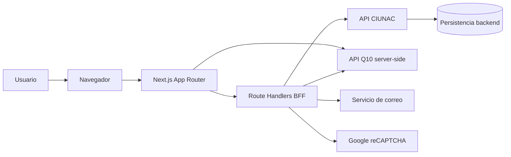
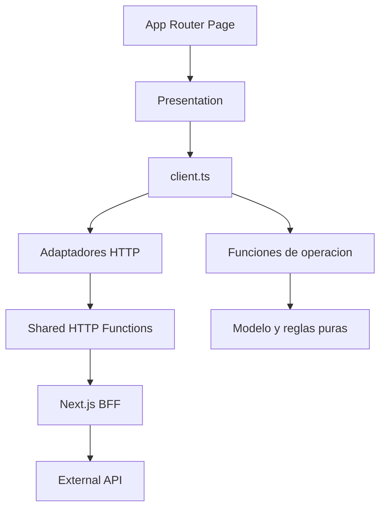
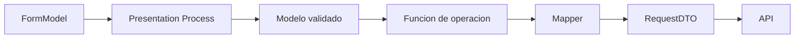
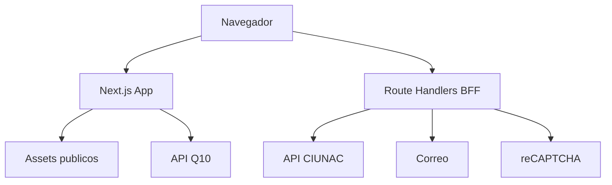
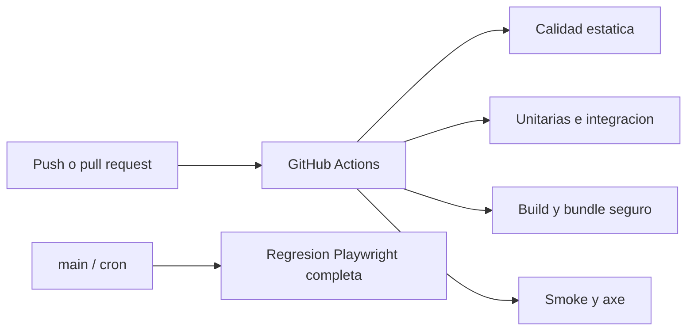

# Software Design Description (SDD) v1.4

- Ultima actualizacion: 2026-09-28 (cierre del paso 8).
- Diseno implementado; los informes de fases anteriores son historicos.
- Decision general: [ADR-031](adr/031-pragmatic-feature-architecture.md).

## 1. Contexto del sistema
El frontend CIUNAC gestiona procesos academicos y administrativos para postulantes y estudiantes. La aplicacion guia al usuario por formularios multi-step, consulta catalogos, registra solicitudes, envia notificaciones y genera comprobantes consumiendo APIs externas.


```mermaid
flowchart LR
    U[Usuario] --> Browser[Navegador]
    Browser --> FE[Next.js App Router]
    FE --> BFF[Route Handlers BFF]
    BFF --> API[API CIUNAC]
    FE --> Q10[API Q10 server-side]
    BFF --> Q10
    BFF --> MAIL[Servicio de correo]
    BFF --> CAPTCHA[Google reCAPTCHA]
    API --> DB[(Persistencia backend)]
```

## 2. Alcance
Este SDD describe la arquitectura del frontend Next.js. El backend, la base de datos y servicios externos se tratan como sistemas integrados mediante contratos HTTP.

El catalogo de programas Q10 se consulta directamente desde servidor. Su registro
se reenvia por CIUNAC q10/estudiantes; mailer y uploads tambien son rutas CIUNAC.
Los diagramas representan responsabilidades externas, no internos confirmados del backend.

La vista completa de arquitectura, con diagramas de contexto, contenedores, capas, datos, estado, integracion y despliegue, se mantiene en `docs/architecture/complete-architecture.md`.

Quedan dentro del alcance:
- flujos de solicitud de certificados;
- solicitud de constancias;
- solicitud de beca;
- examen de ubicacion;
- alumno nuevo;
- consulta y descarga de cargos o constancias;
- estrategia de estado, integracion HTTP y reglas de modulo.

## 3. Arquitectura actual consolidada
- Next.js App Router.
- Componentes cliente con formularios multi-step.
- `shadcn/ui`, React Hook Form y Zod para UI y validacion.
- Zustand para estado efimero de flujos multi-step.
- Infraestructura compartida minima para transporte HTTP, errores y adaptadores
  transversales estables.
- BFF con Route Handlers para credenciales, OTP, CAPTCHA y operaciones protegidas.
- Features organizadas por responsabilidad, con funciones y archivos cohesivos
  en los cinco registros y en las consultas.
- Vitest para pruebas unitarias e integracion; Playwright para smoke, accesibilidad
  y regresion E2E.
- GitHub Actions declara cuatro gates y regresion completa programada.
  La proteccion de rama debe activarse en GitHub; no esta verificada localmente.

## 4. Organizacion implementada
Los cinco features de registro usan una organizacion pragmatica. Los archivos se
mantienen separados por responsabilidad, no como plantilla obligatoria:

```text
modules/<feature>/
  index.ts, client.ts, server.ts
  model.ts, schemas.ts, operations.ts, store.ts
  components/
  infrastructure/
```

Mappers, documentos PDF, catalogos y validadores extensos conservan archivos
propios. Becas y ubicacion conservan politicas puras de archivos en `domain/`.
El paso 6 aplica la misma organizacion al contexto comun de consultas, consulta
de solicitudes y consulta de ubicacion. Consulta de certificado conserva la
simplificacion previa de ADR-027; no se rehace.
Los pasos 1 y 2 consolidaron linea base y reglas de imports. El piloto del paso 3
simplifica certificados con funciones, archivos cohesivos y APIs publicas estables.
El paso 4 aplica la simplificacion a constancias y alumno nuevo en cambios
separados. El paso 5 ordena becas y ubicacion aprovechando las operaciones ya
simplificadas, sin reescribir reglas ni crear abstracciones genericas.
Consultas usa `model.ts`, `operations.ts`, `components/` e `infrastructure/`;
no incorpora stores ni schemas de formulario vacios para cumplir una plantilla.


```mermaid
flowchart TD
    Route[App Router Page] --> Presentation[Presentation]
    Presentation --> Composition[client.ts]
    Composition --> UseCase[Funciones de operacion]
    Composition --> Gateway[Adaptadores HTTP]
    Gateway --> Http[Shared HTTP Functions]
    Http --> BFF[Next.js BFF]
    BFF --> API[External API]
    UseCase --> Domain[Modelo y reglas puras]
```

## 5. Vista logica
### Presentation
- Paginas, componentes de proceso, hooks de submit, loading, dialogos y navegacion.
- Puede usar casos de uso y reglas de dominio.
- No debe construir payloads HTTP ni hablar con `fetch`.

### Application
- Funciones de operacion con dependencias tipadas, sin clases o puertos delegadores.
- Orquesta pasos como guardar estudiante, registrar solicitud, enviar correo o validar duplicidad.
- No debe depender de React, Next.js, stores ni componentes UI.

### Domain
- Reglas puras y tipos del negocio frontend.
- No conoce transporte, framework, stores ni infraestructura.

### Infrastructure
- Gateways, repositories, DTOs, mappers y clientes de API.
- Implementa las funciones de transporte que recibe la aplicacion.

### Shared
- Infraestructura transversal minima, errores, schemas y componentes compartidos.
- Solo recibe piezas que ya tienen uso transversal real.
- No mantiene cache global de catalogos cuando el mismo dato ya fue cargado en un
  Server Component.

## 6. Vista de desarrollo
Patron ya aplicado en:
- `modules/solicitud-certificado`
- `modules/solicitud-beca`
- `modules/solicitud-ubicacion`
- `modules/solicitud-constancia`
- `modules/solicitud-nuevo`
- `modules/consultas`
- `modules/consulta-solicitud`
- `modules/consulta-certificado`
- `modules/consulta-ubicacion`

API publica de `consulta-certificado`:
Recorrido de archivos y llamadas: [guia de lectura](walkthroughs/consulta-certificado.md).

- `@/modules/consulta-certificado`: contrato de presentacion.
- `@/modules/consulta-certificado/server`: consulta cohesiva marcada `server-only`.
- El feature usa un slice vertical simplificado con dominio, contrato externo y
  presentacion; no crea una capa application sin orquestacion real.
- Las rutas y otros features no consumen `domain`, `infrastructure` o
  `presentation` mediante imports profundos.
- `/consulta-certificado/{id}` es una verificacion publica de solo lectura iniciada
  por el QR. No depende de la sesion de `consulta-solicitud`.
- El navegador nunca recibe la API key ni accede directamente al proveedor; la
  consulta y la validacion Zod se ejecutan en servidor. El contrato descarta
  campos desconocidos y verifica que el ID devuelto corresponda al solicitado.

API publica de consultas de solicitudes:
Recorrido de archivos, sesiones y descargas: [guia de lectura](walkthroughs/consulta-solicitud.md).

- `@/modules/consultas`: formulario y contratos transversales browser-safe.
- `@/modules/consultas/server`: `getConsultationRequests` compone solicitudes y
  textos en paralelo; `findConsultationRequests` hace solo el lookup de solicitudes
  necesario para CAPTCHA, normalizando documento y filtrando por tipo.
- `@/modules/consulta-solicitud`: resultados de certificados y constancias.
- `@/modules/consulta-solicitud/server`: entrada server-only que fija el contexto
  funcional de certificados y constancias.
- `client.tsx` conecta funciones de `operations.ts` con el cliente HTTP mediante
  callbacks estables. La UI no importa transporte ni DTOs del proveedor.
- `getDigitalDocument` valida la solicitud y la correspondencia del documento;
  `acceptDigitalDocument` valida el ID antes de aceptar. Se conservan aliases
  historicos de constancias, ausencia, error, bloqueo de descarga y reintento.

Formato compartido de cargos:
- `modules/shared/components/administrative-cargo-pdf.tsx` contiene A4, encabezado
  institucional y estilos comunes.
- Certificado, constancia, ubicacion y consulta mantienen sus propios adaptadores,
  titulos, textos y reglas funcionales.

API publica de consulta de ubicacion:
- `@/modules/consulta-ubicacion`: vista y contrato de presentacion.
- `@/modules/consulta-ubicacion/server`: composicion server-only del join.
- Su infraestructura adapta `@/modules/consultas/server` a modelos locales; dominio,
  aplicacion y presentacion no importan otros features.
- El cargo se deriva de la solicitud activa y no realiza una segunda consulta por ID.
- `loadLocationConsultation` recibe cuatro funciones para contexto, notas,
  examenes y ciclos; conserva las cinco lecturas paralelas, filtros de propiedad,
  datos parciales y requisito del año para generar la constancia.

API publica de solicitud de beca:
- `@/modules/solicitud-beca`: formulario de verificacion y wizard.
- `@/modules/solicitud-beca/client`: composicion funcional de registro y reintento
  de correo, sin commands, ports o clases gateway de un solo metodo.
- `@/modules/solicitud-beca/server`: catalogos academicos, validacion binaria PDF y
  canonicalizacion server-side de facultad, escuela y periodo.
- El schema Zod es la fuente del DTO externo; el workflow Zustand conserva el ID
  guardado para impedir una segunda persistencia durante el reintento de correo.
- Las rutas y el BFF no importan application, infrastructure o presentation de
  forma profunda.

API publica de solicitud de certificados (piloto pragmatico):
- `index.ts` conserva proceso, descarga y avisos finales; `server.ts` conserva
  catalogos, textos y revalidacion de precio del BFF.
- `client.ts` mantiene las cuatro firmas publicas y conecta funciones de
  `operations.ts` con `infrastructure/certificate-client.ts`.
- `model.ts` contiene tipos/reglas puras; `schemas.ts` valida al registrar.
  `store.ts` conserva el workflow Zustand, incluido el ID de exito parcial.
- Componentes, schema de formulario, mapper y hook estan en `components/`.
  El resumen no ejecuta un parse completo durante cada render.
- No hay clases, commands o archivos de ports delegadores; los mappers, schemas
  externos y validadores server-only permanecen separados por responsabilidad.
- Correo conserva categoria, estado, correlationId y retryable. El reintento no
  repite la persistencia; el PDF sigue siendo A4 y se carga bajo demanda.

API publica de solicitud de constancias:
- `@/modules/solicitud-constancia`: wizard y componentes de finalizacion.
- `@/modules/solicitud-constancia/client`: composicion de registro, estudiante,
  correo y cargo.
- `@/modules/solicitud-constancia/server`: catalogos y validacion server-side del
  precio para tipos `5` y `6`.
- App Router y el BFF no importan internals; los catalogos se validan en servidor y
  presentation no consume repositories ni stores globales de catalogos.
- Implementacion pragmatica: `model.ts`, `schemas.ts`, `operations.ts`, `store.ts`,
  `components/` e `infrastructure/`. Las tres operaciones de aplicacion son
  funciones; un cliente agrupa la integracion HTTP. Los mappers, catalogos y
  validacion server-side de precio siguen separados por responsabilidad.
- No hay imports hacia certificados. La UI no parsea toda la solicitud durante
  render; el registro y el BFF conservan validaciones independientes.

API publica de solicitud de ubicacion:
- `@/modules/solicitud-ubicacion`: cronograma, wizard y finalizacion.
- `@/modules/solicitud-ubicacion/client`: composicion de perfil, duplicidad,
  estudiante, registro, correo y cargo.
- `@/modules/solicitud-ubicacion/server`: catalogos, cookie de perfil y validacion
  server-side de payloads y archivos.
- El BFF selecciona el validador PDF academico mediante la sesion `UBICACION` y no
  reutiliza reglas internas de becas.
- Las operaciones de aplicacion son funciones inyectables en `operations.ts`,
  no clases ni archivos de ports. El cliente HTTP local concentra estudiantes,
  solicitudes, correo, perfil y cargo; DTOs se infieren de Zod y conservan sus mappers.
- Duplicidad se comprueba en cliente y BFF con la misma regla pura. El BFF exige
  tarifa S/ 30, perfil compatible y nivel basico cuando el usuario no es CIUNAC.
- El formulario descarta busquedas tardias, invalida datos dependientes al cambiar
  identidad y bloquea avances concurrentes. Zustand conserva los pasos y el exito
  parcial de correo; el resumen no vuelve a parsear toda la solicitud durante render.
- La entrada devuelve `requestType`, `texts` y `schedules`, sin consultar idiomas.
  Idiomas se carga al ingresar al proceso. El PDF permanece A4 y diferido.

API publica de solicitud de alumno nuevo:
- `@/modules/solicitud-nuevo`: wizard de tres pasos.
- `@/modules/solicitud-nuevo/client`: composicion de registro Q10 y reintento de
  notificacion.
- `@/modules/solicitud-nuevo/server`: catalogo de programas y validacion
  server-side de DTO, sesion, email y programa.
- App Router, el BFF y seguridad no importan internals del feature; los DTOs de
  respuesta se infieren desde la validacion Zod.
- `model.ts`, `schemas.ts`, `operations.ts` y `store.ts` mantienen negocio,
  validacion, coordinacion y estado separados sin clases delegadoras. La UI vive
  en `components/`; integracion HTTP, mapper, schemas externos y servidor en
  `infrastructure/`. El request DTO Q10 tambien se infiere de Zod.
- Q10 confirma con respuesta HTTP exitosa sin cuerpo u objeto JSON. Errores o
  respuestas ambiguas detienen el correo; el workflow bloquea escrituras
  indeterminadas. Fallo exclusivo de correo retiene el documento para reintentar
  solo la notificacion, preservando los metadatos del error.

Infraestructura compartida:
- `modules/shared/domain/file-validation.ts` y `payment.ts`: reglas tecnicas y modelo puro.
- `modules/shared/application/payment.schema.ts`: pago completo, sin decisiones de tarifa.
- `modules/shared/components/payment-form.mapper.ts`: conversion formulario/pago.
- `modules/shared/infrastructure/api/payment-fields.ts`: campos HTTP estables del pago.
- `modules/shared/infrastructure/server/file-upload-validation.ts`: validacion binaria server-only.
- `modules/shared/infrastructure/http/browser-http.ts`: JSON, multipart, errores y timeout.
- `modules/shared/application/errors/app-error.ts`
- `modules/shared/infrastructure/api/*`
- `modules/shared/infrastructure/validation/external-response.ts`
- `lib/api.service.ts`
- `modules/security/server/*`
- `modules/security/client/security-client.ts`
- `app/api/security/*`
- `app/api/ciunac/[...path]/route.ts`
- `app/api/ciunac/proxy-policy.ts`
- `app/api/ciunac/proxy-validation.ts`

El paso 7 elimina la fachada `resourceApiRepository`. Los adapters de feature
consumen directamente las funciones CIUNAC; seguridad y perfil utilizan el mismo
transporte del navegador. La API key y las lecturas privadas permanecen en
`ciunacRequest`, sin cache global. Metadatos y firmas de archivos se comparten,
pero los formatos permitidos los decide cada politica. Precio, tipo de solicitud
y perfil siguen bajo validacion autoritativa de cada feature en el BFF.

Politica implementada del BFF CIUNAC:

- `app/api/ciunac/proxy-policy.ts` traduce metodo y ruta a una
  operacion cerrada; no existe autorizacion ambigua `either`.
- `app/api/ciunac/proxy-validation.ts` concentra los contratos de transporte y
  delega cada DTO de negocio a la API publica server-only de su feature.
- La sesion OTP autoriza solo su feature: tipos `1..4` para certificados, `5..6`
  para constancias, `7` para ubicacion, becas para `BECA` y Q10 para `NUEVO`.
- Las sesiones OTP y de consulta se descifran una vez por request.
- Estudiantes y becas deben conservar el email verificado; los cargos deben
  conservar el tipo asociado al flujo.
- Catalogos, QR y joins privados se consultan server-side y no forman parte de la
  allowlist del navegador.
- `modules/security` no conoce internals de consultas ni de features de solicitud;
  sus schemas se limitan a OTP, consulta y notificacion.

Estado compartido y de flujo:
- `modules/solicitud-certificado/store.ts`: workflow tipado de certificados.
- `modules/solicitud-constancia/store.ts`: borrador exclusivo de constancias.
- `modules/solicitud-beca/store.ts`: workflow tipado de beca.
- `modules/solicitud-nuevo/store.ts`: workflow tipado de alumno nuevo.
- `modules/solicitud-ubicacion/store.ts`: workflow tipado de ubicacion.

## 7. Vista de datos
Se distinguen estos modelos:
- `FormModel`: datos capturados por React Hook Form.
- Entrada de operacion: modelo completo validado, sin un Command envoltorio obligatorio.
- `DomainModel`: conceptos de negocio frontend.
- `RequestDTO`: contrato enviado a API.
- `ResponseDTO`: contrato recibido desde API.
- `ViewModel`: shape listo para render o flujo de UI.


```mermaid
flowchart LR
    Form[FormModel] --> Process[Presentation Process]
    Process --> Model[Modelo validado]
    Model --> UseCase[Funcion de operacion]
    UseCase --> Mapper[Mapper]
    Mapper --> DTO[RequestDTO]
    DTO --> API[API]
```

## 8. Vista de estado
- React Hook Form: estado local de formulario.
- Zustand de flujo: datos que sobreviven entre pasos del wizard.
- Hooks de presentation: loading, submit, mensajes y dialogos.
- El workflow retiene registro, referencia y fallo parcial; esos estados no se
  duplican en flags locales contradictorios. No quedan stores globales de catalogos.
- Server Components: fuente preferente para catalogos de solo lectura; los datos
  ya resueltos se inyectan a componentes cliente.

CIUNAC y el catalogo Q10 usan no-store. La matriz de cache de performance es una
propuesta, no una capacidad activada. No existe cache global de datos personales.

## 9. Vista de despliegue
La aplicacion compila como frontend Next.js. Las rutas se generan como contenido
estatico o dinamico segun App Router. GitHub Actions valida cada cambio antes de
su integracion y ejecuta regresion completa en Ubuntu despues del merge.


```mermaid
flowchart TD
    Browser[Navegador] --> Next[Next.js App]
    Next --> Public[Assets publicos]
    Browser --> BFF[Route Handlers BFF]
    BFF --> Api[API CIUNAC]
    BFF --> Mail[Correo]
    BFF --> Captcha[reCAPTCHA]
    Next --> Q10[API Q10]
```


```mermaid
flowchart LR
    Change["Push o pull request"] --> CI["GitHub Actions"]
    CI --> Static["Calidad estatica"]
    CI --> Tests["Unitarias e integracion"]
    CI --> Build["Build y bundle seguro"]
    CI --> Browser["Smoke y axe"]
    Main["main / cron"] --> E2E["Regresion Playwright completa"]
```

Los workflows usan Node.js `24.11.1`, instalacion reproducible con `npm ci` y
variables sinteticas. No contienen secretos reales. Los artefactos de navegador y
auditoria se retienen durante 14 dias.

## 10. Decisiones arquitectonicas
Las decisiones quedan registradas como ADRs en `docs/architecture/adr/`.

Registro de decisiones (con reemplazos parciales explicitos):
- ADR-001 Mantener Next.js App Router.
- ADR-002 Refactorizar incrementalmente por feature.
- ADR-003 Separar responsabilidades; la exigencia de carpetas fue reemplazada por ADR-031.
- ADR-004 Centralizar HTTP, errores y mappers.
- ADR-005 Definir politica de estado frontend.
- ADR-006 Separar el flujo de constancias.
- ADR-007 Introducir BFF seguro, OTP y CAPTCHA server-side.
- ADR-008 Usar resultados explicitos para operaciones externas.
- ADR-009 Adoptar dominio, workflow y fronteras runtime tipadas para constancias.
- ADR-010 Adoptar un contexto tipado comun para consultas por documento.
- ADR-011 Tipar el detalle; la sesion/propietario fue reemplazada por ADR-017 y la estructura por ADR-027.
- ADR-012 Ejecutar en servidor el join tipado de consulta de ubicacion.
- ADR-013 Adoptar dominio, workflow y documentos PDF seguros para solicitud de beca.
- ADR-014 Adoptar dominio, workflow y validacion server-side de precio para certificados.
- ADR-015 Adoptar dominio, workflow y validacion server-side para alumno nuevo.
- ADR-016 Adoptar dominio, workflow, perfil y tarifa server-side para solicitud de ubicacion.
- ADR-017 Permitir la verificacion publica de certificados mediante QR.
- ADR-018 Aplicar limites modulares y formato compartido a consulta de solicitudes.
- ADR-019 Aplicar limites modulares y API publica a consulta de ubicacion.
- ADR-020 Aplicar limites modulares y APIs publicas a solicitud de beca.
- ADR-021 Aplicar limites modulares y APIs publicas a solicitud de certificados.
- ADR-022 Aplicar limites modulares y APIs publicas a solicitud de constancias.
- ADR-023 Aplicar limites modulares y APIs publicas a solicitud de ubicacion.
- ADR-024 Aplicar limites modulares y APIs publicas a solicitud de alumno nuevo.
- ADR-025 Establecer gates automaticos de calidad y baselines temporales.
- ADR-026 Clasificar niveles de prueba y usar dobles deterministas.
- ADR-027 Simplificar la consulta publica de certificado sin capas ceremoniales.
- ADR-028 Mantener `shared` pequeno y orientado a capacidades estables.
- ADR-029 Aplicar una politica explicita por operacion y proposito en el BFF CIUNAC.
- ADR-030 Mantener limites pragmaticos entre seguridad transversal, BFF y features.
- ADR-031 Adoptar organizacion pragmatica por feature, sin una plantilla obligatoria.

Las estructuras iniciales de ADR-009 a ADR-024 son antecedentes; sus reglas de
negocio, APIs publicas y validaciones siguen vigentes salvo reemplazo explicitado.
No se crea un ADR por cada movimiento de archivo.

## 11. Riesgos y mitigaciones
- Riesgo: extraer demasiada logica a `shared`.
  Mitigacion: exigir uso transversal real y contrato estable.
- Riesgo: que application vuelva a depender de UI.
  Mitigacion: reglas ESLint iniciales y checklist de revision.
- Riesgo: que Zustand se convierta en cache global difusa.
  Mitigacion: separar catalogos, flujo y estado visual.
- Riesgo: volver a introducir fachadas delegadoras.
  Mitigacion: conservar solo adaptadores con responsabilidad real. El unico archivo
  en services es storage.service.ts: multipart, nombres y validacion de respuesta.
- Riesgo: replay deliberado de una cookie OTP antigua.
  Mitigacion: limitacion documentada; migrar intentos y uso unico a Redis o persistencia backend.
- Riesgo: dependencias de produccion vulnerables y excepciones vencidas.
  Estado: la auditoria del paso 8 (2026-09-28) reporto 1 critical y 3 high; la baseline
  vencio el `2026-09-17`. Ver [auditoria vigente](../quality/dependency-audit.md).
  Pendiente: correccion de seguridad aislada, sin renovar excepciones para aprobar CI.
- Riesgo: axe no identifica todas las barreras de accesibilidad.
  Mitigacion: mantener revision manual con teclado, lector de pantalla, zoom y contraste.
- Riesgo: teardown de Playwright bloqueado en Windows y build dependiente de Google Fonts.
  Mitigacion: ejecutar CI en Ubuntu y planificar fuente local/reproducible.
- Riesgo: la sesion de consulta digital aun no demuestra propiedad del recurso por DNI.
  Mitigacion: crear un endpoint especializado o validacion backend antes de ampliar
  las operaciones disponibles sobre documentos.
- Riesgo: las firmas iniciales de archivos no prueban inocuidad ni propiedad.
  Mitigacion pendiente: comprobacion de propietario y analisis de contenido en backend.
- Riesgo: correo aceptado sin entrega SMTP confirmada, sin idempotencia garantizada.
  Mitigacion actual: conservar referencia y reintentar solo correo manualmente;
  idempotencia/outbox definitivas requieren backend.
- Riesgo: filtros y limite de 30 programas Q10; perfil CIUNAC autodeclarado y
  comprobacion de duplicidad no atomica. Requieren validacion funcional/backend.

## 12. Criterios de calidad
- Instalacion reproducible con `npm ci`.
- `npm run lint`, `npm run typecheck` y `npm run build` exitosos.
- Unitarias e integracion Vitest exitosas.
- Smoke E2E y accesibilidad automatizada exitosos antes del merge.
- Regresion E2E completa ejecutada en `main`, manualmente y por cron.
- Knip sin nuevos archivos, dependencias o imports no declarados.
- Auditoria sin vulnerabilidades criticas ni high nuevas; excepciones con vencimiento.
- Bundle cliente sin valores de secretos privados.
- Requisitos afectados vinculados con implementacion y pruebas en trazabilidad.
- Reglas puras en `model.ts` o `domain/` y componentes sin orquestacion HTTP directa.

### Linea base y limites de imports (pasos 1 y 2)

`eslint.config.mjs` usa una sola regla local `architecture/dependencies`; conserva
Next.js/TypeScript y evita sobrescrituras entre restricciones. Las 67 pruebas de
`tests/unit/architecture/eslint-boundaries.test.ts` verifican imports permitidos
y prohibidos con la configuracion efectiva, incluidas APIs publicas, rutas
relativas, reexports e imports dinamicos literales. No se requiere una estructura
de carpetas nueva para pasar lint.

El paso 6 elimina la excepcion de imports internos del handler de consulta, que
consume exclusivamente `@/modules/consultas/server`. Las pruebas verifican que
ambos imports anteriores se rechazan. Los limites estaticos no sustituyen
`server-only`, validaciones BFF ni comprobacion de secretos del bundle.

Inventario, secuencias, resultados y riesgos anteriores al piloto:
[Linea base pragmatica](../quality/pragmatic-simplification-baseline.md).

Resultados del piloto de certificados (paso 3), incluidos cambios internos,
contratos preservados y comprobaciones: [Informe de Fase 2F](../quality/phase-2f-solicitud-certificado.md#piloto-pragmatico-paso-3).

Resultados de constancias (primer feature del paso 4):
[Informe de Fase 2A](../quality/phase-2a-constancia-typing.md#simplificacion-pragmatica-paso-4-constancias).

Resultados de alumno nuevo y cierre del paso 4:
[Informe de Fase 2G](../quality/phase-2g-solicitud-nuevo.md#simplificacion-pragmatica-paso-4-alumno-nuevo).

Resultados de consultas (paso 6), contratos preservados y regresion final:
[Linea base de cierre](../quality/baseline.md#simplificacion-pragmatica-consultas-paso-6).

Resultados de capacidades compartidas (paso 7), alcance externo y controles:
[Informe shared](../quality/shared-simplification.md#paso-7-consolidacion-de-capacidades).
Las pruebas funcionales y el build pasan; la auditoria de dependencias sigue
bloqueada por 1 critical, 3 high y excepciones vencidas. No se modifica el framework
en este refactor ni se presenta ese gate como aprobado.

### Cierre general (paso 8)

SDD, mapa de arquitectura, convenciones y checklist reflejan la organizacion
implementada bajo ADR-031. Los informes anteriores se conservan como historia.
Se retiraron exclusivamente siete declaraciones sin consumidores en tres
archivos; no se eliminaron contratos publicos ni dependencias.

[Inventario y cierre](../quality/pragmatic-simplification-baseline.md#paso-8-cierre-documental-y-limpieza)
y [verificaciones](../quality/baseline.md#simplificacion-pragmatica-cierre-documental-paso-8).
La simplificacion finalizada no sustituye la resolucion de gates bloqueantes.
