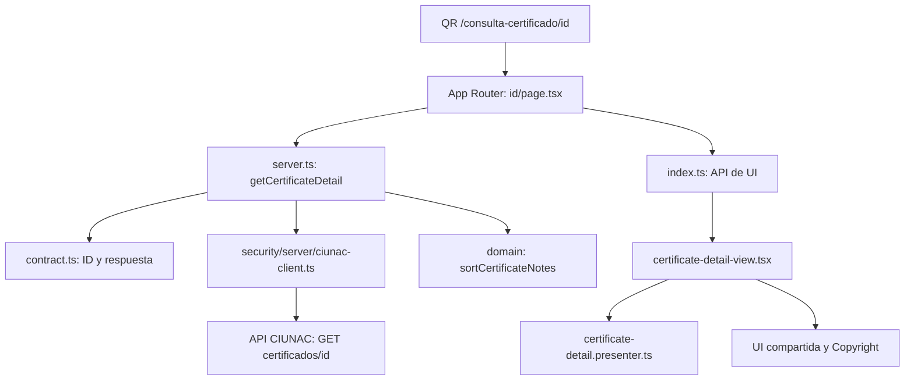
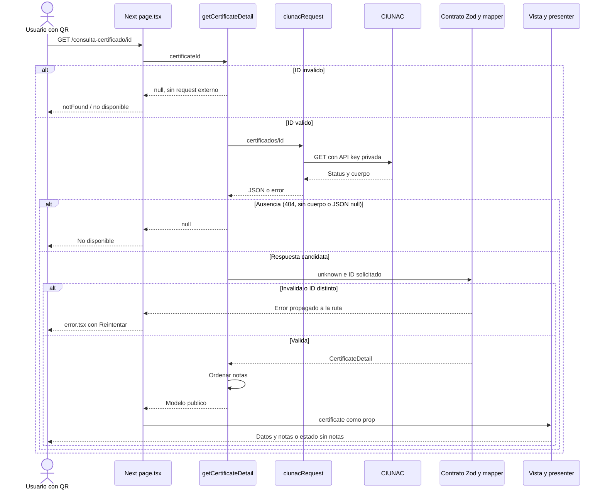

# Lectura de Codigo: Consulta de Certificado

Revisado el 2026-09-28 contra los archivos actuales. Primera entrega de la
revision modulo por modulo. No modifica codigo productivo ni propone otra
refactorizacion. Complementa el [SDD](../sdd.md), [ADR-027](../adr/027-simplified-public-certificate-query.md)
y [ADR-031](../adr/031-pragmatic-feature-architecture.md).

## 1. Que hace y que no hace

Permite verificar publicamente un certificado mediante la URL incluida en su QR:
`/consulta-certificado/{id}`. El ID identifica al certificado, no a la solicitud
ni al DNI. La ruta sin ID es informativa: indica que se debe escanear el QR.

Muestra estudiante, idioma, nivel, horas, registro, fechas, entrega y notas.
No registra solicitudes, no acepta documentos ni genera/descarga PDF.
La descarga digital pertenece a consulta-solicitud; el registro pertenece a
solicitud-certificado. No hay imports internos hacia esos features ni constancias.

No requiere OTP, CAPTCHA, cookie de consulta ni login. Esto es intencional para
el QR publico, no una omision a resolver copiando la sesion de otro flujo.

## 2. Mapa de archivos propios

Paths relativos a modules/consulta-certificado. Son seis archivos, no seis pasos
obligatorios ni una plantilla para todos los features.

| Archivo | Funcion y responsabilidad | Se comunica con |
| --- | --- | --- |
| [index.ts](../../../modules/consulta-certificado/index.ts) | API publica de UI: reexporta CertificateDetailView, sin logica adicional | Vista; lo importa la ruta |
| [server.ts](../../../modules/consulta-certificado/server.ts) | getCertificateDetail: valida ID, consulta, distingue ausencia, valida respuesta y ordena notas | Contrato, dominio y ciunacRequest |
| [domain/certificate-detail.ts](../../../modules/consulta-certificado/domain/certificate-detail.ts) | CertificateDetail, CertificateNote, CertificateDelivery y regla pura de orden | No importa framework, HTTP ni Zod |
| [infrastructure/certificate-detail.contract.ts](../../../modules/consulta-certificado/infrastructure/certificate-detail.contract.ts) | Schema Zod, normalizacion del ID y mapper de respuesta al modelo publico | Modelo, parseExternalResponse y AppError |
| [presentation/certificate-detail.presenter.ts](../../../modules/consulta-certificado/presentation/certificate-detail.presenter.ts) | Convierte fechas, nivel y entrega a etiquetas visibles | Modelo puro; no consulta API |
| [presentation/components/certificate-detail-view.tsx](../../../modules/consulta-certificado/presentation/components/certificate-detail-view.tsx) | Renderiza tarjetas, datos, tabla, estado sin notas y aviso institucional | Presenter, tipo del modelo, UI compartida, imagen y Copyright |

No hay store, hook de fetch, client.ts, clase repository, port, command ni carpeta
application. No hacen falta para coordinar una unica lectura. El contrato agrupa
schema y mapper porque ambos describen la misma frontera externa.

## 3. Archivos de ruta

Paths relativos a app/consulta-certificado.

| Archivo | Papel en el flujo |
| --- | --- |
| [page.tsx](../../../app/consulta-certificado/page.tsx) | Pantalla informativa sin consulta por ID; usa ConsultaPage |
| [layout.tsx](../../../app/consulta-certificado/layout.tsx) | Metadata con titulo y robots noindex/nofollow; devuelve children |
| [page.tsx de detalle](../../../app/consulta-certificado/[id]/page.tsx) | Espera params, llama getCertificateDetail; null activa notFound(); un modelo valido se pasa a la vista |
| [loading.tsx de detalle](../../../app/consulta-certificado/[id]/loading.tsx) | Skeleton del segmento mientras Next resuelve la pagina; no realiza fetch propio |
| [not-found.tsx de detalle](../../../app/consulta-certificado/[id]/not-found.tsx) | Estado de certificado no disponible y retorno a /consulta-certificado |
| [error.tsx de detalle](../../../app/consulta-certificado/[id]/error.tsx) | Frontera cliente de error: mensaje generico y reset para reintentar el segmento |

Next.js elige loading/error/not-found segun el estado del segmento. La pagina no
importa manualmente esos archivos. El skeleton no implica un segundo request.

## 4. Recorrido de una consulta valida

1. El usuario abre el QR. Next recibe la URL /consulta-certificado/CERT-1
   (identificador ficticio usado en pruebas).
2. La pagina dinamica espera params y extrae id como rawId.
3. getCertificateDetail recorta espacios y exige 1-80 caracteres de
   A-Z, a-z, 0-9, guion o guion bajo. Un ID invalido devuelve null sin llamar al proveedor.
4. ciunacRequest ejecuta GET a API_URL/certificados/CERT-1 desde servidor.
   Agrega x-api-key con API_KEY privada y usa no-store y timeout de 15 segundos.
5. El cliente HTTP comprueba status y decodifica JSON. El resultado entra como
   unknown: el generico TypeScript no demuestra que el JSON sea valido.
6. parseCertificateDetailResponse valida el schema y comprueba que _id coincida
   exactamente con el ID pedido. Luego crea CertificateDetail con campos permitidos.
7. sortCertificateNotes devuelve las notas ordenadas por numero final del ciclo.
8. La pagina recibe el modelo y renderiza CertificateDetailView. La vista llama
   al presenter y combina etiquetas formateadas con nombre, horas, registro y notas.
9. Next entrega el resultado renderizado. No se hace una llamada HTTP del
   navegador al backend CIUNAC para cargar estos datos.

server.ts es una entrada de modulo marcada server-only. No es una URL, un
Route Handler ni una Server Action. La URL la publica App Router mediante page.tsx.
Tampoco pasa por /api/ciunac, lib/api.service.ts o browser-http.ts.

Las flechas muestran colaboracion, no una cadena de imports de dominio a HTTP.
El contrato importa el modelo como tipo; el dominio no importa el contrato.

## 5. Secuencia y respuestas

Los fallos de red, configuracion, status no exitoso distinto de 404 o JSON mal
formado tambien se propagan a error.tsx; no pasan a la rama de ausencia.
El diagrama resume colaboracion; el contrato no importa page.tsx.

| Situacion | Resultado interno | Respuesta visible |
| --- | --- | --- |
| ID fuera de formato | null antes de HTTP | Certificado no disponible |
| Proveedor responde 404 | SecurityError reconocido por server.ts, convertido a null | Certificado no disponible |
| Exito sin cuerpo o JSON null | null | Certificado no disponible |
| Objeto valido, notas omitidas o [] | Modelo con notes: [] | Metadatos y mensaje sin notas |
| [] como certificado, {} o campos obligatorios faltantes | AppError EXTERNAL_SERVICE | Error generico y reintento |
| notas: null | Schema rechaza: no equivale a notas omitidas | Error generico y reintento |
| ID de respuesta distinto | AppError EXTERNAL_SERVICE, status 502 | Error generico y reintento |
| Red, timeout, configuracion ausente, 401/403/5xx | Error propagado | Error generico y reintento |

reset solicita reintentar el segmento; no guarda datos ni reenvia correo.
notFound es la decision de renderizado de Next: no asumir el status HTTP final
del documento solo por el mensaje, especialmente si la respuesta ya esta en streaming.

## 6. Como se transforma el dato

| Campo externo | Validacion / normalizacion | Modelo interno |
| --- | --- | --- |
| _id | string no vacio o numero finito, convertido a string; debe coincidir con la consulta | Solo control interno; no se propaga como campo del modelo |
| estudiante, idioma, nivel, numeroRegistro | Texto requerido, recortado, no vacio | studentName, language, level, registrationNumber |
| cantidadHoras | Numero o string de digitos convertido a entero >= 0 | hours |
| fechaEmision, fechaConcluido | Fecha interpretable por Date.parse, normalizada a ISO | issuedAt, completedAt |
| aceptado, fechaAceptacion | Aceptado true exige fecha valida; false/null/ausente es pendiente | delivery: accepted o pending |
| notas[].ciclo | Texto requerido | notes[].cycle |
| notas[].modalidad | Texto opcional, defecto vacio | notes[].modality |
| notas[].nota | Numero finito; no string | notes[].grade |
| Campos adicionales, incluido numeroDocumento | Descartados por el schema; mapper explicito | No se exponen |

Este contrato no impone una escala de notas 0-20 o 0-100 ni valida internals del
backend. Date.parse no es un validador estricto de calendario o formato de negocio.
No documentar garantias que el schema no implementa.

Reglas separadas:

- Dominio: orden por numero al final del ciclo. INGLES 2 va antes de INGLES 10.
  Sin numero va al final; empates conservan orden original; no muta el arreglo.
- Presenter: nivel BASICO 1 se muestra como BASICO con acento, sin numero final;
  reconoce basico/intermedio/avanzado. Un nombre distinto se conserva tras quitar
  ese sufijo. No infiere idioma a partir de la primera nota.
- Presenter: fechas en es-PE y zona UTC; fallback No disponible si recibe una fecha
  invalida. En el flujo normal, el contrato ya rechazo fechas invalidas.
- Vista: delivery accepted se rotula Entregado: Si y fecha de entrega. Solo
  refleja los campos del proveedor; no prueba entrega fisica ni envio de correo.

## 7. Dependencias compartidas y seguridad

| Archivo compartido | Uso aqui |
| --- | --- |
| [ciunac-client.ts](../../../modules/security/server/ciunac-client.ts) | Transporte privado: API key, no-store, timeout, status y JSON |
| [environment.ts](../../../modules/security/server/environment.ts) | Lee API_KEY y API_URL; fallback transitorio de URL a NEXT_PUBLIC_API_URL solo en servidor |
| [security-error.ts](../../../modules/security/server/security-error.ts) | Error de transporte/configuracion; server.ts distingue el 404 |
| [external-response.ts](../../../modules/shared/infrastructure/validation/external-response.ts) | safeParse; falla como AppError con conteo de issues, no payload completo |
| [app-error.ts](../../../modules/shared/application/errors/app-error.ts) | Error normalizado de contrato externo |
| [route-error-state.tsx](../../../modules/shared/components/route-error-state.tsx) | Mensaje seguro y boton de reintento |
| [empty-state.tsx](../../../modules/shared/components/empty-state.tsx) | Mensaje de ausencia y enlace de retorno |
| [consulta-wrapper.tsx](../../../modules/shared/components/consulta-wrapper.tsx) | Layout visual solo de la entrada informativa |
| [copyright.tsx](../../../modules/shared/components/copyright.tsx) | Logo, anio y version de package.json |

La vista usa tambien Card, Table, Alert, Separator, Skeleton para loading,
next/image, iconos y assets locales. Son UI, no dependencias de negocio.

Pagina, server.ts y vista principal se ejecutan por la ruta de Server Components.
error.tsx es cliente para reset; Separator y otras primitivas pueden introducir
islas cliente. Que la vista no tenga use client no significa cero JavaScript.
No hay un fetch de datos ni un store de este feature en el navegador.

Controles existentes: frontera server-only, credencial privada, lista de caracteres
del ID, comprobacion del ID devuelto, validacion runtime, minimizacion del modelo,
no-store y noindex/nofollow. El dominio no importa seguridad ni conoce credenciales.

Limites: noindex no es autenticacion; quien conoce el enlace puede consultar
nombre y notas. La entropia de IDs, el acceso publico aprobado y rate limiting
requieren confirmacion/controles de backend o plataforma (ADR-027).
No hay limitador de tasa propio en este feature. La API key protege la
integracion, no convierte la pagina QR en privada.

## 8. Orden recomendado para revisar el codigo

1. Abrir app/consulta-certificado/[id]/page.tsx: explica el flujo en pocas lineas.
2. Seguir getCertificateDetail en server.ts: localizar la llamada externa y los retornos null.
3. Leer certificate-detail.contract.ts junto a CertificateDetail: comparar JSON
   externo y datos permitidos, sin confundir tipos con validacion runtime.
4. Leer sortCertificateNotes: unica regla de ordenamiento, sin red ni React.
5. Seguir CertificateDetailView y presentCertificateDetail: distinguir estructura
   visual de formato de fechas/etiquetas.
6. Revisar error/loading/not-found: confirmar experiencia ante cada resultado.
7. Leer las pruebas antes de cambiar un contrato o una regla.

| Cambio deseado | Archivo a revisar primero | Que no deberia cambiar |
| --- | --- | --- |
| Otro campo o alias del backend | contract.ts y modelo | No dejar a la UI interpretar JSON desconocido |
| Orden de ciclos | domain/certificate-detail.ts | No ordenar dentro de cada render |
| Formato de fecha o texto Entregado | presenter | No alterar la fecha o estado persistido |
| Distribucion, columnas o aviso visible | certificate-detail-view.tsx | No introducir fetch ni DTOs en JSX |
| Validacion del ID o ausencia | contract.ts y server.ts | No redirigir al flujo de consulta-solicitud |
| Transporte o credenciales | ciunac-client y environment | Son compartidos: revisar consumidores y pruebas antes de cambiar |
| Volver o reintentar | Archivos de ruta | No convertir errores tecnicos en certificado inexistente |

Si se agrega informacion publica, revisar primero si debe exponerse.
Cambiar el schema sin ampliar el mapper no agrega automaticamente un campo a la UI.
Cambiar el modelo TypeScript sin validar la respuesta no hace confiable al backend.

## 9. Pruebas existentes y limites de esta revision

- [Unitarias del feature](../../../tests/unit/consulta-certificado/certificate-detail.test.ts):
  contrato completo/invalido, fechas, entrega, notas vacias, campos descartados,
  ID distinto, formato de ID, orden y etiquetas.
- [E2E de consultas](../../../tests/e2e/consultas.smoke.spec.ts):
  QR directo sin cookies, datos, ausencia de notas, ausencia real, 404,
  respuesta mal formada e ID invalido sin llamada externa.
- [Smoke de rutas](../../../tests/e2e/routes.smoke.spec.ts): entrada informativa y detalle publico.
- [Accesibilidad](../../../tests/e2e/accessibility.spec.ts): certificado publico representativo.

No hay una suite de integracion dedicada a getCertificateDetail en tests/integration.
La ruta completa se ejercita mediante E2E con proveedor simulado. No confundir
las pruebas de registro de certificado o descarga privada con este feature.

Esta revision es documental: no vuelve a ejecutar todas las pruebas de navegador
ni el build, y no valida CIUNAC real. El resultado de las comprobaciones
documentales y unitarias dirigidas se registra al final.

## 10. Criterio de mantenibilidad

La separacion actual es proporcional a una lectura publica: transporte privado,
contrato externo, modelo puro y presentacion tienen tareas distintas.
server.ts concentra la coordinacion corta; index.ts mantiene la API publica.
No hace falta reinstalar clase, port, factory o store para explicar este recorrido.
Un nuevo caso de uso solo se justificaria si aparece coordinacion o una politica
adicional real. Este documento no inicia ese cambio.

## Verificacion de esta entrega

2026-09-28, version observada 1.6.6 (no modificada en esta tarea).
19/19 unitarias dirigidas, lint, type-check y git diff --check correctos.
Comprobados 70 enlaces locales en la guia, README, overview y SDD.
Se revisaron los bloques Markdown; no se ejecuto un renderer Mermaid.
No se modificaron archivos productivos, contratos ni dependencias.
No se repitieron build o E2E por tratarse de una entrega documental.
