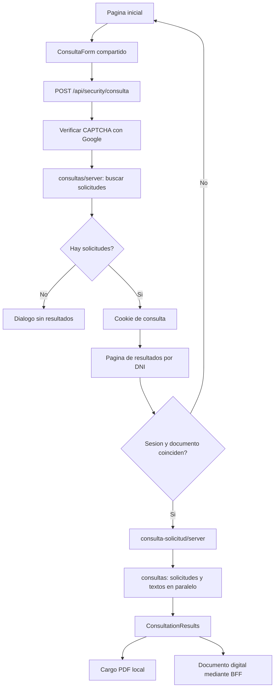
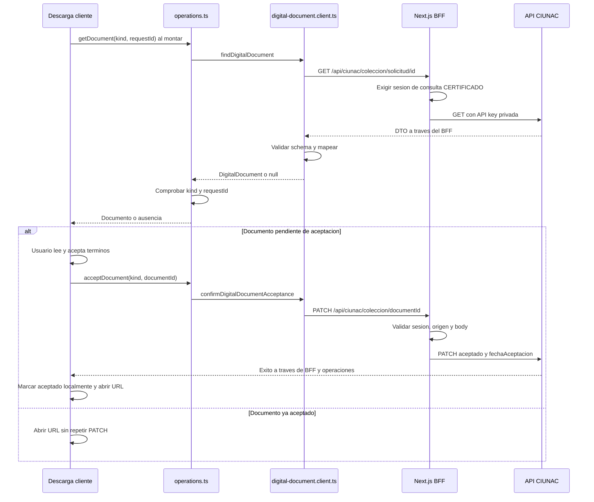
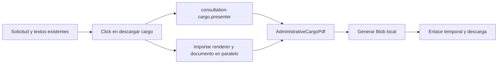

# Lectura de Codigo: Consulta de Solicitud

Revisado el 2026-09-28 contra el codigo actual, aplicacion 1.6.6. Segunda entrega
del recorrido modulo por modulo, despues de [consulta-certificado](consulta-certificado.md).
Documenta lo implementado, no una nueva arquitectura. Complementa el
[SDD](../sdd.md), [ADR-018](../adr/018-modular-request-consultation.md) y
[ADR-031](../adr/031-pragmatic-feature-architecture.md).

## 1. Que hace y que no hace

Consulta las solicitudes asociadas a un documento de identidad, muestra su
estado y permite obtener un cargo o descargar el certificado/constancia digital
emitido por el proveedor. La URL de resultados es `/consulta-solicitud/{dni}`:
el parametro identifica al solicitante, no a una solicitud ni al certificado QR.

| Recorrido | Entrada | Proteccion | Resultado |
| --- | --- | --- | --- |
| Consulta de solicitud | Documento de identidad y CAPTCHA | Sesion de consulta asociada al documento | Lista de solicitudes, cargo y documento digital disponible |
| Consulta de certificado | ID opaco del certificado, normalmente desde QR | Acceso publico previsto | Verificacion del certificado y notas; no descarga |
| Registro de solicitud | Formularios de cada feature | OTP y sesion de correo verificado | Nueva solicitud y notificacion |

Aqui no se registra al estudiante, no se cobra, no se sube voucher, no se
verifica correo ni se envia notificacion. Se muestran datos de pago ya guardados.
No hay store Zustand propio: formulario y descargas tienen estado local; los
resultados llegan desde servidor y la autorizacion via cookie cifrada.

## 2. Mapa de archivos propios

Son 12 archivos bajo `modules/consulta-solicitud`. Los links apuntan al codigo
actual; no a los directorios de cuatro capas retirados durante la simplificacion.

| Archivo | Responsabilidad | Comunicacion |
| --- | --- | --- |
| [index.ts](../../../modules/consulta-solicitud/index.ts) | API publica de UI; exporta ConsultationResults | Ruta de resultados -> componente |
| [server.ts](../../../modules/consulta-solicitud/server.ts) | Entrada server-only getSolicitudConsultation; fija contexto CERTIFICADO | API publica de consultas/server |
| [client.tsx](../../../modules/consulta-solicitud/client.tsx) | Compone operaciones digitales con funciones HTTP y entrega callbacks estables a la UI | operations + infraestructura -> componente cliente |
| [model.ts](../../../modules/consulta-solicitud/model.ts) | DigitalDocument, tipo certificado/constancia, query de lectura y command de aceptacion | Contratos internos sin React ni HTTP |
| [operations.ts](../../../modules/consulta-solicitud/operations.ts) | Valida ID de solicitud y correspondencia del documento; valida ID antes de aceptar | Funciones HTTP inyectadas, no imports de infraestructura |
| [digital-document.client.ts](../../../modules/consulta-solicitud/infrastructure/digital-document.client.ts) | GET del documento y PATCH de aceptacion; distingue ausencia | lib/api.service -> BFF; schemas y mapper |
| [digital-document.schemas.ts](../../../modules/consulta-solicitud/infrastructure/digital-document.schemas.ts) | Valida respuestas externas y aliases historicos; infiere DTOs | Datos unknown -> DTO validado |
| [digital-document.mapper.ts](../../../modules/consulta-solicitud/infrastructure/digital-document.mapper.ts) | Convierte DTO certificado/constancia a DigitalDocument | Schema -> modelo interno |
| [consultation-results.tsx](../../../modules/consulta-solicitud/components/consultation-results.tsx) | Vista server: estudiante, tarjetas, estado y eleccion cargo/documento | Resultado publico de consultas -> descargas cliente |
| [digital-document-download.tsx](../../../modules/consulta-solicitud/components/digital-document-download.tsx) | Lectura al montar, terminos, aceptacion, errores y descarga externa | Callbacks de client.tsx; no importa HTTP |
| [download-cargo.tsx](../../../modules/consulta-solicitud/components/download-cargo.tsx) | Genera Blob y descarga cargo local al pulsar | Presenter + imports dinamicos de renderer/documento PDF |
| [consultation-cargo.presenter.ts](../../../modules/consulta-solicitud/components/consultation-cargo.presenter.ts) | Prepara titulo, campos, fechas y textos del cargo | Solicitud/textos -> AdministrativeCargoDocument |

`server.ts` es una funcion de servidor importada por una pagina, no un endpoint
HTTP ni una Server Action. `client.tsx` es un punto de composicion del navegador,
no un servicio externo. Las APIs index/server permiten que App Router no conozca
los archivos internos. El modelo de la lista pertenece a `modules/consultas`;
el modelo DigitalDocument pertenece a este feature.

### Rutas App Router

| Archivo | Papel |
| --- | --- |
| [page.tsx inicial](../../../app/consulta-solicitud/page.tsx) | Compone ConsultaPage y ConsultaForm con solicitud=CERTIFICADO |
| [page.tsx de resultados](../../../app/consulta-solicitud/[dni]/page.tsx) | Lee params, exige sesion coincidente, carga resultados, resuelve vacio o vista |
| [loading.tsx](../../../app/consulta-solicitud/[dni]/loading.tsx) | Skeleton durante la carga del segmento de resultados |
| [error.tsx](../../../app/consulta-solicitud/[dni]/error.tsx) | Mensaje seguro y reset para errores de resultados |

No hay layout ni not-found propios en este segmento. La ausencia de resultados
no es un 404: se representa con EmptyState. La falta de sesion redirige al formulario.

## 3. Flujo de consulta, paso a paso

1. La pagina inicial monta el formulario compartido. React Hook Form valida un
   documento alfanumerico de 8 o 9 caracteres, lo normaliza a mayusculas y exige
   un token CAPTCHA antes de enviar.
2. `consultByDocument` envia `{ documento, type: 'CERTIFICADO', captchaToken }`
   mediante `POST /api/security/consulta`. El navegador no envia la API key.
3. El Route Handler comprueba origen y JSON, valida el token con Google en
   servidor y llama a `findConsultationRequests` de consultas/server.
4. Esa funcion normaliza el documento, hace `GET solicitudes/documento/{dni}`
   mediante ciunacRequest, valida el arreglo y lo mapea al modelo de consulta.
   Esta primera comprobacion no consulta textos.
5. Responde `{ ok: true, found }`. Solo si encuentra solicitudes escribe
   `ciunac_consultation_session`, con documento, tipo y expiracion de 10 minutos.
   La cookie es cifrada, HttpOnly, SameSite=Strict, path=/ y Secure en produccion.
6. Si found=false, el formulario muestra ausencia y no navega. Si hay error,
   muestra el dialogo de error. El CAPTCHA se reinicia al terminar el intento.
   Si found=true, navega a `/consulta-solicitud/{dni}`.
7. La pagina de resultados exige una sesion vigente de tipo CERTIFICADO cuyo
   documento coincida con el parametro. Sin ella redirige a `/consulta-solicitud`.
8. `getSolicitudConsultation` delega en `getConsultationRequests`. Solicitudes y
   textos se cargan en paralelo. No se reutiliza la respuesta de la comprobacion
   CAPTCHA ni se guarda la lista en la cookie.
9. La ruta muestra EmptyState si la lista queda vacia; en otro caso entrega el
   resultado a ConsultationResults. Un fallo de solicitudes llega a error.tsx.
   Un fallo de textos conserva la lista y muestra una advertencia auxiliar.

El nombre CERTIFICADO es un contexto historico de consulta: **el filtro real
excluye location**, no restringe estrictamente a IDs 1-6. Incluye constancias
(tipos 5 y 6), certificados y eventuales tipos clasificados como other. No equivale
al proposito OTP CERTIFICADO utilizado para autorizar el registro.

### Transformacion de la lista y estados visibles

Los schemas compartidos validan IDs positivos, estudiante, idioma, nivel, estado,
fechas y pago. Exigen coincidencia entre tipoSolicitudId/tiposSolicitud.id y
estadoId/estado.id. Un elemento mal formado invalida la respuesta completa;
no se omite silenciosamente. El mapper elimina del modelo los campos no usados.

| Datos externos | Modelo de consulta | Uso |
| --- | --- | --- |
| estudiante | student | Nombre, documento y cargo |
| tiposSolicitud + tipoSolicitudId | requestType con kind | Diferenciar certificado, constancia y ubicacion |
| estado + estadoId | status con step | Imagen, avance y descarga habilitada |
| creadoEn, digital, observaciones | createdAt, digital, observations | Fecha, modo de entrega y motivo de rechazo |
| pago, numeroVoucher, fechaPago | payment | Datos historicos del cargo, no nuevo pago |

Las reglas de estado viven en consultas/model.ts. Prevalece rejected (ID 5 o
RECHAZADO), luego registered (ID 1 o NUEVO), luego ready (ID 3, PARA RECOGER o
ENTREGADO); el resto es processing. La vista conserva el orden del backend,
no ordena las solicitudes. Usa el estudiante de la primera; la pagina comprueba
antes que la lista no este vacia.

| Situacion | Que muestra ConsultationResults |
| --- | --- |
| Solicitud rechazada | Motivo del rechazo; sin boton de cargo ni documento en esa tarjeta |
| Digital y ready | Monta la busqueda del documento digital |
| Cualquier otra solicitud no rechazada | Cargo generado localmente |
| Textos auxiliares fallidos | Solicitudes y advertencia; no bloquea todos los resultados |

## 4. Documento digital: lectura, aceptacion y descarga

El certificado o constancia emitido **ya existe fuera del frontend**. No se usa
React PDF para reconstruirlo. client.tsx conecta getDigitalDocument y
acceptDigitalDocument con el cliente HTTP de infraestructura.

Si PATCH falla, no se marca aceptado ni se abre la URL; el dialogo permite un
reintento manual. No hay reintento HTTP automatico. La UI usa refs para bloquear
aceptaciones simultaneas y descargas repetidas durante 1.5 segundos. Este ultimo
plazo es un bloqueo visual, no una confirmacion de descarga ni idempotencia backend.

### Contratos digitales y compatibilidad historica

| Operacion | URL consumida desde navegador | Contrato |
| --- | --- | --- |
| Buscar certificado | GET /api/ciunac/certificados/solicitud/{requestId} | Objeto certificado |
| Buscar constancia | GET /api/ciunac/constancias/solicitud/{requestId} | Objeto o primer elemento de un arreglo |
| Aceptar certificado | PATCH /api/ciunac/certificados/{documentId} | aceptado=true, fechaAceptacion ISO |
| Aceptar constancia | PATCH /api/ciunac/constancias/{documentId} | Mismo body, coleccion distinta |

El requestId es el ID numerico de la solicitud; documentId identifica el
documento emitido. No deben intercambiarse ni sustituirse por el DNI.

- `_id` o `id` se convierten en id string; solicitudId admite entero positivo o
  string numerico y se convierte a numero.
- numeroDocumento acepta string o numero historico y se convierte a string.
- Constancias admite `id_solicitud` y `dni` como aliases de solicitudId y
  numeroDocumento. Certificados usa idioma como descriptor; constancias usa tipo.
- nivel y fechaEmision ausentes se normalizan a null; aceptado debe ser boolean.
- La URL debe ser absoluta HTTP/HTTPS. Esto descarta javascript:, pero no es una
  allowlist de hosts ni verifica la propiedad o contenido del archivo remoto.
- Los DTOs se infieren con z.output; los schemas aceptan campos adicionales,
  pero el mapper solo conserva los campos del modelo DigitalDocument.

Para constancias se toma el primer elemento del arreglo, no se selecciona por
fecha ni se recorre buscando otra coincidencia. Luego operations verifica el
requestId; un elemento inconsistente produce error. No se aplica esta tolerancia
de arreglo al certificado. Se preserva asi la compatibilidad del proveedor actual.

| Respuesta o evento | Estado de descarga |
| --- | --- |
| Lectura en curso | loading: boton deshabilitado |
| HTTP 404, respuesta vacia/null o arreglo vacio de constancia | empty: muestra el cargo alternativo |
| Documento valido y coincidente | data: boton de certificado o constancia |
| Error HTTP/red, DTO mal formado o ID inconsistente | error visible + Reintentar consulta + cargo alternativo |
| Error al aceptar | Conserva dialogo y permite reintentar; no inicia descarga |

`apiFetchOptional` distingue 404/vacio del resto de errores. `apiCommand` permite
exito sin cuerpo, como un 204 de aceptacion. El nombre de descarga digital se
construye con documento, descriptor, nivel y fecha disponibles, sanitizando
caracteres. La descarga usa un enlace a la URL remota: no verifica bytes recibidos
y su comportamiento final depende del navegador y de las cabeceras del proveedor.

## 5. Cargo: PDF local, no documento emitido

download-cargo recibe la solicitud y los textos ya cargados. No consulta
`solicitudes/{id}` otra vez ni acepta un documento digital para generar el cargo.

El presenter elige CARGO PARA LA ENTREGA DE CERTIFICADOS o DE CONSTANCIAS segun
requestType.kind. Tambien elige Tipo de documento/Tipo de constancia, datos del
estudiante, idioma, nivel, pago y voucher. Usa TEXTO_NOMBREAN, TEXTO_1_FINAL,
TEXTO_1_DISCLAMER y TEXTO_2_DISCLAMER; fija el plazo de 07 dias habiles para ambos.

El renderer compartido aporta encabezado institucional, logo, estilos, pagina
A4 de 595.28 x 841.89 pt y wrap=false. No contiene reglas de constancias o
certificados. Conservar wrap=false no garantiza que cualquier texto ilimitado
quepa sin recorte; los cambios de contenido requieren revision visual.

React PDF y el renderer solo se importan al pulsar, mediante Promise.all. El
estado es idle/generating/error; el boton se deshabilita mientras genera y permite
reintento si falla. El nombre actual es documento-idioma-nivel.pdf. Se revoca
la URL temporal creada para el Blob despues de disparar la descarga.

**Diferencia importante:** este presenter devuelve string vacio cuando falta un
texto y no bloquea la generacion. Si textos falla, puede generarse un cargo sin
ano o parrafos auxiliares. No debe documentarse como si existiera aqui la guarda
de textos obligatorios de otros flujos.

## 6. Dependencias compartidas y fronteras

| Archivo o entrada externa | Responsabilidad utilizada |
| --- | --- |
| [consultas/index.ts](../../../modules/consultas/index.ts) | API publica del formulario, modelos y busqueda de texto |
| [consultas/server.ts](../../../modules/consultas/server.ts) | Lookup previo y carga de contexto para resultados |
| [consultas/model.ts](../../../modules/consultas/model.ts) y [operations.ts](../../../modules/consultas/operations.ts) | Reglas de documento/tipo/estado y lecturas paralelas; detalles internos de consultas |
| [consultation.repository.ts](../../../modules/consultas/infrastructure/server/consultation.repository.ts) | HTTP server y validacion de listas |
| [consultation.schemas.ts](../../../modules/consultas/infrastructure/consultation.schemas.ts) y [mapper](../../../modules/consultas/infrastructure/consultation.mapper.ts) | DTO externo -> modelo de listado |
| [consulta-form.tsx](../../../modules/consultas/components/consulta-form.tsx) | RHF, CAPTCHA, mensajes y navegacion |
| [security-client.ts](../../../modules/security/client/security-client.ts) | Peticion inicial y guarda de respuesta ok/found |
| [Route Handler consulta](../../../app/api/security/consulta/route.ts) | Origen, entrada, CAPTCHA y emision de cookie |
| [session.ts](../../../modules/security/server/session.ts) | Cifrado, lectura, expiracion y coincidencia de sesion |
| [captcha.ts](../../../modules/security/server/captcha.ts) | Verificacion del token con Google desde servidor |
| [api.service.ts](../../../lib/api.service.ts) y [browser-http.ts](../../../modules/shared/infrastructure/http/browser-http.ts) | Prefijo BFF, JSON, ausencia y errores de transporte browser |
| [Route Handler BFF](../../../app/api/ciunac/[...path]/route.ts) | Compone autorizacion, validacion y comunicacion con CIUNAC |
| [proxy-policy.ts](../../../app/api/ciunac/proxy-policy.ts) y [proxy-validation.ts](../../../app/api/ciunac/proxy-validation.ts) | Allowlist, tipo de sesion y schema del PATCH |
| [ciunac-client.ts](../../../modules/security/server/ciunac-client.ts) | API key privada, no-store y timeout de conexion al proveedor |
| [administrative-cargo-pdf.tsx](../../../modules/shared/components/administrative-cargo-pdf.tsx) | Renderer visual A4 reutilizable |
| [consulta-wrapper.tsx](../../../modules/shared/components/consulta-wrapper.tsx), [empty-state.tsx](../../../modules/shared/components/empty-state.tsx), [route-error-state.tsx](../../../modules/shared/components/route-error-state.tsx) | Layout y estados UI comunes |

Las paginas y ConsultationResults son Server Components. El formulario, client.tsx,
las descargas y error.tsx son fronteras cliente. Los tipos importados con import
type no cargan el renderer PDF en runtime. Las tarjetas pueden incorporar
primitivas cliente de shadcn: vista server no significa JavaScript cero.

No hay imports desde este feature a internals de solicitud-certificado,
solicitud-constancia o consulta-certificado. Consultar ambos documentos no requiere
invocar sus flujos de registro. El BFF comparte infraestructura de autorizacion
con otros flujos, pero selecciona operaciones por metodo/ruta y sesion.

## 7. Seguridad: controles reales y pendientes

- La pagina de resultados exige documento y tipo coincidentes con una cookie
  vigente. Entrar escribiendo la URL sin esa cookie redirige: no es el QR publico.
- CAPTCHA se comprueba en servidor. No prueba que quien consulta sea titular del
  DNI; no hay OTP ni autenticacion personal en este recorrido.
- Los datos CIUNAC se consultan mediante servidor con API key privada y no-store.
  El navegador recibe datos de resultados y URL de descarga, no la credencial.
- Las lecturas/aceptaciones digitales del BFF requieren sesion de consulta
  CERTIFICADO. Una sesion OTP de registro por si sola no autoriza esas operaciones.
- El PATCH comprueba origen y un body estricto con boolean aceptado y fecha ISO.
  El cliente normal envia true; el schema actual no exige literal true y la fecha
  procede del cliente. No atribuirle un sello temporal autoritativo del servidor.
- Los errores de rutas API se normalizan con correlation ID y logging server-side;
  no se muestran cuerpos internos del proveedor como mensaje de error de ruta.

**Pendiente relevante:** el BFF comprueba tipo de sesion, pero para estas dos
operaciones digitales no compara el documento solicitado con el DNI de la cookie.
La comprobacion kind/requestId de operations.ts se ejecuta en cliente y comprueba
coherencia, no autorizacion. El listado compartido tampoco refiltra por DNI los
registros devueltos por solicitudes/documento/{dni}: confia en ese contrato backend.
Son limites distintos de la guarda URL/cookie; no se corrigen en esta entrega documental.

El parametro DNI aparece en URL e historial. La URL externa del PDF llega al
navegador y su acceso posterior depende del proveedor. No confundir no-store en
fetch con una politica completa de privacidad de logs, historial o archivos externos.

## 8. Lecturas y costo del flujo actual

Conteo derivado de llamadas en codigo, no medicion nueva de latencia ni benchmark.
Para una consulta exitosa normal, sin reintentos, prefetch ni remontajes adicionales:

| Momento | Consultas externas |
| --- | --- |
| POST inicial | 1 verificadora CAPTCHA a Google; despues 1 GET solicitudes/documento/{dni} |
| Pagina de resultados autorizada | 1 GET solicitudes/documento/{dni} y 1 GET textos en paralelo |
| Tarjetas digitales ready | N GET digitales al montar, uno por tarjeta elegible |
| Aceptacion pendiente | 1 PATCH por confirmacion exitosa sin reintentos |
| Cargo | 0 llamadas CIUNAC; carga de chunks PDF bajo demanda |
| Archivo digital | Acceso del navegador a URL del proveedor al descargar |

En total son 3 + N lecturas CIUNAC antes de aceptar/descargar en ese recorrido.
El GET por documento se repite entre la comprobacion CAPTCHA y los resultados.
Es comportamiento actual: la cookie solo guarda permiso temporal, no el listado.
Las dos lecturas de resultados ya son paralelas; la busqueda digital espera al
listado y a la hidratacion. Un reintento de lectura repite su GET; no crea solicitudes.
Una entrada directa con cookie vigente omite el POST inicial, no la guarda de sesion.

## 9. Orden recomendado para revisar o modificar

1. Leer las dos paginas App Router: entrada, guarda y eleccion vacio/vista.
2. Seguir server.ts hacia consultas/server.ts y operations.ts para entender la lista.
3. Leer consultation-results.tsx: alli se decide rechazo, cargo o documento digital.
4. Seguir client.tsx -> operations.ts -> digital-document.client.ts para la descarga.
5. Leer schema y mapper para entender las diferencias reales del backend de constancias.
6. Leer download-cargo y su presenter solo si se revisa el cargo, no el documento emitido.
7. Revisar policy/validation del BFF para autorizacion: ocultar un boton no autoriza datos.

| Cambio solicitado | Lugar principal | Comprobacion necesaria |
| --- | --- | --- |
| Cambiar estado que permite descarga | Reglas de consultas/model y eleccion de la vista | Impacto tambien en consultas compartidas |
| Nuevo alias de respuesta de constancias | digital-document.schemas y mapper | Fixture real anonimizada, unitarias e integracion |
| Cambiar aceptacion | operations, cliente digital y contrato BFF | No descargar tras fallo; no duplicar PATCH por clics simultaneos |
| Modificar titulo o campos del cargo | consultation-cargo.presenter | Certificado y constancia, textos incompletos |
| Cambiar formato visual de todos los cargos | Renderer compartido | Revisar tambien los consumidores de registro y ubicacion |
| Autorizar por propietario | Servidor/BFF y soporte del backend | Pruebas negativas por documento e ID ajenos; no solo validacion cliente |

La separacion actual tiene responsabilidades concretas: estado visual en
componentes, reglas comprobables en operaciones/modelo, adaptacion de contratos
en infraestructura y composicion en las entradas publicas. No se necesita crear
otra clase, port o command por cada llamada. Los dos modelos (lista y documento)
no son duplicados: describen respuestas y usos distintos.

## 10. Pruebas que protegen este recorrido

| Archivo | Evidencia existente |
| --- | --- |
| [consultation-typing.test.ts](../../../tests/unit/consultas/consultation-typing.test.ts) | Schemas, mapper, filtro, estados, aliases numericos/de constancia, URL, ID coincidente, comandos y variantes del cargo |
| [consultation-pipelines.test.ts](../../../tests/integration/consultation-pipelines.test.ts) | Lookup sin textos, paralelismo, no-store, ausencia/error, GET y PATCH digitales sin API key en browser; incluye casos de ubicacion |
| [feature-pipelines.test.ts](../../../tests/integration/feature-pipelines.test.ts) | Entrada publica de solicitud y fallos del proveedor; incluye tambien registro de certificado |
| [ciunac-proxy-policy.test.ts](../../../tests/unit/security/ciunac-proxy-policy.test.ts) | Matriz metodo/ruta/sesion del BFF |
| [ciunac-proxy-route.test.ts](../../../tests/integration/ciunac-proxy-route.test.ts) | Contratos y rechazos del proxy |
| [security-route-contracts.test.ts](../../../tests/integration/security-route-contracts.test.ts) | Contratos de seguridad y consulta con sesiones |
| [consultas.smoke.spec.ts](../../../tests/e2e/consultas.smoke.spec.ts) | Consulta por documento, texto fallido, lista invalida/vacia, certificado historico, constancia, doble clic, aceptacion fallida y reintento para ambos documentos |

No todos los tests de esos archivos pertenecen a consulta-solicitud. Las pruebas
del PDF comprueban datos y dimensiones A4; eso no sustituye una inspeccion visual
con textos largos. Las pruebas con proveedor simulado no certifican disponibilidad
ni descarga correcta de todas las URLs del proveedor real.

### Verificacion de esta entrega documental

Se ejecutaron las tres primeras suites de la tabla con Vitest: **51/51 pruebas
correctas**, con fetch simulado. No se llamo al backend de produccion.
Lint y type-check correctos. Se verificaron 94 enlaces locales entre esta guia,
README, overview y SDD, sin destinos inexistentes, y los bloques Markdown estan
cerrados. Los diagramas Mermaid se revisaron como codigo; no se renderizaron.
git diff --check correcto, con advertencias LF/CRLF del worktree preexistente.
No se modifico codigo productivo. No se repitieron build ni E2E en esta entrega;
los escenarios arriba enumerados son cobertura existente, no una nueva ejecucion.
