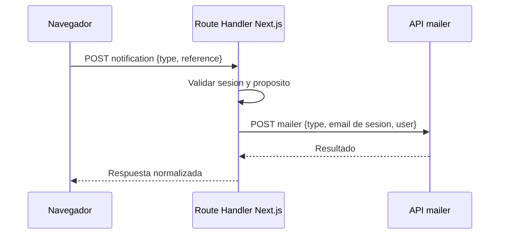

# Contratos de Integracion

## Proposito
Documentar las fronteras HTTP visibles desde el navegador y la comunicacion server-side con servicios externos.

## Frontera BFF
El navegador solo consume rutas same-origin de Next.js. `/api/ciunac/[...path]` aplica allowlist, sesion, origen, content type, tamano y validacion Zod antes de reenviar una operacion. La cabecera `x-api-key` se agrega exclusivamente en servidor.

| Endpoint interno | Metodo | Autorizacion | Respuesta |
| --- | --- | --- | --- |
| `/api/security/otp/request` | `POST` | CAPTCHA valido | `202 { ok: true }` |
| `/api/security/otp/verify` | `POST` | Desafio OTP valido | `200 { ok: true }` |
| `/api/security/consulta` | `POST` | CAPTCHA valido | `{ ok, found }` |
| `/api/security/notifications` | `POST` | Sesion de email verificada | `202 { ok: true }` |
| `/api/ciunac/[...path]` | `GET/POST/PATCH` | Segun allowlist | Payload de exito o error normalizado |

## Correo
El navegador ya no accede a `mailer`. OTP y notificaciones se envian desde Route Handlers, que recuperan el email de la sesion cuando corresponde.

## Solicitud de Constancia
| Aspecto | Estado |
| --- | --- |
| Guardado backend | Pendiente de confirmacion funcional. |
| Endpoint candidato | `solicitudes` si constancia es tipo de solicitud. |
| Respuesta minima esperada | Identificador de solicitud. |
| Correo | Se dispara por `/api/security/notifications`; `mailer` solo es accesible server-side. |
| Cargo PDF | Generado en frontend con `@react-pdf/renderer`. |

Queda pendiente confirmar un tipo de correo propio para constancias y el contrato backend definitivo antes de completar la Fase 1E.
