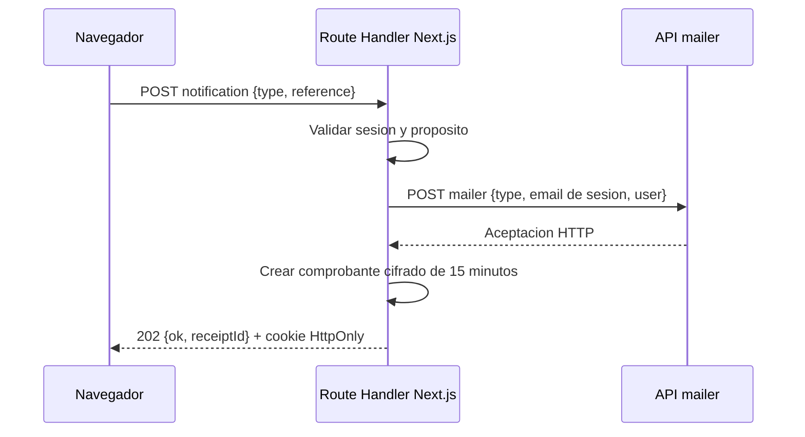

# Contratos de Integracion

## Proposito
Documentar las fronteras HTTP visibles desde el navegador y la comunicacion server-side con servicios externos.

## Frontera BFF
El navegador solo consume rutas same-origin de Next.js. `/api/ciunac/[...path]` aplica allowlist, sesion, origen, content type, tamano y validacion Zod antes de reenviar una operacion. La cabecera `x-api-key` se agrega exclusivamente en servidor.

| Endpoint interno | Metodo | Autorizacion | Respuesta |
| --- | --- | --- | --- |
| `/api/security/otp/request` | `POST` | CAPTCHA valido | `202 { ok: true }` |
| `/api/security/otp/verify` | `POST` | Desafio OTP valido | `200 { ok: true }` |
| `/api/security/consulta` | `POST` | CAPTCHA valido | `{ ok, found }` |
| `/api/security/notifications` | `POST` | Sesion de email verificada | `202 { ok: true, receiptId }` |
| `/api/security/ubicacion/profile` | `POST` | Sesion OTP `UBICACION` | `200 { ok: true }` + cookie `HttpOnly` |
| `/api/ciunac/[...path]` | `GET/POST/PATCH` | Segun allowlist | Payload, `204` sin cuerpo o error normalizado |

## Resultado Comun

Los clientes internos representan de manera explicita los tres resultados posibles:

```ts
type AppResult<T> =
  | { ok: true; kind: 'data'; data: T }
  | { ok: true; kind: 'empty' }
  | { ok: false; kind: 'error'; error: AppError }
```

`AppError` usa los codigos `VALIDATION`, `AUTHENTICATION`, `AUTHORIZATION`, `EXTERNAL_SERVICE`, `NETWORK` y `UNEXPECTED`. Puede incluir `status`, `correlationId` y `retryable`, pero nunca el cuerpo ni el mensaje interno del proveedor.

- Un proveedor `2xx` sin contenido se traduce a HTTP `204` en el BFF.
- Un comando puede aceptar `204` si no necesita datos de respuesta.
- Una creacion que necesita un ID rechaza el cuerpo vacio o incompleto y detiene las operaciones posteriores.
- JSON mal formado o una estructura que no cumple el esquema minimo se clasifica como `EXTERNAL_SERVICE`.
- `404` solo se convierte en ausencia para recursos definidos como opcionales; otros fallos se propagan.

## Correo
El navegador ya no accede a `mailer`. OTP y notificaciones se envian desde Route Handlers, que recuperan el email de la sesion cuando corresponde.



El `receiptId` permite que una pagina final confirme que el Route Handler obtuvo una aceptacion HTTP de `mailer`. No demuestra entrega SMTP. Si el correo falla despues de persistir una solicitud, la UI conserva el ID y solo puede reintentar la notificacion; no vuelve a crear estudiante, solicitud, voucher o documentos.

## Solicitud de Constancia
| Aspecto | Estado |
| --- | --- |
| Guardado backend | Implementado con el contrato existente de solicitudes. |
| Endpoint externo | `POST solicitudes`, mediante `/api/ciunac/solicitudes`. |
| Tipos | `tipoSolicitudId` `5` o `6`, obtenidos del catalogo `tipossolicitud`. |
| Respuesta minima | `{ id }`; una respuesta vacia o incompleta detiene correo y navegacion. |
| Voucher | `POST upload/vouchers`, compartido con certificados y ubicacion. |
| Correo | Entrada BFF `CONSTANCIA`; adaptacion temporal a `CERTIFICADO` al invocar `mailer`. |
| Cargo PDF | Generado en frontend con `@react-pdf/renderer`. |

El comprobante cifrado conserva el tipo `CONSTANCIA`, por lo que una pagina final no puede validar un recibo emitido para otro flujo. Queda pendiente incorporar una plantilla `CONSTANCIA` nativa en el proveedor de correo.

### Contratos Tipados de Constancia

El slice no usa `Isolicitud` ni `ISolicitudRes` como frontera. Los adaptadores construyen DTOs explicitos y validan toda respuesta como `unknown` antes de devolver tipos de aplicacion.

| Operacion | Entrada minima | Salida valida |
| --- | --- | --- |
| Crear o actualizar estudiante | Nombres, apellidos, documento, celular, email y datos UNAC cuando apliquen | `{ id: string }` |
| Crear solicitud | IDs de estudiante, tipo `5/6`, idioma, nivel, periodo, pago y voucher cuando aplique | `{ id: string }` |
| Consultar cargo | ID positivo | Cargo completo o ausencia real por `404` |

Una respuesta vacia, un ID cero/negativo, un objeto sin ID o un cargo sin estudiante, tipo, idioma o nivel se clasifica como respuesta externa invalida. No se continua al correo, navegacion o PDF.

### Carga de Voucher

`POST /api/ciunac/upload/vouchers` requiere sesion verificada y `multipart/form-data`. El Route Handler aplica un maximo real de archivo de 8 MiB y permite:

- PDF con extension `.pdf`, MIME `application/pdf` y firma `%PDF-`.
- PNG con extension `.png`, MIME `image/png` y firma PNG completa.
- JPEG con extension `.jpg` o `.jpeg`, MIME `image/jpeg` y marcador inicial JPEG.

Archivo ausente, vacio, sobredimensionado o incompatible devuelve un error normalizado `INVALID_FILE`. La API externa no recibe el archivo rechazado. La validacion comprueba formato, no autenticidad del comprobante de pago.

## Solicitud de Beca

La ruta de proceso obtiene `facultades` y `escuelas` server-side. Ambas respuestas
deben contener al menos un registro con IDs positivos; una lista vacia o un objeto
incompleto activa el estado de error de ruta. La escuela seleccionada debe pertenecer
a la facultad elegida.

`POST /api/ciunac/solicitudbecas` requiere sesion OTP `BECA` y recibe un DTO estricto.
El payload conserva nombres snake_case y el campo historico `contancia_tercio`. No
acepta IDs de respuesta, estado, observaciones ni fechas como parte del request.

La respuesta valida contiene `_id` o `id` como string no vacio de hasta 80 caracteres.
Una respuesta `204`, `{}`, un ID vacio o un tipo inesperado produce
`EXTERNAL_SERVICE`; no se invoca `mailer` sin un identificador confirmado.

`POST /api/ciunac/upload/becas` acepta exclusivamente un archivo PDF por llamada,
con maximo de 8 MiB. Cliente y servidor comprueban ausencia, extension `.pdf` y MIME
`application/pdf`; el Route Handler verifica adicionalmente la firma `%PDF-`. Un
archivo rechazado no se reenvia al proveedor externo.

Los cinco documentos requeridos son constancia de matricula, historial academico,
constancia de tercio o quinto, carta de compromiso y declaracion jurada. Las URLs
devueltas se incluyen en el DTO; comprobar su propiedad definitiva corresponde al
backend externo.

## Solicitud de Certificado

La ruta de proceso obtiene tipos `1` a `4`, idiomas, facultades, escuelas y textos
desde servidor. Cada respuesta se valida como `unknown` con Zod antes de mapearla a
`CertificateCatalogs`; un catalogo vacio, mal formado o con una escuela asociada a
una facultad inexistente activa `error.tsx`.

| Operacion | Entrada minima | Salida valida |
| --- | --- | --- |
| Buscar estudiante | Documento verificado | Estudiante completo o ausencia real por `404` |
| Crear o actualizar estudiante | Identidad, contacto y datos UNAC cuando apliquen | `{ id: string }` |
| Crear solicitud | Estudiante, tipo `1..4`, idioma, nivel `1..3`, periodo, precio y voucher | `{ id: string }` |
| Consultar cargo | ID entero positivo | `CertificateCargo` completo o ausencia real por `404` |

El DTO externo conserva `estudianteId`, `tipoSolicitudId`, `idiomaId`, `nivelId`,
`estadoId`, `periodo`, `alumnoCiunac`, `fechaPago`, `pago`, `digital`,
`numeroVoucher` e `imgVoucher`. No incluye `trabajador`, `antiguo` ni
`imgCertEstudio`. `digital` es verdadero exclusivamente para tipos `2` y `4`.

Antes de reenviar `POST /api/ciunac/solicitudes`, el BFF vuelve a consultar
`tipossolicitud` y compara el monto en centimos con el precio normal vigente. Si no
coincide devuelve:

```json
{
  "ok": false,
  "error": {
    "code": "PRICE_CHANGED",
    "message": "El tarifario cambio. Revise nuevamente el monto antes de continuar."
  },
  "correlationId": "..."
}
```

El estado HTTP es `409` y la API externa no recibe la solicitud. Si el tarifario
no esta disponible, el BFF bloquea la operacion con `503`.

Una respuesta vacia, nula, sin ID o mal formada detiene correo y navegacion. Si la
solicitud ya fue creada pero `mailer` falla, la UI conserva el ID y reintenta solo
`CERTIFICADO`; no repite estudiante, voucher ni solicitud.

## Solicitud de Examen de Ubicacion

La sesion OTP `UBICACION` se complementa con una cookie cifrada `HttpOnly` de 15
minutos que contiene el perfil declarado. El query string `alumno_ciunac` no forma
parte del contrato. El BFF exige que el valor de `alumnoCiunac` coincida con el
perfil antes de reenviar la solicitud.

| Operacion | Entrada minima | Salida valida |
| --- | --- | --- |
| Guardar perfil | `{ isCiunacStudent: boolean }` | `{ ok: true }` y cookie segura |
| Crear o actualizar estudiante | Identidad, contacto, email de sesion e `imgDoc` | `{ id: string }` |
| Crear solicitud | `{ documentNumber, request }`, tipo `7`, precio `30`, voucher y perfil | `{ id: string }` |
| Consultar cargo | ID entero positivo | `LocationCargo` completo o ausencia real por `404` |

Antes de `POST solicitudes`, el BFF consulta `tipossolicitud` y exige que el unico
tipo `7` tenga precio `30`. Tambien exige `request.pago === 30` y comprueba que no
exista estado `1` para el mismo documento, idioma y tipo. Un monto manipulado
devuelve `409 PRICE_CHANGED`; una duplicidad devuelve `409 DUPLICATE_REQUEST`; un
tarifario ausente o distinto de S/ 30 devuelve `503`.

No CIUNAC usa nivel basico, no envia `imgCertEstudio` y mantiene `digital: false`.
CIUNAC puede elegir nivel `1..3` y debe adjuntar `imgCertEstudio` como PDF. El
documento de identidad se envia como `imgDoc` y admite PDF, PNG o JPEG. Documento y
certificado tienen maximo de 8 MiB y se validan en servidor por extension, MIME y
firma. El voucher conserva la politica compartida documentada anteriormente.

Una respuesta sin ID detiene correo y navegacion. Un fallo de `mailer` posterior al
guardado conserva el ID y permite reintentar solo `UBICACION`.

## Registro de Alumno Nuevo

La pagina consulta `https://api.q10.com/v1/programas?Limit=30` solo desde servidor
usando `API_KEY_Q10`. La respuesta se valida como `unknown` con Zod y se reduce a
opciones `{ code, name }`. Una lista vacia es un estado funcional; un cuerpo
incompleto o JSON invalido activa el estado de error de ruta.

`POST /api/ciunac/q10/estudiantes` requiere una sesion OTP con proposito `NUEVO`.
El BFF valida el DTO estricto, compara `Email` con el email de la sesion y vuelve a
consultar que `Codigo_programa` siga disponible. Un email diferente o programa
desconocido devuelve `422` normalizado y no alcanza la API externa.

| Campo de dominio | Campo Q10 |
| --- | --- |
| `firstLastName` | `Primer_apellido` |
| `secondLastName` | `Segundo_apellido` |
| `firstName` / `secondName` | `Primer_nombre` / `Segundo_nombre` |
| `document` | `Codigo_tipo_identificacion` / `Numero_identificacion` |
| `birthDate` | `Fecha_nacimiento` ISO |
| `phone` | `Telefono` y `Celular` |
| `program.code` | `Codigo_programa` |

Q10 puede confirmar el comando con `204` o con un objeto JSON. Arreglos, valores
primitivos o JSON mal formado se clasifican como `EXTERNAL_SERVICE`; no se envia
correo. Un fallo de correo posterior conserva el documento y permite reintentar
solo `REGISTER`. Ante red o respuesta indeterminada de la escritura, la UI bloquea
un segundo registro automatico para evitar duplicados.

## Consulta Por Documento

`POST /api/security/consulta` recibe `documento`, `type` y `captchaToken`. La
respuesta publica se valida como `{ ok: true, found: boolean }`; un cuerpo vacio o
mal formado se clasifica como respuesta externa invalida.

Una sesion de consulta valida permite al Server Component recuperar solicitudes por
documento. La respuesta externa se valida como DTO antes de mapearse a
`ConsultedRequest`:

```ts
type ConsultedRequest = {
  id: number
  kind: 'certificate' | 'constancia' | 'location' | 'other'
  step: 'registered' | 'processing' | 'ready' | 'rejected'
  student: { documentNumber: string; fullName: string }
  requestType: { id: number; name: string }
  status: { id: number; name: string }
  language: { id: number; name: string }
  level: { id: number; name: string }
  submittedAt: string
  payment: { amount: number | null; voucherNumber: string | null; paidAt: string | null }
}
```

La consulta `CERTIFICADO` incluye certificados y constancias, pero excluye examen
de ubicacion. `EXAMEN` incluye solo solicitudes de ubicacion. Una lista vacia es un
resultado funcional; una respuesta incompleta o inconsistente produce
`EXTERNAL_SERVICE`.

Los textos auxiliares son opcionales: su indisponibilidad se informa sin ocultar
solicitudes validas.

### Documentos Digitales

Certificados y constancias digitales se validan con contratos separados. Una URL
de descarga debe usar `http` o `https`; un `404` es ausencia real y una respuesta
mal formada es un error tecnico reintentable. La aceptacion no habilita la descarga
si el proveedor falla.

Limitacion vigente: estas operaciones aun atraviesan el BFF generico. La sesion
autentica el flujo de consulta, pero falta un endpoint especializado que compruebe
que el recurso solicitado pertenece al documento consultado antes de devolver la
URL o aceptar el documento.

## Detalle Publico de Certificado

`GET certificados/{id}` se ejecuta server-side despues de validar una sesion de
consulta `CERTIFICADO`. El identificador admite exclusivamente letras, numeros,
guion y guion bajo, hasta 80 caracteres.

La respuesta minima valida requiere:

- ID, tipo `VIRTUAL/FISICO`, estudiante y numero de documento;
- idioma, nivel, horas, solicitud y numero de registro;
- fechas validas de emision y conclusion;
- estado de entrega y fecha de aceptacion cuando corresponda;
- notas completas o una lista vacia.

El DTO se valida con Zod y se mapea a `CertificateDetail`. Un `404` o un `2xx` sin
cuerpo produce ausencia. Un cuerpo incompleto, fecha invalida o nota mal formada
produce `EXTERNAL_SERVICE`.

Antes de renderizar, el caso de uso exige que `numeroDocumento` coincida con el
documento de la sesion. Si no coincide, responde como recurso no encontrado y no
expone metadatos del certificado.

## Consulta de Examen de Ubicacion

La ruta server-side combina estas operaciones:

| Recurso | Contrato minimo |
| --- | --- |
| `solicitudes/documento/{documento}` | Solicitudes tipadas del contexto de consultas. |
| `detallesubicacion/estudiante/documento/{documento}` | ID, examen, solicitud, nota `0..100`, estado, idioma, nivel y calificacion opcional. |
| `examenesubicacion` | ID y fecha valida. |
| `ciclos` | ID y nombre. |
| `textos` | Codigo y contenido; `TEXTO_NOMBREAN` es requerido para PDF. |

Las respuestas se validan de forma independiente con Zod. Una lista vacia es un
resultado funcional. Un cuerpo mal formado produce `EXTERNAL_SERVICE` y activa el
estado de error de ruta.

El join se realiza por `solicitudId`, `examenId` y `cicloId`. Solo se incluyen
resultados asociados a solicitudes de ubicacion pertenecientes al documento de la
sesion. Cuando el detalle omite estudiante, se utiliza el alumno de la solicitud
autorizada; si incluye otro documento, se descarta.

Una relacion de examen o ciclo ausente conserva la nota con estado `partial`, pero
bloquea la constancia. La constancia tambien requiere resultado terminado y nombre
del año disponible.
