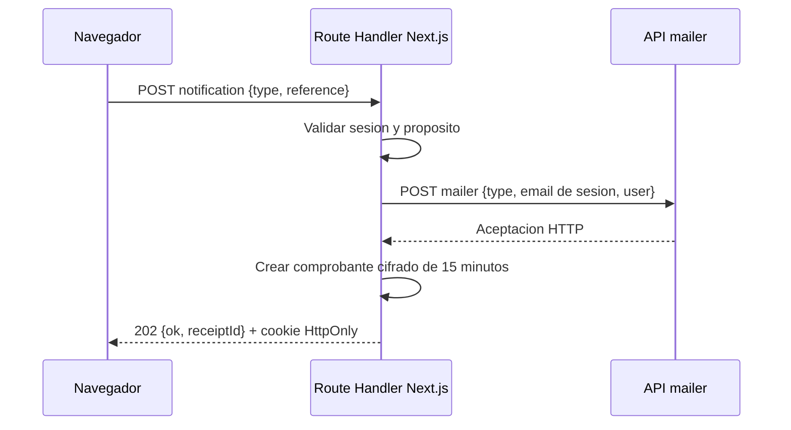

# Contratos de Integracion

## Proposito
Documentar las fronteras HTTP visibles desde el navegador y la comunicacion server-side con servicios externos.

## Frontera BFF
El navegador solo consume rutas same-origin de Next.js. `/api/ciunac/[...path]` aplica allowlist, sesion, origen, content type, tamano y validacion Zod antes de reenviar una operacion. La cabecera `x-api-key` se agrega exclusivamente en servidor.

| Endpoint interno | Metodo | Autorizacion | Respuesta |
| --- | --- | --- | --- |
| `/api/security/otp/request` | `POST` | CAPTCHA valido | `202 { ok: true }` |
| `/api/security/otp/verify` | `POST` | Desafio OTP valido | `200 { ok: true }` |
| `/api/security/consulta` | `POST` | CAPTCHA valido | `{ ok, found }` |
| `/api/security/notifications` | `POST` | Sesion de email verificada | `202 { ok: true, receiptId }` |
| `/api/ciunac/[...path]` | `GET/POST/PATCH` | Segun allowlist | Payload, `204` sin cuerpo o error normalizado |

## Resultado Comun

Los clientes internos representan de manera explicita los tres resultados posibles:

```ts
type AppResult<T> =
  | { ok: true; kind: 'data'; data: T }
  | { ok: true; kind: 'empty' }
  | { ok: false; kind: 'error'; error: AppError }
```

`AppError` usa los codigos `VALIDATION`, `AUTHENTICATION`, `AUTHORIZATION`, `EXTERNAL_SERVICE`, `NETWORK` y `UNEXPECTED`. Puede incluir `status`, `correlationId` y `retryable`, pero nunca el cuerpo ni el mensaje interno del proveedor.

- Un proveedor `2xx` sin contenido se traduce a HTTP `204` en el BFF.
- Un comando puede aceptar `204` si no necesita datos de respuesta.
- Una creacion que necesita un ID rechaza el cuerpo vacio o incompleto y detiene las operaciones posteriores.
- JSON mal formado o una estructura que no cumple el esquema minimo se clasifica como `EXTERNAL_SERVICE`.
- `404` solo se convierte en ausencia para recursos definidos como opcionales; otros fallos se propagan.

## Correo
El navegador ya no accede a `mailer`. OTP y notificaciones se envian desde Route Handlers, que recuperan el email de la sesion cuando corresponde.



El `receiptId` permite que una pagina final confirme que el Route Handler obtuvo una aceptacion HTTP de `mailer`. No demuestra entrega SMTP. Si el correo falla despues de persistir una solicitud, la UI conserva el ID y solo puede reintentar la notificacion; no vuelve a crear estudiante, solicitud, voucher o documentos.

## Solicitud de Constancia
| Aspecto | Estado |
| --- | --- |
| Guardado backend | Implementado con el contrato existente de solicitudes. |
| Endpoint externo | `POST solicitudes`, mediante `/api/ciunac/solicitudes`. |
| Tipos | `tipoSolicitudId` `5` o `6`, obtenidos del catalogo `tipossolicitud`. |
| Respuesta minima | `{ id }`; una respuesta vacia o incompleta detiene correo y navegacion. |
| Voucher | `POST upload/vouchers`, compartido con certificados y ubicacion. |
| Correo | Entrada BFF `CONSTANCIA`; adaptacion temporal a `CERTIFICADO` al invocar `mailer`. |
| Cargo PDF | Generado en frontend con `@react-pdf/renderer`. |

El comprobante cifrado conserva el tipo `CONSTANCIA`, por lo que una pagina final no puede validar un recibo emitido para otro flujo. Queda pendiente incorporar una plantilla `CONSTANCIA` nativa en el proveedor de correo.
