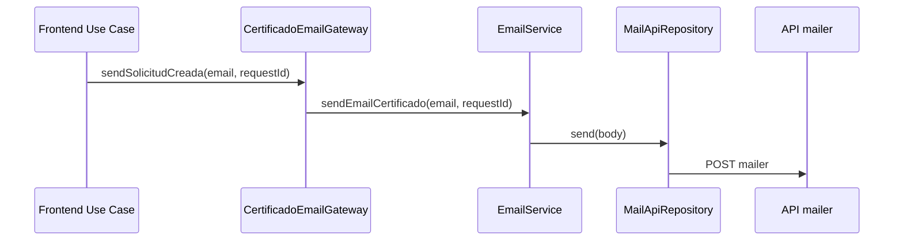

# Contratos de Integracion

## Proposito
Documentar los contratos externos relevantes para el frontend. Este documento registra lo confirmado por el codigo actual y marca pendientes para nuevos flujos.

## Patron Actual de Correo
El frontend dispara correos llamando al endpoint `mailer`. El envio real ocurre en el backend/API de correo.

Flujo confirmado en certificados:

## Endpoint de Correo
| Contrato | Valor |
| --- | --- |
| Metodo | `POST` |
| Ruta frontend actual | `mailer` |
| Cliente | `modules/shared/infrastructure/api/mail-api.repository.ts` |
| DTO | `{ type, email, user?, number? }` |
| Pendiente | Confirmar `type` para constancias. |

## Solicitud de Constancia
| Aspecto | Estado |
| --- | --- |
| Guardado backend | Pendiente de confirmacion. |
| Endpoint candidato | `solicitudes` si constancia es tipo de solicitud. |
| Endpoint alternativo | Nuevo endpoint de `constancias`, si backend lo separa. |
| Respuesta minima esperada | Identificador de solicitud para finalizar y generar cargo. |
| Correo | Frontend dispara llamada a `mailer`; backend/API ejecuta envio. |
| Cargo PDF | Generado en frontend con `@react-pdf/renderer`. |

## Datos Minimos Pendientes
Antes de implementar constancias se debe confirmar:
- nombre de endpoint para crear la solicitud;
- shape de request;
- shape de response;
- tipo de correo esperado por `mailer`;
- catalogo de tipos de constancia;
- estructura de datos requerida para construir el cargo PDF.

