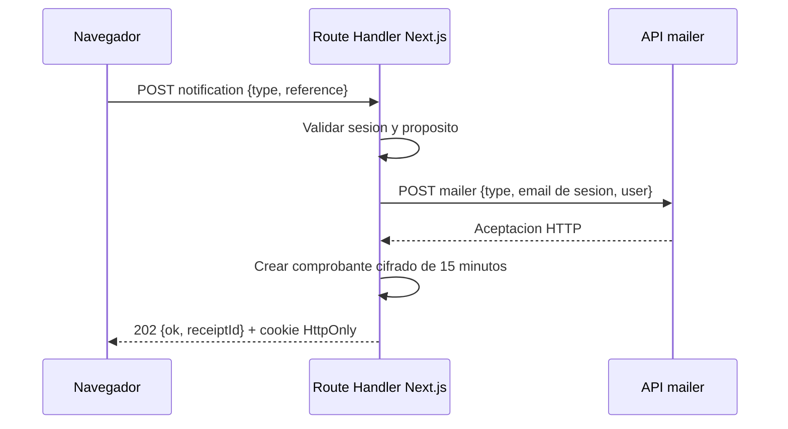

# Contratos de Integracion

## Proposito
Documentar las fronteras HTTP visibles desde el navegador y la comunicacion server-side con servicios externos.

## Frontera BFF
El navegador solo consume rutas same-origin de Next.js. `/api/ciunac/[...path]` aplica allowlist, sesion, origen, content type, tamano y validacion Zod antes de reenviar una operacion. La cabecera `x-api-key` se agrega exclusivamente en servidor.

| Endpoint interno | Metodo | Autorizacion | Respuesta |
| --- | --- | --- | --- |
| `/api/security/otp/request` | `POST` | CAPTCHA valido | `202 { ok: true }` |
| `/api/security/otp/verify` | `POST` | Desafio OTP valido | `200 { ok: true }` |
| `/api/security/consulta` | `POST` | CAPTCHA valido | `{ ok, found }` |
| `/api/security/notifications` | `POST` | Sesion de email verificada | `202 { ok: true, receiptId }` |
| `/api/security/ubicacion/profile` | `POST` | Sesion OTP `UBICACION` | `200 { ok: true }` + cookie `HttpOnly` |
| `/api/ciunac/[...path]` | `GET/POST/PATCH` | Operacion y proposito exactos | Payload, `204` sin cuerpo o error normalizado |

### Politica del Proxy CIUNAC

| Recurso | Proposito permitido |
| --- | --- |
| Estudiantes | `CERTIFICADO`, `CONSTANCIA`, `UBICACION`; email igual a sesion |
| Solicitudes tipos `1..4` | `CERTIFICADO` |
| Solicitudes tipos `5..6` | `CONSTANCIA` |
| Solicitud tipo `7` | `UBICACION` |
| Cargo de solicitud | Mismo proposito que el tipo devuelto |
| Beca | `BECA`; email igual a sesion |
| Q10 | `NUEVO` |
| Voucher | `CERTIFICADO`, `CONSTANCIA`, `UBICACION` |
| DNI | `UBICACION` |
| Documentos en `upload/becas` | `BECA` o certificado academico `UBICACION` |
| Certificado o constancia digital | Sesion de consulta `CERTIFICADO` |

El proxy no expone catalogos al navegador. Catalogos, certificado publico por QR,
detalles de ubicacion y consultas agregadas usan `ciunacRequest` server-side. No se
modificaron los endpoints externos ni la API key deja el servidor.

La politica metodo/ruta/proposito y el dispatch HTTP viven junto al Route Handler
en `app/api/ciunac`. Los DTOs de certificado, constancia, beca, ubicacion y Q10 se
validan una sola vez mediante la API publica `server.ts` de cada feature; el valor
parseado es exactamente el que se reenvia. `modules/security/server/schemas.ts`
solo contiene los contratos de OTP, consulta y notificacion.

## Resultado Comun

Los clientes internos representan de manera explicita los tres resultados posibles:

```ts
type AppResult<T> =
  | { ok: true; kind: 'data'; data: T }
  | { ok: true; kind: 'empty' }
  | { ok: false; kind: 'error'; error: AppError }
```

`AppError` usa los codigos `VALIDATION`, `AUTHENTICATION`, `AUTHORIZATION`, `EXTERNAL_SERVICE`, `NETWORK` y `UNEXPECTED`. Puede incluir `status`, `correlationId` y `retryable`, pero nunca el cuerpo ni el mensaje interno del proveedor.

- Un proveedor `2xx` sin contenido se traduce a HTTP `204` en el BFF.
- Un comando puede aceptar `204` si no necesita datos de respuesta.
- Una creacion que necesita un ID rechaza el cuerpo vacio o incompleto y detiene las operaciones posteriores.
- JSON mal formado o una estructura que no cumple el esquema minimo se clasifica como `EXTERNAL_SERVICE`.
- `404` solo se convierte en ausencia para recursos definidos como opcionales; otros fallos se propagan.

## Correo
El navegador ya no accede a `mailer`. OTP y notificaciones se envian desde Route Handlers, que recuperan el email de la sesion cuando corresponde.


```mermaid
sequenceDiagram
    participant UI as Navegador
    participant Route as Route Handler Next.js
    participant Mail as API mailer

    UI->>Route: POST notification {type, reference}
    Route->>Route: Validar sesion y proposito
    Route->>Mail: POST mailer {type, email de sesion, user}
    Mail-->>Route: Aceptacion HTTP
    Route->>Route: Crear comprobante cifrado de 15 minutos
    Route-->>UI: 202 {ok, receiptId} + cookie HttpOnly
```

El `receiptId` permite que una pagina final confirme que el Route Handler obtuvo una aceptacion HTTP de `mailer`. No demuestra entrega SMTP. Si el correo falla despues de persistir una solicitud, la UI conserva el ID y solo puede reintentar la notificacion; no vuelve a crear estudiante, solicitud, voucher o documentos.

## Solicitud de Constancia
| Aspecto | Estado |
| --- | --- |
| Guardado backend | Implementado con el contrato existente de solicitudes. |
| Endpoint externo | `POST solicitudes`, mediante `/api/ciunac/solicitudes`. |
| Tipos | `tipoSolicitudId` `5` o `6`, obtenidos del catalogo `tipossolicitud`. |
| Respuesta minima | `{ id }`; una respuesta vacia o incompleta detiene correo y navegacion. |
| Voucher | `POST upload/vouchers`, compartido con certificados y ubicacion. |
| Correo | Entrada BFF `CONSTANCIA`; adaptacion temporal a `CERTIFICADO` al invocar `mailer`. |
| Cargo PDF | Generado en frontend con `@react-pdf/renderer`. |

El comprobante cifrado conserva el tipo `CONSTANCIA`, por lo que una pagina final no puede validar un recibo emitido para otro flujo. Queda pendiente incorporar una plantilla `CONSTANCIA` nativa en el proveedor de correo.

### Contratos Tipados de Constancia

El slice no usa `Isolicitud` ni `ISolicitudRes` como frontera. Los adaptadores construyen DTOs explicitos y validan toda respuesta como `unknown` antes de devolver tipos de aplicacion.

| Operacion | Entrada minima | Salida valida |
| --- | --- | --- |
| Crear o actualizar estudiante | Nombres, apellidos, documento, celular, email y datos UNAC cuando apliquen | `{ id: string }` |
| Crear solicitud | IDs de estudiante, tipo `5/6`, idioma, nivel, periodo, pago y voucher cuando aplique | `{ id: string }` |
| Consultar cargo | ID positivo | Cargo completo o ausencia real por `404` |

Una respuesta vacia, un ID cero/negativo, un objeto sin ID o un cargo sin estudiante, tipo, idioma o nivel se clasifica como respuesta externa invalida. No se continua al correo, navegacion o PDF.

### Carga de Voucher

`POST /api/ciunac/upload/vouchers` requiere sesion verificada y `multipart/form-data`. El Route Handler aplica un maximo real de archivo de 8 MiB y permite:

- PDF con extension `.pdf`, MIME `application/pdf` y firma `%PDF-`.
- PNG con extension `.png`, MIME `image/png` y firma PNG completa.
- JPEG con extension `.jpg` o `.jpeg`, MIME `image/jpeg` y marcador inicial JPEG.

Archivo ausente, vacio, sobredimensionado o incompatible devuelve un error normalizado `INVALID_FILE`. La API externa no recibe el archivo rechazado. La validacion comprueba formato, no autenticidad del comprobante de pago.

## Solicitud de Beca

La ruta de proceso obtiene `facultades` y `escuelas` server-side. Ambas respuestas
deben contener al menos un registro con IDs positivos; una lista vacia o un objeto
incompleto activa el estado de error de ruta. La escuela seleccionada debe pertenecer
a la facultad elegida.

`POST /api/ciunac/solicitudbecas` requiere sesion OTP `BECA` y recibe un DTO estricto.
El payload conserva nombres snake_case y el campo historico `contancia_tercio`. No
acepta IDs de respuesta, estado, observaciones ni fechas como parte del request.

Antes de persistir, el BFF compara el email con la sesion, consulta facultades y
escuelas, valida su relacion y reemplaza sus nombres por los valores canonicos.
`periodo` se calcula server-side. Un catalogo no disponible bloquea la operacion
con `503`; una seleccion inexistente o inconsistente devuelve `400` sin invocar
`solicitudbecas`.

La respuesta valida contiene `_id` o `id` como string no vacio de hasta 80 caracteres.
Una respuesta `204`, `{}`, un ID vacio o un tipo inesperado produce
`EXTERNAL_SERVICE`; no se invoca `mailer` sin un identificador confirmado.

`POST /api/ciunac/upload/becas` acepta exclusivamente un archivo PDF por llamada,
con maximo de 8 MiB. Cliente y servidor comprueban ausencia, extension `.pdf` y MIME
`application/pdf`; el Route Handler verifica adicionalmente la firma `%PDF-`. Un
archivo rechazado no se reenvia al proveedor externo.

Los cinco documentos requeridos son constancia de matricula, historial academico,
constancia de tercio o quinto, carta de compromiso y declaracion jurada. Las URLs
devueltas se incluyen en el DTO; comprobar su propiedad definitiva corresponde al
backend externo.

### Límite Modular de Becas

App Router consume `@/modules/solicitud-beca` y
`@/modules/solicitud-beca/server`. El Route Handler obtiene la validación específica
de `/upload/becas` desde la misma entrada server-only. Ningún consumidor externo
importa gateways, DTOs, schemas o componentes internos.

En el paso 5, `operations.ts` conserva la orquestacion y
`infrastructure/scholarship-client.ts` el transporte. El reintento publico llama
solo a notificaciones y no cambia el DTO historico ni repite `POST solicitudbecas`.
Los errores normalizados se propagan sin reconstruir ni alterar `retryable`.

`ScholarshipRequestDto`, `_id`/`id`, facultades y escuelas se infieren desde sus
schemas Zod. El mapper conserva la traduccion entre dominio y nombres historicos
del proveedor. La aplicacion usa funciones inyectables, sin clases ni ports de un
solo metodo.

## Solicitud de Certificado

La ruta de proceso obtiene tipos `1` a `4`, idiomas, facultades, escuelas y textos
desde servidor. Cada respuesta se valida como `unknown` con Zod antes de mapearla a
`CertificateCatalogs`; un catalogo vacio, mal formado o con una escuela asociada a
una facultad inexistente activa `error.tsx`.

| Operacion | Entrada minima | Salida valida |
| --- | --- | --- |
| Buscar estudiante | Documento verificado | Estudiante completo o ausencia real por `404` |
| Crear o actualizar estudiante | Identidad, contacto y datos UNAC cuando apliquen | `{ id: string }` |
| Crear solicitud | Estudiante, tipo `1..4`, idioma, nivel `1..3`, periodo, precio y voucher | `{ id: string }` |
| Consultar cargo | ID entero positivo | `CertificateCargo` completo o ausencia real por `404` |

El DTO externo conserva `estudianteId`, `tipoSolicitudId`, `idiomaId`, `nivelId`,
`estadoId`, `periodo`, `alumnoCiunac`, `fechaPago`, `pago`, `digital`,
`numeroVoucher` e `imgVoucher`. No incluye `trabajador`, `antiguo` ni
`imgCertEstudio`. `digital` es verdadero exclusivamente para tipos `2` y `4`.

Antes de reenviar `POST /api/ciunac/solicitudes`, el BFF vuelve a consultar
`tipossolicitud` y compara el monto en centimos con el precio normal vigente. Si no
coincide devuelve:

```json
{
  "ok": false,
  "error": {
    "code": "PRICE_CHANGED",
    "message": "El tarifario cambio. Revise nuevamente el monto antes de continuar."
  },
  "correlationId": "..."
}
```

El estado HTTP es `409` y la API externa no recibe la solicitud. Si el tarifario
no esta disponible, el BFF bloquea la operacion con `503`.

Una respuesta vacia, nula, sin ID o mal formada detiene correo y navegacion. Si la
solicitud ya fue creada pero `mailer` falla, la UI conserva el ID y reintenta solo
`CERTIFICADO`; no repite estudiante, voucher ni solicitud.

### Limite Modular de Certificados

App Router consume `@/modules/solicitud-certificado` y
`@/modules/solicitud-certificado/server`. El Route Handler obtiene la revalidacion
de precio desde la entrada server-only. Ningun consumidor externo importa
gateways, DTOs, schemas, repositories o componentes internos.

`CertificateRequestDto` se infiere desde el schema Zod externo y el DTO de
estudiante permanece junto al mapper que lo construye. Identificadores,
catalogos, estudiante consultado y cargo se infieren desde sus schemas Zod.
Las funciones de `operations.ts` validan documento e identificador antes de
invocar la integracion. `client.ts` conserva las firmas publicas de registro,
reintento, busqueda y cargo; los endpoints y payloads no cambian.

La simplificacion del piloto preserva los errores normalizados del correo,
incluidos categoria, status, correlationId y retryable. Ya no reclasifica todos
los fallos como `EXTERNAL_SERVICE`. Las pruebas de integracion verifican que una
respuesta vacia, nula, incompleta o con JSON invalido detenga la secuencia y no
dispare correo ni una segunda escritura automatica.

## Solicitud de Constancia

La ruta de proceso obtiene tipos `5` y `6`, idiomas, facultades, escuelas y textos
desde servidor. Las respuestas se validan con Zod y se mapean a
`ConstanciaCatalogs`; un catalogo vacio, mal formado o con relaciones academicas
inconsistentes activa el estado de error de la ruta.

| Operacion | Entrada minima | Salida valida |
| --- | --- | --- |
| Buscar estudiante | Documento normalizado de 8 o 9 caracteres | Estudiante completo o ausencia real por `404` |
| Crear o actualizar estudiante | Identidad, contacto y datos UNAC cuando apliquen | `{ id: string }` |
| Crear solicitud | Estudiante, tipo `5..6`, idioma, nivel `1..3`, periodo, precio y voucher | `{ id: string }` |
| Consultar cargo | ID entero positivo | `ConstanciaCargo` completo o ausencia real por `404` |

Antes de reenviar `POST /api/ciunac/solicitudes`, el BFF consulta
`tipossolicitud` y compara el monto en centimos con el precio vigente del tipo `5`
o `6`. Un monto distinto devuelve `409 PRICE_CHANGED`; un tarifario ausente o
invalido devuelve `503`. En ambos casos la API externa no recibe la solicitud.

App Router consume `@/modules/solicitud-constancia` y
`@/modules/solicitud-constancia/server`. Los componentes cliente consumen casos de
uso desde `client.ts`; ningun consumidor externo importa gateways, schemas, DTOs o
componentes internos.

El paso 5 conserva estas entradas y todas sus firmas. `operations.ts` orquesta
las mismas funciones de `infrastructure/location-client.ts`; se conserva el
envelope `{ documentNumber, request }`, `imgDoc`, tipo 7, S/ 30 y el endpoint
historico `upload/becas` para el certificado academico. Cookies, precio,
duplicidad, proposito y firmas binarias mantienen sus validaciones server-side.
El renderer PDF continua cargandose solo al pulsar descarga.

El paso 4 pragmatico conserva esas firmas publicas: `registerSolicitudConstancia({
solicitud })`, `retrySolicitudConstanciaNotification(requestId)`,
`findConstanciaStudent(documentNumber)` y `getConstanciaCargo(requestId)`.
`operations.ts` orquesta funciones inyectables e `infrastructure/constancia-client.ts`
realiza las llamadas. `ConstanciaRequestDto` se infiere desde el schema externo;
no cambian campos, endpoints, periodos, `digital: true` ni tipos `5` y `6`.

El error de notificacion ya no se reconstruye forzando `EXTERNAL_SERVICE` y
`retryable: true`: se conserva el `AppError` original. Si falta el comprobante,
el transporte compartido actualmente lanza un error no tipado; se normaliza como
`UNEXPECTED` con mensaje seguro y resultado parcial, nunca como exito. La mejora
de ese contrato compartido queda para la etapa de transporte, sin cambiarlo aqui.

## Solicitud de Examen de Ubicacion

La sesion OTP `UBICACION` se complementa con una cookie cifrada `HttpOnly` de 15
minutos que contiene el perfil declarado. El query string `alumno_ciunac` no forma
parte del contrato. El BFF exige que el valor de `alumnoCiunac` coincida con el
perfil antes de reenviar la solicitud.

| Operacion | Entrada minima | Salida valida |
| --- | --- | --- |
| Guardar perfil | `{ isCiunacStudent: boolean }` | `{ ok: true }` y cookie segura |
| Crear o actualizar estudiante | Identidad, contacto, email de sesion e `imgDoc` | `{ id: string }` |
| Crear solicitud | `{ documentNumber, request }`, tipo `7`, precio `30`, voucher y perfil | `{ id: string }` |
| Consultar cargo | ID entero positivo | `LocationCargo` completo o ausencia real por `404` |

Antes de `POST solicitudes`, el BFF consulta `tipossolicitud` y exige que el unico
tipo `7` tenga precio `30`. Tambien exige `request.pago === 30` y comprueba que no
exista estado `1` para el mismo documento, idioma y tipo. Un monto manipulado
devuelve `409 PRICE_CHANGED`; una duplicidad devuelve `409 DUPLICATE_REQUEST`; un
tarifario ausente o distinto de S/ 30 devuelve `503`.

No CIUNAC usa nivel basico, no envia `imgCertEstudio` y mantiene `digital: false`.
CIUNAC puede elegir nivel `1..3` y debe adjuntar `imgCertEstudio` como PDF. El
documento de identidad se envia como `imgDoc` y admite PDF, PNG o JPEG. Documento y
certificado tienen maximo de 8 MiB y se validan en servidor por extension, MIME y
firma. El voucher conserva la politica compartida documentada anteriormente.

Una respuesta sin ID detiene correo y navegacion. Un fallo de `mailer` posterior al
guardado conserva el ID y permite reintentar solo `UBICACION`.

### Limite Modular de Ubicacion

App Router consume `@/modules/solicitud-ubicacion` y
`@/modules/solicitud-ubicacion/server`. Los componentes cliente consumen casos de
uso desde `client.ts`; ningun consumidor externo importa gateways, schemas, DTOs o
componentes internos.

`LocationStudentRequestDto`, `LocationRequestDto` y el envelope del BFF permanecen
explicitos. Respuestas de estudiante, solicitud, duplicidad, catalogos y cargo se
infieren desde schemas Zod. `/upload/becas` conserva su nombre externo, pero una
sesion `UBICACION` activa la politica y firma PDF propias del certificado academico.

## Registro de Alumno Nuevo

La pagina consulta `https://api.q10.com/v1/programas?Limit=30` solo desde servidor
usando `API_KEY_Q10`. La respuesta se valida como `unknown` con Zod y se reduce a
opciones `{ code, name }`. Una lista vacia es un estado funcional; un cuerpo
incompleto o JSON invalido activa el estado de error de ruta.

`POST /api/ciunac/q10/estudiantes` requiere una sesion OTP con proposito `NUEVO`.
El BFF valida el DTO estricto, compara `Email` con el email de la sesion y vuelve a
consultar que `Codigo_programa` siga disponible. Un email diferente o programa
desconocido devuelve `422` normalizado y no alcanza la API externa.

| Campo de dominio | Campo Q10 |
| --- | --- |
| `firstLastName` | `Primer_apellido` |
| `secondLastName` | `Segundo_apellido` |
| `firstName` / `secondName` | `Primer_nombre` / `Segundo_nombre` |
| `document` | `Codigo_tipo_identificacion` / `Numero_identificacion` |
| `birthDate` | `Fecha_nacimiento` ISO |
| `phone` | `Telefono` y `Celular` |
| `program.code` | `Codigo_programa` |

Q10 puede confirmar el comando con `204` o con un objeto JSON. Arreglos, valores
primitivos o JSON mal formado se clasifican como `EXTERNAL_SERVICE`; no se envia
correo. Un fallo de correo posterior conserva el documento y permite reintentar
solo `REGISTER`. Ante red o respuesta indeterminada de la escritura, la UI bloquea
un segundo registro automatico para evitar duplicados.

La integracion se consume mediante las fronteras modulares:

- `@/modules/solicitud-nuevo/client` compone las funciones de `operations.ts` con
  `infrastructure/new-student-client.ts`, sin exponer implementaciones internas.
- `@/modules/solicitud-nuevo/server` expone la validacion estricta y la revalidacion
  server-side usada por el BFF.
- `Q10StudentRequestDto`, programas y respuestas de registro se infieren desde
  sus schemas Zod; los campos y nombres del proveedor no cambian.

El paso 4 conserva `registerNewStudent({ student })` y
`retryNewStudentNotification(documentNumber)`. El contrato HTTP existente admite
comandos exitosos sin cuerpo (incluido 204; el transporte tambien admite 200 vacio)
u objeto JSON. `null`, arreglos, primitivos y JSON mal formado detienen la operacion
antes del correo. No se agrega reintento automatico; red y error externo conservan
la clasificacion que el workflow utiliza para bloquear una escritura indeterminada.

El correo mantiene `type: REGISTER` y el documento como referencia. Su fallo ya
no sustituye categoria y retryable por valores fijos: conserva codigo, status,
correlationId y retryable. Un comprobante ausente produce error seguro y resultado
parcial; no confirma finalizacion ni repite Q10. Sesion NUEVO, email autoritativo,
revalidacion de programa y filtros del catalogo permanecen sin cambios.

## Consulta Por Documento

`POST /api/security/consulta` recibe `documento`, `type` y `captchaToken`. La
respuesta publica se valida como `{ ok: true, found: boolean }`; un cuerpo vacio o
mal formado se clasifica como respuesta externa invalida.

El handler usa `findConsultationRequests` desde `@/modules/consultas/server`,
despues de validar origen, entrada y CAPTCHA. Esta operacion normaliza el documento,
filtra por tipo y realiza un solo GET de solicitudes, sin pedir textos. Solo una
coincidencia crea la cookie de consulta; nombres, atributos y expiracion no cambian.
`getConsultationRequests` conserva solicitudes y textos en paralelo para las
paginas de resultados. Todas estas lecturas privadas mantienen `no-store`.

Una sesion de consulta valida permite al Server Component recuperar solicitudes por
documento. La respuesta externa se valida como DTO antes de mapearse a
`ConsultedRequest`:

```ts
type ConsultedRequest = {
  id: number
  student: { id: string; names: string; lastNames: string; documentNumber: string }
  requestType: { id: number; name: string; kind: 'certificate' | 'constancia' | 'location' | 'other' }
  status: { id: number; name: string; reference: string; step: 'registered' | 'processing' | 'ready' | 'rejected' }
  language: { id: number; name: string }
  level: { id: number; name: string }
  createdAt: string
  digital: boolean
  observations: string | null
  payment: { amount: number; voucherNumber: string | null; paidAt: string | null }
}
```

La consulta `CERTIFICADO` incluye certificados y constancias, pero excluye examen
de ubicacion. `EXAMEN` incluye solo solicitudes de ubicacion. Una lista vacia es un
resultado funcional; una respuesta incompleta o inconsistente produce
`EXTERNAL_SERVICE`.

Los textos auxiliares son opcionales: su indisponibilidad se informa sin ocultar
solicitudes validas.

### Documentos Digitales

Certificados y constancias digitales se validan con contratos separados. Una URL
de descarga debe usar `http` o `https`; un `404` es ausencia real y una respuesta
mal formada es un error tecnico reintentable. La aceptacion no habilita la descarga
si el proveedor falla.

El endpoint historico `GET constancias/solicitud/{id}` devuelve `id_solicitud` y
`dni`, mientras el dominio usa `solicitudId` y `numeroDocumento`. El adapter de
infraestructura normaliza estos aliases antes de validar y mapear. Los nombres
historicos no se propagan a aplicacion, dominio ni presentacion.

El paso 6 simplifica estas operaciones a funciones de `operations.ts`, conectadas
al cliente HTTP por `client.tsx`. Se mantienen GET por solicitud y PATCH con
`aceptado: true` y `fechaAceptacion` ISO; el navegador nunca envia la API key.
El reintento manual de aceptacion no vuelve a leer el documento ni repite el
registro de solicitud. Las URLs, cuerpos y normalizacion externa no cambian.

Limitacion vigente: estas operaciones atraviesan una operacion explicita del BFF,
pero la sesion solo autentica el flujo de consulta. Falta un endpoint especializado que compruebe
que el recurso solicitado pertenece al documento consultado antes de devolver la
URL o aceptar el documento.

## Detalle Publico de Certificado

`GET certificados/{id}` se ejecuta server-side al abrir la URL publica incluida en
el QR. No requiere sesion de `consulta-solicitud`. El identificador admite
exclusivamente letras, numeros, guion y guion bajo, hasta 80 caracteres.

La respuesta publica minima valida requiere:

- ID y estudiante;
- idioma, nivel, horas y numero de registro;
- fechas validas de emision y conclusion;
- estado de entrega, donde `null` o ausencia significa pendiente, y fecha de
  aceptacion cuando corresponda;
- notas completas o una lista vacia.

El DTO se valida con Zod y se adapta a `CertificateDetail`. Los campos externos no
declarados se descartan y el `_id` debe coincidir con el ID solicitado. Un `404` o
un `2xx` sin cuerpo produce ausencia. Un cuerpo incompleto, fecha invalida, nota
mal formada o ID inconsistente produce `EXTERNAL_SERVICE`. `numeroDocumento` no se
propaga al dominio publico ni a presentacion, incluso si el proveedor lo incluye.

La API key permanece server-only y el BFF generico conserva sus guardas. El
navegador no llama directamente a la API CIUNAC.

## Consulta de Examen de Ubicacion

La ruta server-side combina estas operaciones:

| Recurso | Contrato minimo |
| --- | --- |
| `solicitudes/documento/{documento}` | Solicitudes tipadas del contexto de consultas. |
| `detallesubicacion/estudiante/documento/{documento}` | ID, examen, solicitud, nota `0..100`, estado, idioma, nivel y calificacion opcional. |
| `examenesubicacion` | ID y fecha valida. |
| `ciclos` | ID y nombre. |
| `textos` | Codigo y contenido; `TEXTO_NOMBREAN` es requerido para PDF. |

Las respuestas se validan de forma independiente con Zod. Una lista vacia es un
resultado funcional. Un cuerpo mal formado produce `EXTERNAL_SERVICE` y activa el
estado de error de ruta.

El join se realiza por `solicitudId`, `examenId` y `cicloId`. Solo se incluyen
resultados asociados a solicitudes de ubicacion pertenecientes al documento de la
sesion. Cuando el detalle omite estudiante, se utiliza el alumno de la solicitud
autorizada; si incluye otro documento, se descarta.

Una relacion de examen o ciclo ausente conserva la nota con estado `partial`, pero
bloquea la constancia. La constancia tambien requiere resultado terminado y nombre
del año disponible.

La ruta App Router consume `@/modules/consulta-ubicacion/server`. El adaptador de
contexto usa `@/modules/consultas/server`; no accede a repositories, DTOs o dominio
internos de consultas. Notas, examenes y ciclos conservan funciones de transporte
server-only propias, inyectadas en `loadLocationConsultation`.

El resultado incluye una proyeccion del cargo construida con la solicitud activa.
Por ello, el estado sin notas no ejecuta `GET solicitudes/{id}`. El PDF se genera
en frontend, usa el renderer A4 compartido y mantiene titulo, textos y nombre de
archivo propios de ubicacion. La tarifa esperada del examen es S/ 30.00.

## Capacidades Compartidas: Paso 7

No cambian endpoints, DTOs de negocio, cookies ni secuencias del proveedor.
Los campos `pago`, `fechaPago`, `numeroVoucher` e `imgVoucher` se validan y
convierten en un unico lugar. Un pago positivo sigue exigiendo voucher completo;
un pago cero permite omitirlo. Cada BFF de feature conserva su control de precio.

Los validadores publicos de uploads delegan metadata y firma a un helper
server-only. Se conservan PDF/JPEG/PNG para voucher e identidad, PDF para becas y
certificado academico, y 8 MiB por archivo. El preflight multipart del BFF conserva
sus rechazos historicos de request, sin cambiar su status publico. La firma de
cabecera no demuestra que el archivo sea inocuo ni pertenezca al solicitante.

JSON y multipart del navegador comparten `browser-http.ts`: cookies same-origin,
ninguna API key y timeout de 15 segundos, incluida la lectura del cuerpo. Los
errores conservan status, correlationId y retryable. HTTP 413/415 se clasifican
como VALIDATION; 429 es reintentable, pero nunca dispara un reintento automatico.
Un cuerpo de error no JSON conserva el status HTTP y usa un mensaje seguro.
Un cuerpo exitoso mal formado es EXTERNAL_SERVICE; un fallo al leerlo es NETWORK.

Se mantienen `data | empty | error`, 404 como ausencia en lecturas opcionales,
confirmacion Q10 sin cuerpo y bloqueo de escrituras indeterminadas. El cliente
server-side sigue separado, con API key privada y `no-store`.
