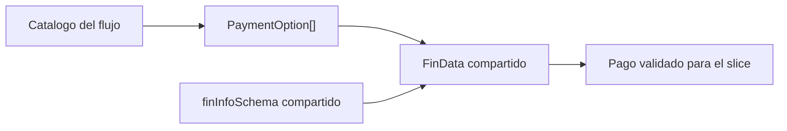
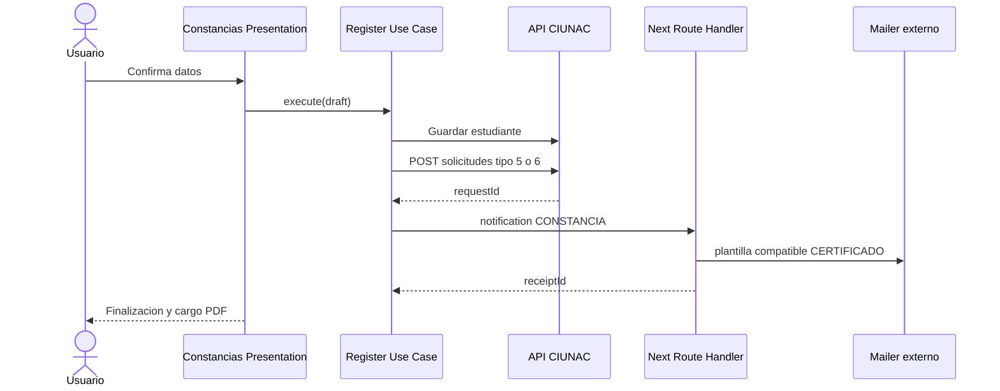

# Flujo Funcional: Solicitud de Constancia

## Estado
Implementado en la Fase 1E. Este documento describe el comportamiento actual.

## Rutas
| Ruta | Responsabilidad |
| --- | --- |
| `app/solicitud-constancias/page.tsx` | Catalogo de constancias y verificacion de correo. |
| `app/solicitud-constancias/proceso/page.tsx` | Guarda de sesion y wizard de tres pasos. |
| `app/solicitud-constancias/finalizar/page.tsx` | Comprobante de notificacion y descarga del cargo. |

## Pasos
| Paso | Contenido |
| --- | --- |
| Datos Basicos | Tipo `5/6`, idioma, nivel, datos personales y condicion Alumno UNAC. |
| Datos de Pago | Componente y schema compartidos; precio inyectado desde catalogo. |
| Finalizar | Resumen, terminos, registro, correo y navegacion. |

## Politica Compartida de Pago
`modules/shared/components/fin-data.tsx` no calcula precios ni lee el store de solicitudes. Certificados, ubicacion y constancias le entregan `documentNumber`, `defaultValues`, `paymentOptions` y el callback validado.



- Monto mayor que cero: numero de 15 digitos, fecha y archivo obligatorios.
- Monto cero: campos deshabilitados y voucher opcional.
- Todos los vouchers usan `/api/ciunac/upload/vouchers` hacia `upload/vouchers`.

## Slice
```text
modules/solicitud-constancia/
  domain/solicitud-constancia.ts
  application/register-solicitud-constancia.use-case.ts
  infrastructure/register-solicitud-constancia.adapters.ts
  schemas/basic-data.schema.ts
  presentation/
    solicitud-constancia.store.ts
    use-register-solicitud-constancia.ts
    components/
      solicitud-constancia-process.tsx
      basic-data.tsx
      register.tsx
      solicitud-summary.tsx
      cargo-pdf.tsx
      descarga-cargo.tsx
      final-notices.tsx
```

## Integraciones


La traduccion temporal de plantilla ocurre solo en el BFF. El slice y el comprobante conservan el tipo funcional `CONSTANCIA`.

## Estados
- Carga durante catalogos, persistencia, correo y consulta del cargo.
- Error de validacion antes de avanzar.
- Error de persistencia sin operaciones posteriores.
- Exito parcial `saved_notification_failed` con reintento exclusivo del correo.
- Error de lectura o PDF con reintento, sin repetir el registro.

## Deuda Pendiente
- Incorporar una plantilla `CONSTANCIA` nativa en el mailer externo.
- Añadir idempotencia de notificacion en backend para eliminar duplicados ante respuesta indeterminada.
- Confirmar si el plazo y textos del cargo requieren una plantilla institucional exclusiva de constancias.
