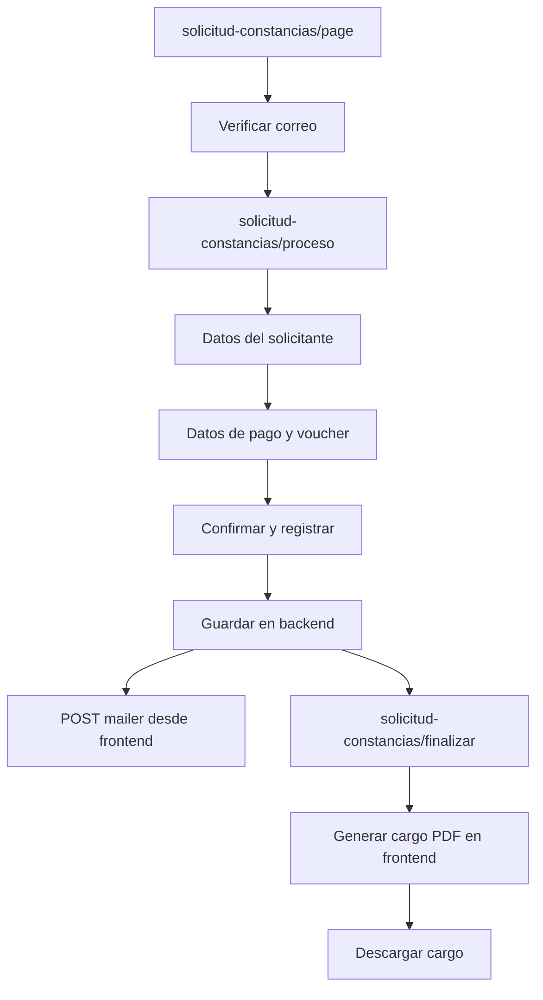

# Flujo Funcional: Solicitud de Constancia

## Proposito
Especificar el comportamiento esperado del nuevo flujo de solicitud de constancia antes de iniciar desarrollo. Este documento baja la historia `HU-001` y el caso de uso `CU-008` a nivel de pantallas, pasos, datos, validaciones y estados.

## Rutas Sugeridas
| Ruta | Responsabilidad |
| --- | --- |
| `app/solicitud-constancias/page.tsx` | Verificacion de correo y entrada al flujo. |
| `app/solicitud-constancias/proceso/page.tsx` | Wizard principal de datos, pago y confirmacion. |
| `app/solicitud-constancias/finalizar/page.tsx` | Pantalla final y descarga de cargo PDF. |
| `app/solicitud-constancias/layout.tsx` | Layout del flujo. |

## Modulo Sugerido
```text
modules/solicitud-constancia/
  presentation/
  application/
  domain/
  infrastructure/
  components/
  schemas/
```

## Pasos del Wizard
| Paso | Nombre | Contenido |
| --- | --- | --- |
| 1 | Datos del solicitante | Tipo de constancia, datos personales y datos academicos requeridos. |
| 2 | Datos de pago | Pago, numero de voucher, fecha de pago y voucher. |
| 3 | Finalizar | Revision, aceptacion de informacion, registro backend, correo y cargo PDF. |

## Campos Iniciales
| Campo | Obligatorio | Observacion |
| --- | --- | --- |
| `email` | Si | Se obtiene desde la verificacion previa. |
| `tipo_constancia` | Si | Catalogo pendiente de definicion. |
| `apellidos` | Si | Datos del solicitante. |
| `nombres` | Si | Datos del solicitante. |
| `tipo_documento` | Si | `DNI`, `CE` o `PASAPORTE`, sujeto a confirmacion. |
| `numero_documento` | Si | Validar longitud segun tipo. |
| `celular` | Si | 9 digitos. |
| `facultad` | Pendiente | Depende de reglas funcionales de constancias. |
| `escuela` | Pendiente | Depende de reglas funcionales de constancias. |
| `codigo_estudiante` | Pendiente | Depende de reglas funcionales de constancias. |
| `pago` | Si | Monto o indicador de pago. |
| `numero_voucher` | Si | Obligatorio para constancias. |
| `fecha_pago` | Si | Obligatorio para constancias. |
| `img_voucher` | Si | Archivo o URL devuelta por servicio de subida. |

## Estados y Mensajes
- `loading`: mientras se guarda solicitud, se dispara correo o se prepara PDF.
- `success`: solicitud registrada y cargo disponible.
- `validation_error`: campos obligatorios incompletos o voucher faltante.
- `integration_error`: fallo de backend, correo o archivos.
- `pdf_error`: fallo al generar cargo PDF en frontend.

## Flujo Visual


## Archivos Para Desarrollo
- `app/solicitud-constancias/page.tsx`
- `app/solicitud-constancias/proceso/page.tsx`
- `app/solicitud-constancias/finalizar/page.tsx`
- `app/solicitud-constancias/layout.tsx`
- `modules/solicitud-constancia/presentation/components/solicitud-constancia-process.tsx`
- `modules/solicitud-constancia/presentation/hooks/use-register-solicitud-constancia.ts`
- `modules/solicitud-constancia/presentation/view-models/solicitud-constancia-process.view-model.ts`
- `modules/solicitud-constancia/application/commands/register-solicitud-constancia.command.ts`
- `modules/solicitud-constancia/application/ports/register-solicitud-constancia.ports.ts`
- `modules/solicitud-constancia/application/use-cases/register-solicitud-constancia.use-case.ts`
- `modules/solicitud-constancia/application/factories/create-register-solicitud-constancia-use-case.ts`
- `modules/solicitud-constancia/infrastructure/api/solicitud-constancia-api.gateway.ts`
- `modules/solicitud-constancia/infrastructure/api/constancia-email.gateway.ts`
- `modules/solicitud-constancia/schemas/basic-data.schema.ts`
- `modules/solicitud-constancia/schemas/solicitud-constancia.schema.ts`
- `modules/solicitud-constancia/components/form-email-solicitud.tsx`
- `modules/solicitud-constancia/components/basic-data.tsx`
- `modules/solicitud-constancia/components/register.tsx`
- `modules/solicitud-constancia/components/cargo-pdf.tsx`
- `modules/solicitud-constancia/components/descarga-cargo.tsx`

## Pendientes Antes de Implementar
- Confirmar endpoint backend definitivo para guardar constancias.
- Confirmar catalogo de tipos de constancia.
- Confirmar campos academicos obligatorios.
- Confirmar plantilla visual y textos del cargo PDF.
- Confirmar si el correo usa un tipo nuevo en `mailer`.

