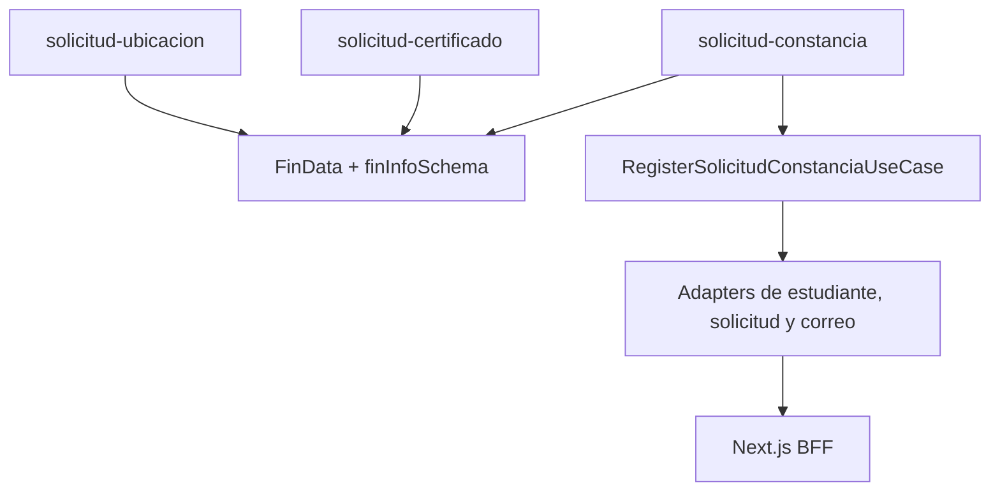

# Fase 1E: Constancias como Slice Independiente

## Alcance Completado
- Flujo propio para tipos de constancia `5` y `6`.
- Store, formulario basico, caso de uso, adaptadores, registro, finalizacion y PDF propios.
- Un unico componente y schema de pago para certificados, ubicacion y constancias.
- Persistencia mediante el contrato existente `solicitudes`.
- Correo seguro mediante el BFF y comprobante `CONSTANCIA`.
- Cargo PDF A4 generado y descargado en frontend.

## Dependencias Eliminadas
Constancias ya no importa componentes, schemas, view-models, reglas de precio, registro ni store de `solicitud-certificado`.

## Dependencias Compartidas Intencionales
- `modules/shared/components/fin-data.tsx`.
- `modules/shared/schemas/fin-data.schema.ts`.
- Cliente HTTP, errores, catalogos, tabla de precios y carga a `upload/vouchers`.
- Repositorio HTTP, errores normalizados y catalogos compartidos.

Desde Fase 2A, los adaptadores de constancias ya no dependen de las fachadas genericas de estudiantes y solicitudes; usan DTOs, schemas runtime y mappers propios sobre el repositorio HTTP compartido.

## Resultados de Verificacion
| Control | Resultado |
| --- | --- |
| `npm run lint` | Correcto. |
| `npx tsc --noEmit` | Correcto. |
| `npm run test:unit` | 30 de 30 pruebas. |
| `npm run test:e2e` | 37 de 37 escenarios funcionales reportados como aprobados. |
| `npm run build` | Correcto con Next.js 16.2.12. |
| `npm run env:check` | Bloqueado por configuracion: secret key y site key de reCAPTCHA tienen el mismo valor. |
| `npm run security:bundle-check` | El aislamiento pasa con una clave privada efimera; el entorno real se rechaza por el par reCAPTCHA invalido. |
| `git diff --check` | Correcto; solo advertencias de fin de linea en Windows. |

Playwright mantiene procesos hijos abiertos en Windows despues de reportar el resultado. Se cerraron por PID verificado; esta incidencia corresponde al lifecycle del runner y no a fallos de los escenarios.

Accion manual requerida: configurar en `.env` y en el hosting una `RECAPTCHA_SECRET_KEY` real, privada y distinta de `NEXT_PUBLIC_RECAPTCHA_SITE_KEY`. Ningun valor fue mostrado ni modificado durante esta fase.

## Deuda Tecnica
- El proveedor externo aun recibe la plantilla `CERTIFICADO` para correos de constancia; la adaptacion esta aislada en el Route Handler.
- El reintento de correo no puede garantizar idempotencia sin soporte de backend u outbox.
- La maquetacion institucional definitiva del cargo puede evolucionar sin cambiar el caso de uso.
