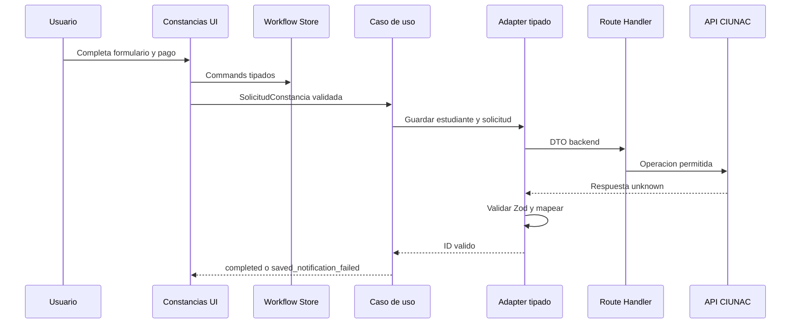

# Fase 2A: Tipado y Confiabilidad de Constancias

## Alcance

La fase se limita a `solicitud-constancia` y a la validacion transversal del endpoint de vouchers que consume el slice. No cambia contratos backend, reglas visuales, certificados, ubicacion, beca ni alumno nuevo.

## Cambios Implementados

- Dominio completo `SolicitudConstancia`, con datos basicos y pago discriminados.
- Store Zustand sin `Partial` ni setter generico.
- Commands tipados para edicion, registro, exito, error y reintento de correo.
- Schemas Zod en el dominio y en respuestas externas.
- DTOs y mappers explicitos para estudiante, solicitud y cargo.
- Puertos que devuelven IDs validos en lugar de objetos opcionales o `null`.
- Cargo PDF tipado y carga con estados `loading`, `data`, `empty` y `error`.
- Estados de ruta `loading.tsx`, `error.tsx` y `not-found.tsx`.
- Validacion server-side de voucher por extension, MIME, tamano y firma binaria.
- Error `INVALID_FILE` normalizado y visible sin usar `alert` del navegador.

## Flujo de Confianza

## Dependencias Eliminadas

- `SolicitudConstanciaDraft` ambiguo.
- `Partial<SolicitudConstanciaDraft>` y `updateDraft`.
- `toCompleteDraft` y su cast.
- `Isolicitud` dentro del caso de uso de constancias.
- `ISolicitudRes` y `SolicitudesService` para cargar el cargo de constancia.
- Fachadas genericas de estudiante y solicitud dentro de los adaptadores de constancias.

## Dependencias Que Permanecen

- `FinData` y `finInfoSchema` como politica unica de pago.
- `resourceApiRepository`, `mailApiRepository` y errores comunes.
- Stores de catalogos existentes.
- API `estudiantes`, `solicitudes`, `mailer` y `upload/vouchers`.
- `@react-pdf/renderer` para generar el cargo en frontend.

## Casos Probados

- Tipos de constancia `5` y `6`, alumno UNAC incompleto y pago incompleto.
- Pago cero sin voucher y pago positivo con voucher.
- DTO exacto de estudiante y solicitud.
- Respuestas validas, vacias, incompletas y con IDs invalidos.
- Estados initial, editing, submitting, success, error y fallo parcial de correo.
- Cargo completo e incompleto.
- Voucher PDF, PNG y JPEG por firma real.
- MIME valido con firma falsa, extension incompatible, ausencia, vacio y mas de 8 MiB.
- Flujo E2E de registro, reintento de correo, acceso sin sesion, voucher falsificado e ID final invalido.

## Deuda Tecnica Pendiente

- Extender el patron tipado a los otros features, uno por iteracion.
- Validar propiedad y vigencia de la URL del voucher en el backend externo.
- Incorporar idempotencia de correo en backend u outbox.
- Corregir el lifecycle de procesos hijos de Playwright en Windows.
- Sustituir la adaptacion temporal de correo `CONSTANCIA` a plantilla `CERTIFICADO` cuando el proveedor exponga una plantilla propia.

## Refactor Modular Posterior

ADR-022 completa la separacion fisica de capas. Los stores globales de catalogos
dejaron de ser dependencias de constancias; App Router consume APIs publicas y el
BFF revalida el precio vigente de los tipos `5` y `6`. Presentation ya no importa
repositories y application ya no compone infraestructura.

## Resultados de Verificacion

| Control | Resultado |
| --- | --- |
| `npm run lint` | Correcto. |
| `npx tsc --noEmit` | Correcto. |
| `npm run test:unit` | 61 de 61 pruebas. |
| Smoke E2E de constancias | 5 de 5 escenarios. |
| `npm run test:e2e` | 40 de 40 escenarios. |
| `npm run build` | Correcto con Next.js 16.2.12; 21 paginas generadas. |
| `npm run security:bundle-check` | Correcto; no se detectaron secretos privados en `.next/static`. |
| `npm run env:check` | Correcto; variables presentes, par reCAPTCHA distinto y API key publica ausente. |
| `git diff --check` | Correcto; solo advertencias de fin de linea en Windows. |

El primer build no pudo descargar Geist por la red restringida del sandbox. La repeticion autorizada del mismo comando termino correctamente sin modificar fuentes ni configuracion. Playwright reporto todos los escenarios aprobados, pero mantuvo procesos hijos abiertos en Windows; se cerraron por PID y linea de comando verificados.
