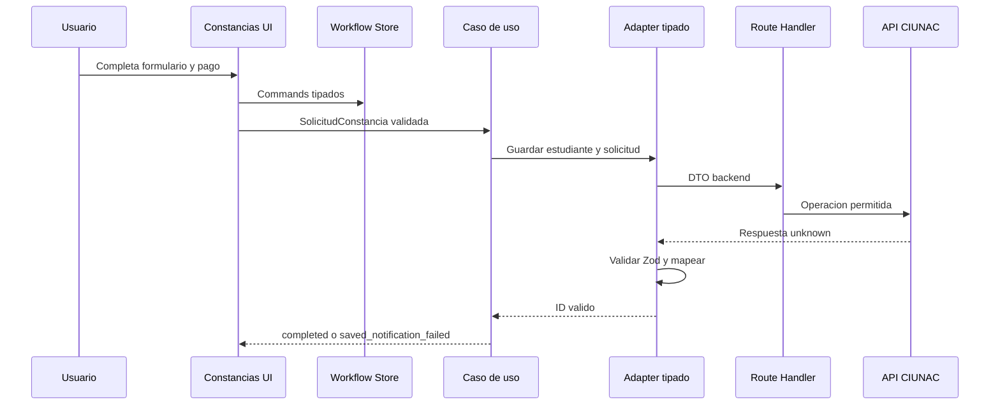

# Fase 2A: Tipado y Confiabilidad de Constancias

Los apartados iniciales conservan el registro historico de Fase 2A. La estructura
y verificacion vigentes se detallan en [Paso 4 pragmatico](#simplificacion-pragmatica-paso-4-constancias).

## Alcance

La fase se limita a `solicitud-constancia` y a la validacion transversal del endpoint de vouchers que consume el slice. No cambia contratos backend, reglas visuales, certificados, ubicacion, beca ni alumno nuevo.

## Cambios Implementados

- Dominio completo `SolicitudConstancia`, con datos basicos y pago discriminados.
- Store Zustand sin `Partial` ni setter generico.
- Commands tipados para edicion, registro, exito, error y reintento de correo.
- Schemas Zod en el dominio y en respuestas externas.
- DTOs y mappers explicitos para estudiante, solicitud y cargo.
- Puertos que devuelven IDs validos en lugar de objetos opcionales o `null`.
- Cargo PDF tipado y carga con estados `loading`, `data`, `empty` y `error`.
- Estados de ruta `loading.tsx`, `error.tsx` y `not-found.tsx`.
- Validacion server-side de voucher por extension, MIME, tamano y firma binaria.
- Error `INVALID_FILE` normalizado y visible sin usar `alert` del navegador.

## Flujo de Confianza


```mermaid
sequenceDiagram
    participant User as Usuario
    participant UI as Constancias UI
    participant Store as Workflow Store
    participant UseCase as Caso de uso
    participant Adapter as Adapter tipado
    participant BFF as Route Handler
    participant API as API CIUNAC

    User->>UI: Completa formulario y pago
    UI->>Store: Commands tipados
    UI->>UseCase: SolicitudConstancia validada
    UseCase->>Adapter: Guardar estudiante y solicitud
    Adapter->>BFF: DTO backend
    BFF->>API: Operacion permitida
    API-->>Adapter: Respuesta unknown
    Adapter->>Adapter: Validar Zod y mapear
    Adapter-->>UseCase: ID valido
    UseCase-->>UI: completed o saved_notification_failed
```

## Dependencias Eliminadas

- `SolicitudConstanciaDraft` ambiguo.
- `Partial<SolicitudConstanciaDraft>` y `updateDraft`.
- `toCompleteDraft` y su cast.
- `Isolicitud` dentro del caso de uso de constancias.
- `ISolicitudRes` y `SolicitudesService` para cargar el cargo de constancia.
- Fachadas genericas de estudiante y solicitud dentro de los adaptadores de constancias.

## Dependencias Que Permanecen

- `FinData` y `finInfoSchema` como politica unica de pago.
- `resourceApiRepository`, `mailApiRepository` y errores comunes.
- Stores de catalogos existentes.
- API `estudiantes`, `solicitudes`, `mailer` y `upload/vouchers`.
- `@react-pdf/renderer` para generar el cargo en frontend.

## Casos Probados

- Tipos de constancia `5` y `6`, alumno UNAC incompleto y pago incompleto.
- Pago cero sin voucher y pago positivo con voucher.
- DTO exacto de estudiante y solicitud.
- Respuestas validas, vacias, incompletas y con IDs invalidos.
- Estados initial, editing, submitting, success, error y fallo parcial de correo.
- Cargo completo e incompleto.
- Voucher PDF, PNG y JPEG por firma real.
- MIME valido con firma falsa, extension incompatible, ausencia, vacio y mas de 8 MiB.
- Flujo E2E de registro, reintento de correo, acceso sin sesion, voucher falsificado e ID final invalido.

## Deuda Tecnica Pendiente

- Extender el patron tipado a los otros features, uno por iteracion.
- Validar propiedad y vigencia de la URL del voucher en el backend externo.
- Incorporar idempotencia de correo en backend u outbox.
- Corregir el lifecycle de procesos hijos de Playwright en Windows.
- Sustituir la adaptacion temporal de correo `CONSTANCIA` a plantilla `CERTIFICADO` cuando el proveedor exponga una plantilla propia.

## Refactor Modular Posterior

ADR-022 completa la separacion fisica de capas. Los stores globales de catalogos
dejaron de ser dependencias de constancias; App Router consume APIs publicas y el
BFF revalida el precio vigente de los tipos `5` y `6`. Presentation ya no importa
repositories y application ya no compone infraestructura.

## Resultados de Verificacion

| Control | Resultado |
| --- | --- |
| `npm run lint` | Correcto. |
| `npx tsc --noEmit` | Correcto. |
| `npm run test:unit` | 61 de 61 pruebas. |
| Smoke E2E de constancias | 5 de 5 escenarios. |
| `npm run test:e2e` | 40 de 40 escenarios. |
| `npm run build` | Correcto con Next.js 16.2.12; 21 paginas generadas. |
| `npm run security:bundle-check` | Correcto; no se detectaron secretos privados en `.next/static`. |
| `npm run env:check` | Correcto; variables presentes, par reCAPTCHA distinto y API key publica ausente. |
| `git diff --check` | Correcto; solo advertencias de fin de linea en Windows. |

El primer build no pudo descargar Geist por la red restringida del sandbox. La repeticion autorizada del mismo comando termino correctamente sin modificar fuentes ni configuracion. Playwright reporto todos los escenarios aprobados, pero mantuvo procesos hijos abiertos en Windows; se cerraron por PID y linea de comando verificados.

## Simplificacion Pragmatica: Paso 4 Constancias

Fecha: 2026-09-23. Primer feature del paso 4, continuando el piloto de certificados.
Alumno nuevo queda pendiente para un cambio independiente. Aplicacion 1.6.5 y
Next.js 16.2.12 sin modificaciones de version ni dependencias.

### Alcance y resultado

| Elemento | Antes | Despues |
| --- | --- | --- |
| Archivos de constancias | 31 | 22 |
| Clases delegadoras | 7 | 0 |
| Composicion | Command, ports, tres casos de uso y cuatro gateways | Funciones inyectables y un cliente HTTP del feature |
| Confirmacion | Parse completo por render | Guarda tipada de borrador completo |
| Validacion real | Formulario, registro y BFF | Conservada en las tres fronteras |
| Secuencia backend | Estudiante, solicitud, correo | Identica; sin reintentos automaticos de escritura |
| Correo fallido | Forzaba categoria externa y retryable | Conserva categoria, status, correlationId y retryable |

```text
modules/solicitud-constancia/
  index.ts / client.ts / server.ts
  model.ts / schemas.ts / operations.ts / store.ts
  components/       # UI, hook, formulario y mapper de presentacion
  infrastructure/
    constancia-client.ts
    constancia-api.mapper.ts
    constancia-api.schemas.ts
    server/        # catalogos y validacion de precio
```

Se conservaron las APIs publicas, los tipos 5/6, `digital: true`, los payloads,
tarifas revalidadas en BFF, sesiones, pago/voucher compartido y PDF A4 diferido.
El mapper conserva las diferencias de dominio; no hay imports hacia certificados.
No se modificaron rutas, BFF, shared, componentes de otros features ni `.env`.
Los cambios fuera del modulo son pruebas y documentacion. Se preservaron los
cambios previos del worktree, incluidos los de este mismo feature.

Primero se simplificaron las operaciones y se verificaron lint, type-check,
unitarias, integracion, Knip y los seis E2E de constancias (36.2 s, exit 0).
Solo despues se movieron archivos y se ajustaron imports, incluido el import
dinamico del PDF. No se crearon reexports de compatibilidad para archivos internos.

### Pruebas agregadas

- Diez unitarias: borrador completo/pago cero, secuencia, interrupcion por fallo
  de estudiante, cinco categorias de error de correo, error inesperado seguro y
  lookup valido/ausente/mal formado. Las 26 existentes se conservaron.
- Catorce integraciones con `fetch` simulado y API publica real: DTO exacto de
  tipos 5/6, PATCH, fallo parcial, reintento exclusivo, ocho respuestas invalidas
  de estudiante/solicitud, red, recibo ausente y lecturas vacias/fallidas.
- Los seis E2E existentes se mantienen. Se refuerza el orden exacto y una sola
  carga de voucher, escritura de estudiante y creacion de solicitud; reintentar
  correo no repite ninguna de esas operaciones.

### Verificacion final

| Control | Resultado |
| --- | --- |
| Lint y type-check | Correctos, incluyendo repeticion posterior al build |
| Unitarias | 387/387 globales; constancias 36/36 (antes 26) |
| Integracion | 62/62 globales; 14 nuevas de constancias |
| E2E completo | 110/110, exit 0, sin omisiones ni flaky; 303.1 s |
| Constancias | 6/6 dentro de la regresion completa |
| Smoke general y accesibilidad | 34/34 y 9/9 incluidos en la regresion completa |
| Build | Correcto con acceso de red; 22 paginas generadas |
| Knip | Sin nuevos archivos, dependencias o imports no resueltos |
| Bundle-check | Sin valores privados configurados en `.next/static` |
| Env-check | Correcto; solo presencia/ausencia, sin valores; `.env` sin cambios |
| Imports | Cero imports profundos externos y cero dependencias con certificados |
| `git diff --check` | Correcto; avisos LF/CRLF existentes no funcionales |

La primera ejecucion completa no inicio escenarios: el dev server de pruebas
habia conservado referencias de webpack a los archivos trasladados. Se reinicio
solo el servidor de pruebas, sin modificar codigo, y la repeticion completa paso.
El primer build no descargo Google Fonts con red restringida; repetir el mismo
comando con permiso de red finalizo correctamente. Estos intentos no se cuentan
como verificaciones aprobadas. Reporte final local:
`%TEMP%/ciunac-step4-constancia-e2e-final.json`.

Una asercion nueva esperaba inicialmente EXTERNAL_SERVICE para recibo ausente;
la inspeccion del transporte shared confirmo que lanza Error y el normalizador
lo clasifica UNEXPECTED. La prueba documenta el contrato real y exige resultado
parcial y mensaje seguro. No se modifico shared para ocultar el resultado.

### Limites y riesgos conservados

- Un correo aceptado por HTTP no acredita entrega SMTP. El proveedor todavia
  usa la plantilla CERTIFICADO para CONSTANCIA; el comprobante conserva CONSTANCIA.
- Sin recibo, el transporte shared lanza actualmente un Error no tipado. Se
  normaliza como UNEXPECTED seguro y resultado parcial. Mejorar esa clasificacion
  corresponde a la etapa compartida, no se cambia en este feature.
- Propiedad de URLs de voucher e idempotencia/outbox siguen requiriendo backend.
- Las validaciones de documento y las posibles respuestas tardias de busqueda
  no se cambian durante este refactor estructural.
- La auditoria de dependencias no se certifica como aprobada: sus excepciones
  conocidas vencieron el 2026-09-17 y no se renovaron aqui.
