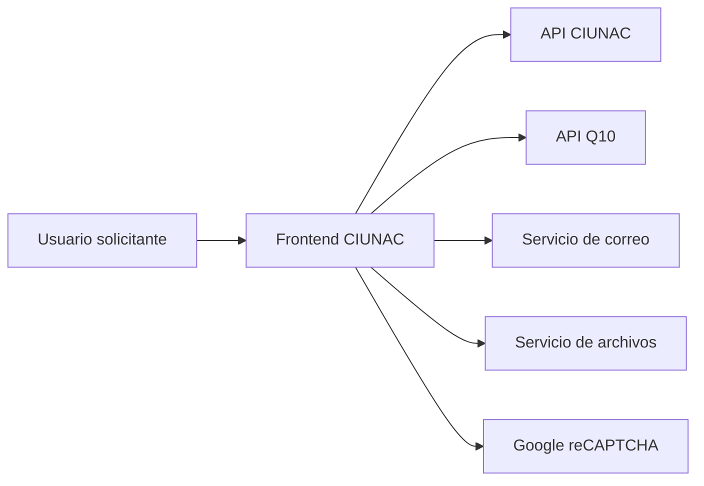

# Analisis de Requisitos del Frontend CIUNAC

## 1. Proposito
Este documento describe los requisitos funcionales y no funcionales del frontend CIUNAC observables en el codigo actual. Complementa la documentacion arquitectonica existente y responde que debe hacer el sistema desde la perspectiva del usuario y de los flujos de negocio.

## 2. Alcance
El alcance funcional incluye:
- registrar solicitudes de certificados;
- registrar solicitudes de constancias;
- registrar solicitudes de beca;
- registrar solicitudes de examen de ubicacion;
- registrar alumno nuevo en integracion Q10;
- consultar solicitudes por documento;
- consultar certificados;
- consultar resultados o constancias de ubicacion;
- validar correo mediante codigo y reCAPTCHA;
- consumir catalogos, textos, archivos, solicitudes, estudiantes, certificados y correo desde servicios externos.

Queda fuera del alcance de este documento:
- logica interna del backend;
- modelo de base de datos;
- reglas administrativas no visibles en frontend;
- aprobacion o procesamiento interno posterior a la solicitud.

## 3. Actores
| Actor | Descripcion |
| --- | --- |
| Usuario solicitante | Persona que registra o consulta solicitudes academicas. |
| Alumno UNAC/CIUNAC | Usuario que puede declarar pertenencia academica y completar datos adicionales. |
| Postulante | Usuario que registra datos para alumno nuevo. |
| Sistema CIUNAC | Frontend Next.js que guia flujos, valida datos y consume APIs. |
| API CIUNAC | Sistema externo para estudiantes, solicitudes, certificados, catalogos, textos, archivos y correo. |
| API Q10 | Sistema externo usado para programas y registro de alumno nuevo. |
| Servicio de correo | Integracion externa para codigos de verificacion y notificaciones. |

## 4. Dependencias Externas
- API CIUNAC para solicitudes, estudiantes, certificados, catalogos y textos.
- API Q10 para programas y registro de alumno nuevo.
- Servicio de correo para verificacion y notificaciones.
- Servicio de archivos para subir documentos y vouchers.
- Google reCAPTCHA para verificacion anti-abuso en formularios visibles.



## 5. Requisitos Funcionales
| ID | Requisito |
| --- | --- |
| RF-001 | El sistema debe permitir verificar un correo electronico mediante OTP de 6 digitos antes de iniciar flujos de solicitud principales. |
| RF-002 | El sistema debe exigir reCAPTCHA antes de aceptar la verificacion de correo y las consultas por documento. |
| RF-003 | El sistema debe permitir registrar una solicitud de certificado mediante un flujo por pasos. |
| RF-004 | El sistema debe permitir seleccionar tipo de solicitud, idioma, nivel, datos personales y datos academicos para certificados. |
| RF-005 | El sistema debe permitir buscar datos de estudiante por documento y precargar apellidos, nombres, celular e identificador cuando existan. |
| RF-006 | El sistema debe resolver el precio normal de una solicitud de certificado segun el catalogo y revalidarlo en servidor antes de crearla. |
| RF-007 | El sistema debe aplicar una politica comun de pago: para montos mayores que cero exige numero de 15 digitos, fecha y archivo del voucher; para monto cero permite continuar sin ellos. |
| RF-008 | El sistema debe solicitar documentos adicionales en ubicacion cuando sus reglas vigentes lo requieran. Certificados solo carga el voucher de pago. |
| RF-009 | El sistema debe guardar o actualizar datos de estudiante antes de crear una solicitud cuando aplique. |
| RF-010 | El sistema debe crear la solicitud en la API correspondiente y enviar una notificacion por correo al finalizar. |
| RF-011 | El sistema debe permitir registrar una solicitud de beca con datos academicos y documentos obligatorios. |
| RF-012 | El sistema debe permitir registrar una solicitud de examen de ubicacion mediante un flujo por pasos. |
| RF-013 | El sistema debe bloquear una nueva solicitud de ubicacion si ya existe una solicitud en proceso para el mismo documento, idioma y tipo de solicitud. |
| RF-014 | El sistema debe permitir registrar un alumno nuevo con correo verificado y un programa vigente obtenido desde API Q10. |
| RF-015 | El sistema debe permitir consultar solicitudes por documento y redirigir a detalle si existen resultados. |
| RF-016 | El sistema debe permitir verificar en modo de solo lectura un certificado mediante el identificador opaco incluido en su QR. |
| RF-017 | El sistema debe permitir consultar informacion de examen de ubicacion por documento. |
| RF-018 | El sistema debe mostrar mensajes de error, carga, bloqueo y finalizacion en los flujos principales. |
| RF-019 | El sistema debe permitir registrar una solicitud de constancia mediante un flujo independiente al de certificados. |
| RF-020 | El sistema debe generar un cargo PDF desde frontend al finalizar exitosamente una solicitud de constancia. |
| RF-021 | El sistema debe mostrar S/ 30.00 como tarifa del examen de ubicacion y revalidarla en servidor antes del registro. |
| RF-022 | El sistema debe conservar server-side el perfil CIUNAC declarado y rechazar un payload que no coincida con dicho perfil. |
| RF-023 | El sistema debe validar en servidor el formato real de los archivos de identidad, voucher y certificado academico de ubicacion. |

## 6. Requisitos No Funcionales
| ID | Requisito |
| --- | --- |
| RNF-001 | El frontend debe validar datos obligatorios antes de avanzar entre pasos. |
| RNF-002 | Los formularios deben mostrar estados de carga y evitar submits duplicados mientras se procesa una solicitud. |
| RNF-003 | Los errores de integracion deben mostrarse como mensajes comprensibles para el usuario. |
| RNF-004 | Los datos temporales de flujos multi-step deben reiniciarse al iniciar un nuevo proceso. |
| RNF-005 | Los catalogos usados en formularios deben reutilizarse por sesion cuando aplique. |
| RNF-006 | El sistema debe mantener separada la logica de UI, casos de uso, reglas de dominio e infraestructura segun la arquitectura documentada. |
| RNF-007 | El sistema debe funcionar como aplicacion web responsive para escritorio y movil. |
| RNF-008 | El sistema debe evitar exponer credenciales sensibles en cliente; las claves publicas deben limitarse a servicios que lo permitan, como reCAPTCHA. |

## 7. Reglas de Negocio
| ID | Regla |
| --- | --- |
| RN-001 | Si el tipo de documento es DNI, el documento debe tener 8 digitos. |
| RN-002 | Si el tipo de documento es CE o PASAPORTE, el documento debe tener 9 caracteres. |
| RN-003 | El celular debe tener 9 digitos. |
| RN-004 | Si el usuario marca que es alumno, los campos facultad, escuela y codigo son obligatorios cuando el schema del flujo lo exige. |
| RN-005 | Cuando el monto es mayor que cero, numero de voucher de 15 digitos, fecha de pago y archivo cargado son obligatorios. |
| RN-006 | La solicitud de beca requiere constancia de matricula, historial academico, constancia de tercio, carta de compromiso y declaracion jurada; cada documento debe ser PDF y no superar 8 MiB. |
| RN-007 | La solicitud de ubicacion debe bloquear duplicados con estado en proceso para el mismo documento, idioma y tipo de solicitud. |
| RN-008 | La verificacion por correo usa un OTP generado y validado en servidor, con vigencia de 5 minutos, reenvio despues de 3 minutos y maximo de 5 intentos. |
| RN-009 | En ubicacion, un alumno CIUNAC debe adjuntar certificado de estudios PDF; un usuario no CIUNAC no debe adjuntarlo. |
| RN-010 | El precio normal depende del catalogo externo vigente y debe verificarse nuevamente en el BFF antes del registro. |
| RN-011 | Las constancias aplican la politica comun de pago; el voucher no es una regla especial del flujo. Los tipos actuales `5` y `6` tienen monto positivo. |
| RN-012 | La solicitud de constancia no debe reutilizar el flujo de certificados como experiencia principal. |
| RN-015 | Certificados acepta tipos `1` a `4` y rechaza con `409 PRICE_CHANGED` un monto distinto del precio normal vigente. |
| RN-016 | Los tipos de certificado `2` y `4` se registran como digitales. |
| RN-017 | Certificados no solicita documentos adicionales distintos del voucher. |
| RN-018 | No se aplican descuentos de trabajador sin una validacion backend; `trabajador` y `antiguo` no alteran el flujo mediante URL. |
| RN-019 | Alumno nuevo debe validar DNI de 8 digitos o CE de 9 caracteres alfanumericos, telefono de 9 digitos y fecha de nacimiento no futura. |
| RN-020 | El BFF debe exigir que email y programa del registro de alumno nuevo coincidan con la sesion OTP y el catalogo Q10 vigente. |
| RN-021 | Q10 puede confirmar el registro con `204` o un objeto; una respuesta mal formada no debe continuar al correo. |
| RN-022 | Ubicacion usa tipo `7` y tarifa oficial S/ 30.00; un monto o catalogo diferente bloquea el registro. |
| RN-023 | El perfil CIUNAC debe coincidir con la sesion server-side y no puede determinarse por query string. |
| RN-024 | No CIUNAC usa nivel basico; CIUNAC puede elegir nivel y debe adjuntar certificado de estudios PDF de hasta 8 MiB. |
| RN-025 | El documento de identidad de ubicacion es obligatorio, se envia como `imgDoc` y admite PDF, PNG o JPEG de hasta 8 MiB. |
| RN-026 | Las solicitudes de ubicacion se registran con `digital: false`. |

## 8. Restricciones
- El frontend depende de disponibilidad de API CIUNAC, API Q10, servicio de correo, archivos y reCAPTCHA.
- El backend se trata como sistema externo; sus validaciones internas no se redefinen aqui.
- El catalogo Q10 de alumno nuevo conserva un limite de 30 programas y filtros por nombre pendientes de validacion funcional.
- Algunos textos funcionales provienen de catalogos remotos y pueden variar sin cambio de codigo.

## 9. Supuestos
- El usuario tiene acceso a un correo electronico valido para iniciar solicitudes.
- La API CIUNAC retorna identificadores de solicitud que permiten redirigir a la pantalla final.
- La busqueda por documento puede retornar cero, uno o varios resultados segun el backend.
- Las URLs de archivos devueltas por el servicio de subida son persistibles en las solicitudes.
- El cargo PDF de constancias se genera en frontend con `@react-pdf/renderer`.
- El navegador solicita correos al BFF y no accede directamente al endpoint externo de correo.

## 10. Criterios Generales de Aceptacion
```gherkin
Dado que el usuario completa un flujo con datos validos
Cuando confirma el registro
Entonces el sistema crea la solicitud correspondiente
Y muestra o redirige a la pantalla de finalizacion
```

```gherkin
Dado que una integracion externa falla
Cuando el usuario intenta registrar o consultar informacion
Entonces el sistema informa el problema sin dejar el flujo en estado inconsistente
```

```gherkin
Dado que el usuario inicia un nuevo proceso
Cuando entra al flujo multi-step
Entonces el estado temporal previo del flujo se reinicia
```

