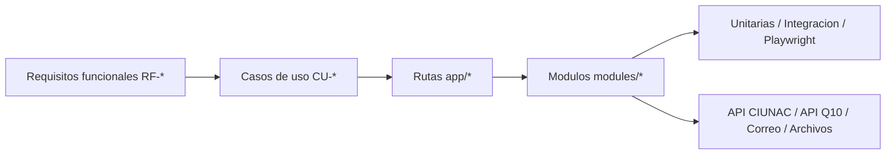

# Matriz de Trazabilidad de Requisitos

## Proposito
Relacionar requisitos funcionales con casos de uso, rutas Next.js, modulos y
pruebas automatizadas. Esta matriz ayuda a revisar cambios y verificar cobertura
funcional sin confundir documentacion con evidencia de ejecucion.

## Matriz Funcional
| Requisito | Caso de uso | Rutas principales | Modulos principales | Pruebas automatizadas |
| --- | --- | --- | --- | --- |
| RF-001 | CU-001, CU-002, CU-003, CU-004 | Entradas de solicitudes | Verificacion de correo compartida y features de solicitud | `otp.test.ts`; smoke de cada solicitud |
| RF-002 | CU-001 a CU-005, CU-007 | Solicitudes y consultas por documento | Seguridad OTP/CAPTCHA y formulario de consultas | `http-and-security-boundaries.test.ts`; smoke de solicitudes y consultas |
| RF-003 | CU-001 | `/solicitud-certificados/proceso` | `modules/solicitud-certificado` | `solicitud-certificado.test.ts`; `solicitud-certificado.smoke.spec.ts` |
| RF-004 | CU-001 | `/solicitud-certificados/proceso` | Presentacion y dominio de certificado | `solicitud-certificado.test.ts`; smoke de certificado |
| RF-005 | CU-001, CU-003 | Procesos de certificado y ubicacion | Gateways de estudiante por feature | `feature-pipelines.test.ts`; unitarias y smoke de ambos features |
| RF-006 | CU-001 | Proceso y BFF de certificados | Mapper y validacion server-side de precio | `solicitud-certificado.test.ts`; smoke de precio manipulado |
| RF-007 | CU-001, CU-003, CU-008 | Procesos con pago | `FinData` y politica de pago/voucher compartida | `payment-policy.test.ts`; smoke de certificado, ubicacion y constancia |
| RF-008 | CU-003 | Proceso de ubicacion | Documentos de ubicacion | `solicitud-ubicacion.test.ts`; smoke de archivos |
| RF-009 | CU-001, CU-003 | Procesos de certificado y ubicacion | Gateways de estudiante por feature | `feature-pipelines.test.ts`; unitarias de ambos features |
| RF-010 | CU-001, CU-002, CU-003 | Registro y finalizacion | Casos de uso y gateways de solicitud/correo | `registration-use-cases.test.ts`; `feature-pipelines.test.ts`; smoke de correo |
| RF-011 | CU-002 | Proceso y finalizacion de beca | `modules/solicitud-beca` | `solicitud-beca.test.ts`; `scholarship-document-upload.test.ts`; smoke de beca |
| RF-012 | CU-003 | `/solicitud-ubicacion/proceso` | `modules/solicitud-ubicacion` | `solicitud-ubicacion.test.ts`; smoke de ubicacion |
| RF-013 | CU-003 | `/solicitud-ubicacion/proceso` | Caso de uso de duplicidad | `solicitud-ubicacion.test.ts`; smoke de duplicidad |
| RF-014 | CU-004 | Solicitud y finalizacion de alumno nuevo | `modules/solicitud-nuevo`; API Q10 | `solicitud-nuevo.test.ts`; `solicitud-nuevo.smoke.spec.ts` |
| RF-015 | CU-005 | `/consulta-solicitud` y detalle | `modules/consulta-solicitud` | `consultation-typing.test.ts`; `feature-pipelines.test.ts`; `consultas.smoke.spec.ts` |
| RF-016 | CU-006 | `/consulta-certificado` y detalle publico | `modules/consulta-certificado` | `certificate-detail.test.ts`; smoke de certificado publico |
| RF-017 | CU-007 | `/consulta-ubicacion` y detalle | `modules/consulta-ubicacion` | `location-consultation.test.ts`; `consultas.smoke.spec.ts` |
| RF-018 | CU-001 a CU-007 | Todos los flujos principales | Presentacion y estados de ruta | `routes.smoke.spec.ts`; `accessibility.spec.ts`; regresion E2E completa |
| RF-019 | CU-008 | Solicitud y proceso de constancia | `modules/solicitud-constancia` | `typing-and-mappers.test.ts`; `solicitud-constancia.smoke.spec.ts` |
| RF-020 | CU-008 | Finalizacion de constancia | Cargo PDF de constancia | Unitarias de constancia; smoke de finalizacion y cargo |
| RF-021 | CU-003 | Entrada de ubicacion y BFF | Catalogo y validacion de solicitud | `solicitud-ubicacion.test.ts`; smoke de tarifa S/ 30 |
| RF-022 | CU-003 | Perfil y proceso de ubicacion | Sesion de perfil y validacion server-side | `http-and-security-boundaries.test.ts`; smoke de perfil/sesion |
| RF-023 | CU-003 | Upload de DNI, voucher y certificado | Validadores de archivo de ubicacion y shared | `voucher-upload-validation.test.ts`; unitarias y smoke de ubicacion |

## Cobertura de Flujos Visibles
| Flujo visible | Estado documental |
| --- | --- |
| Solicitud de certificados | Cubierto por CU-001 |
| Solicitud de beca | Cubierto por CU-002 |
| Solicitud de examen de ubicacion | Cubierto por CU-003 |
| Solicitud de alumno nuevo | Cubierto por CU-004 |
| Consulta de solicitud | Cubierto por CU-005 |
| Consulta de certificado | Cubierto por CU-006 |
| Consulta de ubicacion | Cubierto por CU-007 |
| Solicitud de constancia | Cubierto por CU-008 |
| Home `app/page.tsx` | Fuera de alcance funcional especifico; actua como entrada/navegacion |

## Matriz Visual

