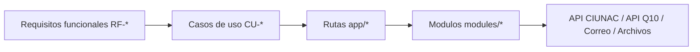

# Matriz de Trazabilidad de Requisitos

## Proposito
Relacionar requisitos funcionales con casos de uso, rutas Next.js y modulos principales. Esta matriz ayuda a revisar cambios, planificar pruebas y verificar que cada flujo visible tenga cobertura documental.

## Matriz Funcional
| Requisito | Caso de uso | Rutas principales | Modulos principales |
| --- | --- | --- | --- |
| RF-001 | CU-001, CU-002, CU-003, CU-004 | `app/solicitud-certificados/page.tsx`, `app/solicitud-beca/page.tsx`, `app/solicitud-ubicacion/page.tsx`, `app/solicitud-nuevo/page.tsx` | `modules/shared/components/email-verification-form.tsx` |
| RF-002 | CU-001, CU-002, CU-003, CU-004, CU-005, CU-007 | Solicitudes y consultas por documento | `modules/shared/components/email-verification-form.tsx`, `modules/consulta-solicitud/components/consulta-form.tsx` |
| RF-003 | CU-001 | `app/solicitud-certificados/proceso/page.tsx` | `modules/solicitud-certificado` |
| RF-004 | CU-001 | `app/solicitud-certificados/proceso/page.tsx` | `modules/solicitud-certificado/components/basic-data.tsx` |
| RF-005 | CU-001, CU-003 | Procesos de certificado y ubicacion | `services/estudiantes.service.ts` |
| RF-006 | CU-001 | `app/solicitud-certificados/proceso/page.tsx` | `modules/solicitud-certificado/domain/rules` |
| RF-007 | CU-001, CU-003, CU-008 | Procesos de certificado, ubicacion y constancia | `modules/shared/components/fin-data.tsx`, `modules/shared/schemas/fin-data.schema.ts` |
| RF-008 | CU-001, CU-003 | Procesos de certificado y ubicacion | `modules/shared/components/documentos-step.tsx` |
| RF-009 | CU-001, CU-003 | Procesos de certificado y ubicacion | Gateways de estudiante por feature |
| RF-010 | CU-001, CU-002, CU-003 | Pantallas de registro/finalizacion | Casos de uso y gateways de cada solicitud |
| RF-011 | CU-002 | `app/solicitud-beca/proceso/page.tsx` | `modules/solicitud-beca` |
| RF-012 | CU-003 | `app/solicitud-ubicacion/proceso/page.tsx` | `modules/solicitud-ubicacion` |
| RF-013 | CU-003 | `app/solicitud-ubicacion/proceso/page.tsx` | `check-duplicate-solicitud-ubicacion.use-case.ts` |
| RF-014 | CU-004 | `app/solicitud-nuevo/page.tsx` | `modules/solicitud-nuevo`, API Q10 |
| RF-015 | CU-005 | `app/consulta-solicitud/page.tsx`, `app/consulta-solicitud/[dni]/page.tsx` | `modules/consulta-solicitud` |
| RF-016 | CU-006 | `app/consulta-certificado/page.tsx`, `app/consulta-certificado/[id]/page.tsx` | `modules/consulta-certificado`, `services/certificados.service.ts` |
| RF-017 | CU-007 | `app/consulta-ubicacion/page.tsx`, `app/consulta-ubicacion/[dni]/page.tsx` | `modules/consulta-ubicacion` |
| RF-018 | CU-001, CU-002, CU-003, CU-004, CU-005, CU-006, CU-007 | Todos los flujos principales | Componentes de presentation y dialogs |
| RF-019 | CU-008 | `app/solicitud-constancias/page.tsx`, `app/solicitud-constancias/proceso/page.tsx` | `modules/solicitud-constancia` |
| RF-020 | CU-008 | `app/solicitud-constancias/finalizar/page.tsx` | `modules/solicitud-constancia/presentation/components/cargo-pdf.tsx`, `modules/solicitud-constancia/presentation/components/descarga-cargo.tsx` |

## Cobertura de Flujos Visibles
| Flujo visible | Estado documental |
| --- | --- |
| Solicitud de certificados | Cubierto por CU-001 |
| Solicitud de beca | Cubierto por CU-002 |
| Solicitud de examen de ubicacion | Cubierto por CU-003 |
| Solicitud de alumno nuevo | Cubierto por CU-004 |
| Consulta de solicitud | Cubierto por CU-005 |
| Consulta de certificado | Cubierto por CU-006 |
| Consulta de ubicacion | Cubierto por CU-007 |
| Solicitud de constancia | Cubierto por CU-008 |
| Home `app/page.tsx` | Fuera de alcance funcional especifico; actua como entrada/navegacion |

## Matriz Visual

