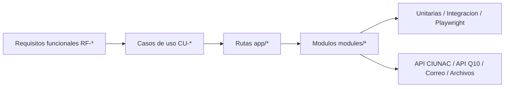

# Matriz de Trazabilidad de Requisitos

## Proposito
Relacionar requisitos funcionales con casos de uso, rutas Next.js, modulos y
pruebas automatizadas. Esta matriz ayuda a revisar cambios y verificar cobertura
funcional sin confundir documentacion con evidencia de ejecucion.

## Matriz Funcional
| Requisito | Caso de uso | Rutas principales | Modulos principales | Pruebas automatizadas |
| --- | --- | --- | --- | --- |
| RF-001 | CU-001, CU-002, CU-003, CU-004 | Entradas de solicitudes | Verificacion de correo compartida y features de solicitud | `otp.test.ts`; smoke de cada solicitud |
| RF-002 | CU-001 a CU-005, CU-007 | Solicitudes y consultas por documento | Seguridad OTP/CAPTCHA y formulario de consultas | `http-and-security-boundaries.test.ts`; `browser-http.test.ts` (errores, ausencia, timeout y credenciales); smoke de solicitudes y consultas |
| RF-003 | CU-001 | `/solicitud-certificados/proceso` | `modules/solicitud-certificado/operations.ts`, `client.ts` y componentes | `solicitud-certificado.test.ts`; `feature-pipelines.test.ts` (secuencia, respuestas invalidas y fallos); `solicitud-certificado.smoke.spec.ts` |
| RF-004 | CU-001 | `/solicitud-certificados/proceso` | Presentacion y dominio de certificado | `solicitud-certificado.test.ts`; smoke de certificado |
| RF-005 | CU-001, CU-003 | Procesos de certificado y ubicacion | Gateways de estudiante por feature | `feature-pipelines.test.ts`; unitarias y smoke de ambos features |
| RF-006 | CU-001 | Proceso y BFF de certificados | Mapper y validacion server-side de precio | `solicitud-certificado.test.ts`; smoke de precio manipulado |
| RF-007 | CU-001, CU-003, CU-008 | Procesos con pago | `FinData` y politica de pago/voucher compartida | `payment-policy.test.ts` (modelo, conversion ISO, DTO de tres flujos y pago cero); smoke de certificado, ubicacion y constancia |
| RF-008 | CU-003 | Proceso de ubicacion | Documentos de ubicacion | `solicitud-ubicacion.test.ts`; smoke de archivos |
| RF-009 | CU-001, CU-003 | Procesos de certificado y ubicacion | Gateways de estudiante por feature | `feature-pipelines.test.ts`; unitarias de ambos features |
| RF-010 | CU-001, CU-002, CU-003 | Registro y finalizacion | Casos de uso y gateways de solicitud/correo | `registration-use-cases.test.ts`; `feature-pipelines.test.ts`; smoke de correo |
| RF-011 | CU-002 | Proceso y finalizacion de beca | `solicitud-beca/operations.ts`, `client.ts`, `store.ts` y validacion server-side | `solicitud-beca.test.ts`; `scholarship-document-upload.test.ts`; `file-validation.test.ts`; `scholarship-pipeline.test.ts`; smoke de beca |
| RF-012 | CU-003 | `/solicitud-ubicacion/proceso` | `solicitud-ubicacion/operations.ts`, `client.ts` y `store.ts` | `solicitud-ubicacion.test.ts`; `location-pipeline.test.ts`; smoke de ubicacion |
| RF-013 | CU-003 | `/solicitud-ubicacion/proceso` | `checkDuplicateLocation` y validacion BFF | `solicitud-ubicacion.test.ts`; `location-pipeline.test.ts`; smoke de duplicidad |
| RF-014 | CU-004 | Solicitud y finalizacion de alumno nuevo | `solicitud-nuevo/operations.ts`, `client.ts`, `store.ts` y API Q10 | `solicitud-nuevo.test.ts`; `new-student-pipeline.test.ts`; `solicitud-nuevo.smoke.spec.ts` |
| RF-015 | CU-005 | `/consulta-solicitud` y detalle | `consultas/server.ts`, `consulta-solicitud/operations.ts` y componentes | `consultation-typing.test.ts`; `feature-pipelines.test.ts`; `consultation-pipelines.test.ts` (concurrencia, contratos, vacios, aceptacion); `consultas.smoke.spec.ts` (descarga, fallo y reintento) |
| RF-016 | CU-006 | `/consulta-certificado` y detalle publico | `modules/consulta-certificado` | `certificate-detail.test.ts`; smoke de certificado publico |
| RF-017 | CU-007 | `/consulta-ubicacion` y detalle | `consulta-ubicacion/operations.ts`, modelo, adapters server-only y componentes | `location-consultation.test.ts`; `consultation-pipelines.test.ts` (cinco lecturas paralelas y cargo sin GET extra); `consultas.smoke.spec.ts` |
| RF-018 | CU-001 a CU-007 | Todos los flujos principales | Presentacion y estados de ruta | `routes.smoke.spec.ts`; `accessibility.spec.ts`; regresion E2E completa |
| RF-019 | CU-008 | Solicitud y proceso de constancia | `solicitud-constancia/operations.ts`, `client.ts` y `components/` | `typing-and-mappers.test.ts`; `constancia-pipeline.test.ts`; `solicitud-constancia.smoke.spec.ts` |
| RF-020 | CU-008 | Finalizacion de constancia | `solicitud-constancia/components/cargo-pdf.tsx`, carga diferida desde `descarga-cargo.tsx` | Unitarias de constancia; integracion de cargo; smoke de finalizacion y descarga |
| RF-021 | CU-003 | Entrada de ubicacion y BFF | Catalogo y validacion de solicitud | `solicitud-ubicacion.test.ts`; smoke de tarifa S/ 30 |
| RF-022 | CU-003 | Perfil y proceso de ubicacion | Sesion de perfil y validacion server-side | `http-and-security-boundaries.test.ts`; smoke de perfil/sesion |
| RF-023 | CU-003 | Upload de DNI, voucher y certificado | Validadores de archivo de ubicacion y shared | `file-validation.test.ts`; `voucher-upload-validation.test.ts`; unitarias y smoke de ubicacion |

## Cobertura de Flujos Visibles
El paso 8 cierra documentacion y elimina solo declaraciones sin consumidores.
No agrega ni modifica RF, CU, rutas, validaciones o contratos. El mapa de
implementacion de la tabla sigue vigente bajo
[ADR-031](../architecture/adr/031-pragmatic-feature-architecture.md).
La comprobacion de imports usa tests/unit/architecture/eslint-boundaries.test.ts;
las capacidades comunes se prueban en file-validation.test.ts,
payment-policy.test.ts y browser-http.test.ts. No representan RF nuevos.
Los resultados finales y el intento E2E anterior quedan en la
[linea base de cierre](../quality/baseline.md#simplificacion-pragmatica-cierre-documental-paso-8).

El paso 7 (2026-09-25) consolida capacidades, sin cambiar requisitos funcionales.
RF-007 comparte modelo y conversiones; RF-008, RF-011 y RF-023 conservan politicas
de archivos de cada feature con metadata/firma comunes. RF-002 y RF-010 mantienen
sesion y correo seguro usando un unico transporte del navegador. Las 42 nuevas
integraciones comprueban categorias HTTP, multipart, timeout, ausencia y cero
credenciales privadas; las suites existentes conservan secuencias y reintentos.
Resultado: 431 unitarias, 166 integraciones y 113 E2E (34 smoke, 9 axe).
Auditoria de dependencias bloqueada, detallada en
[linea base](../quality/baseline.md#simplificacion-pragmatica-capacidades-compartidas-paso-7).

El segundo feature del paso 4 (alumno nuevo, 2026-09-23) mantiene RF-014 y CU-004.
La integracion comprueba DTO exacto, exito Q10 vacio/objeto, respuestas invalidas,
errores HTTP/red y reintento de correo sin repetir Q10. Los E2E comprueban ademas
el bloqueo de un segundo registro tras respuesta ambigua o perdida por red.

El primer feature del paso 4 (constancias, 2026-09-23) mantiene RF-019, RF-020 y
la politica comun RF-007. La integracion verifica DTOs de tipos 5/6, PATCH del
estudiante existente, interrupcion por respuestas invalidas, errores de correo
sin perder metadatos y reintento exclusivo. El E2E verifica un upload, una escritura
de estudiante y una solicitud, ademas de seguridad y descarga PDF.

El piloto pragmatico de certificados (paso 3, 2026-09-22) conserva RF-003 a RF-007,
RF-009 y RF-010: cambia la organizacion interna, no sus contratos funcionales.
La suite E2E comprueba orden y cantidad de uploads/escrituras, reintento exclusivo
del correo, sesion, precio y descarga del cargo. `eslint-boundaries.test.ts`
complementa estas pruebas con limites estructurales, no con requisitos de negocio.

| Flujo visible | Estado documental |
| --- | --- |
| Solicitud de certificados | Cubierto por CU-001 |
| Solicitud de beca | Cubierto por CU-002 |
| Solicitud de examen de ubicacion | Cubierto por CU-003 |
| Solicitud de alumno nuevo | Cubierto por CU-004 |
| Consulta de solicitud | Cubierto por CU-005 |
| Consulta de certificado | Cubierto por CU-006 |
| Consulta de ubicacion | Cubierto por CU-007 |
| Solicitud de constancia | Cubierto por CU-008 |
| Home `app/page.tsx` | Fuera de alcance funcional especifico; actua como entrada/navegacion |

## Matriz Visual

```mermaid
flowchart LR
    RF["Requisitos funcionales RF-*"] --> CU["Casos de uso CU-*"]
    CU --> Routes["Rutas app/*"]
    Routes --> Modules["Modulos modules/*"]
    Modules --> Tests["Unitarias / Integracion / Playwright"]
    Modules --> APIs["API CIUNAC / API Q10 / Correo / Archivos"]
```

