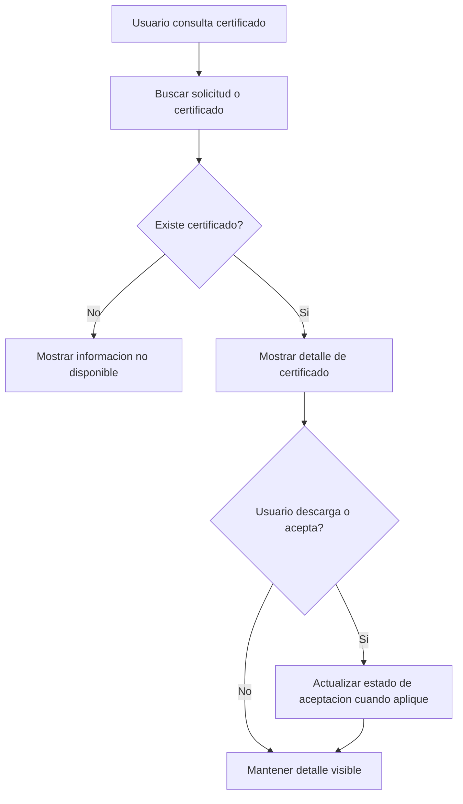

# CU-006 Consultar Certificado

## Objetivo
Permitir que un Usuario solicitante consulte certificados asociados a solicitudes y acceda a informacion o descarga cuando este disponible.

## Actores
- Actor principal: Usuario solicitante.
- Actores secundarios: Sistema CIUNAC, API CIUNAC.

## Precondiciones
- Existe una solicitud o certificado registrado en API CIUNAC.
- El usuario cuenta con documento o identificador requerido por el flujo de consulta.

## Disparador
El usuario ingresa a `app/consulta-certificado/page.tsx` o a una ruta de detalle de certificado.

## Flujo Principal
1. El sistema presenta el contenedor de consulta.
2. El usuario busca por documento mediante el flujo compartido de consulta cuando corresponde.
3. El sistema consulta solicitudes o certificados disponibles.
4. Si existe certificado, el sistema muestra informacion del certificado.
5. Si el usuario descarga o acepta el certificado, el sistema puede actualizar estado de aceptacion.

## Diagrama del Flujo


## Flujos Alternativos
- Si no existe certificado asociado, el sistema no muestra descarga disponible.
- Si la busqueda por solicitud no retorna certificado, el sistema retorna `null` segun implementacion actual.

## Excepciones
- Si falla la consulta del certificado, el sistema registra el error y evita romper la pantalla.

## Postcondiciones
- El usuario visualiza o descarga el certificado si esta disponible.
- El estado de aceptacion puede actualizarse cuando el usuario ejecuta la accion correspondiente.

## Datos Requeridos
- Documento o identificador de solicitud/certificado.

## Reglas Relacionadas
- RF-016, RF-018.

## Criterios de Aceptacion
```gherkin
Dado que existe un certificado para una solicitud
Cuando el usuario consulta la informacion
Entonces el sistema muestra el certificado disponible
```

