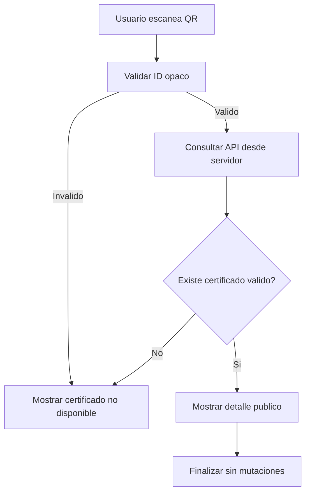

# CU-006 Verificar Certificado Mediante QR

## Objetivo

Permitir que un tercero verifique la informacion de un certificado CIUNAC desde
la URL publica incluida en su codigo QR.

## Actores

- Actor principal: Usuario verificador.
- Actores secundarios: Sistema CIUNAC, API CIUNAC.

## Precondiciones

- Existe un certificado registrado en API CIUNAC.
- El usuario dispone del certificado o de su URL QR con identificador opaco.

## Disparador

El usuario escanea el QR y abre `/consulta-certificado/{certificateId}`.

## Flujo Principal

1. El sistema valida el formato del identificador incluido en la URL.
2. El Server Component consulta el certificado usando la API key privada.
3. El sistema valida la respuesta externa y elimina datos no publicos del modelo.
4. El sistema muestra nombre, idioma, nivel, horas, registro, fechas, entrega y
   notas disponibles.
5. La pagina permanece en modo de solo lectura.



## Flujos Alternativos

- Si el certificado no contiene notas, se muestran los metadatos y un estado
  vacio de notas.
- Si `aceptado` llega nulo, se muestra como entrega pendiente.
- Si se abre `/consulta-certificado` sin ID, se muestran instrucciones para usar
  el QR.

## Excepciones

- Un ID invalido, `404` o respuesta vacia muestra certificado no disponible.
- Una respuesta mal formada o un fallo tecnico muestra un error reintentable.

## Postcondiciones

- El usuario visualiza la informacion publica del certificado cuando existe.
- No se descarga, acepta ni modifica ningun recurso.

## Datos Requeridos

- Identificador opaco del certificado incluido en el QR.

## Reglas Relacionadas

- RF-016, RF-018.
- ADR-017.

## Criterios de Aceptacion

```gherkin
Dado un certificado existente con un identificador QR valido
Y sin una sesion previa de consulta
Cuando el usuario abre la URL del QR
Entonces el sistema permanece en la ruta del certificado
Y muestra su detalle publico
Y no expone la API key ni el numero de documento
```
