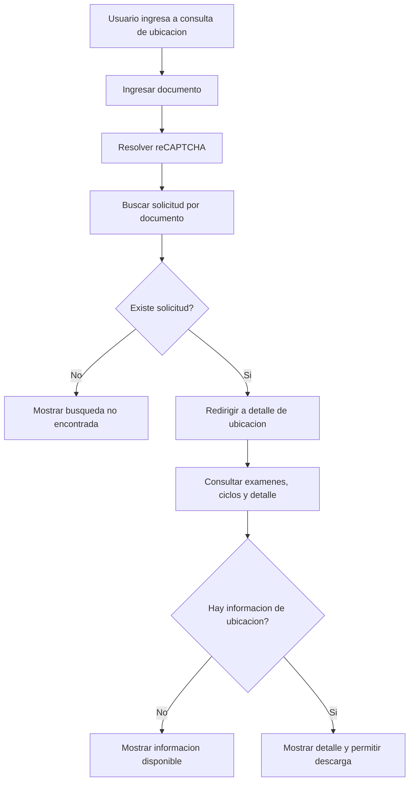

# CU-007 Consultar Ubicacion

## Objetivo
Permitir que un Usuario solicitante consulte informacion de examen de ubicacion por documento y descargue o visualice constancia cuando corresponda.

## Actores
- Actor principal: Usuario solicitante.
- Actores secundarios: Sistema CIUNAC, API CIUNAC.

## Precondiciones
- El usuario conoce el documento usado para la solicitud de ubicacion.
- API CIUNAC provee informacion de solicitudes, examenes y detalle de notas.

## Disparador
El usuario ingresa a `app/consulta-ubicacion/page.tsx` o es redirigido desde consulta por documento.

## Flujo Principal
1. El sistema muestra formulario de consulta por documento.
2. El usuario ingresa documento y resuelve reCAPTCHA.
3. El sistema consulta solicitudes por documento.
4. Si hay resultados, el sistema redirige a `app/consulta-ubicacion/[dni]/page.tsx` con datos basicos en query string.
5. El sistema consulta detalle de examen y ciclos.
6. El sistema muestra informacion disponible y permite descargar constancia cuando aplique.

## Diagrama del Flujo


## Flujos Alternativos
- Si no hay solicitudes para el documento, el sistema muestra mensaje de no encontrado.
- Si no hay detalle de examen, el sistema muestra la informacion disponible sin constancia. Pendiente de validacion funcional.

## Excepciones
- Si falla la consulta de ciclos o detalle, el sistema registra error y conserva la vista sin datos completos.

## Postcondiciones
- El usuario visualiza detalle de ubicacion si existe informacion.
- El usuario puede descargar constancia cuando el flujo lo habilite.

## Datos Requeridos
- Documento de identidad.
- reCAPTCHA valido en el inicio de consulta.

## Reglas Relacionadas
- RF-002, RF-017, RF-018.
- RN-001, RN-002.

## Criterios de Aceptacion
```gherkin
Dado que existe informacion de ubicacion para el documento
Cuando el usuario realiza la consulta
Entonces el sistema muestra el detalle de examen de ubicacion
```

